# AWS Cloud Solution for Two Company Websites Using Reverse Proxy Technology

A production-style, highly available AWS infrastructure that hosts **two separate web applications** — a **WordPress** site and an internal **Tooling** site — behind an **Nginx reverse proxy**, spread across two Availability Zones for resilience and security.

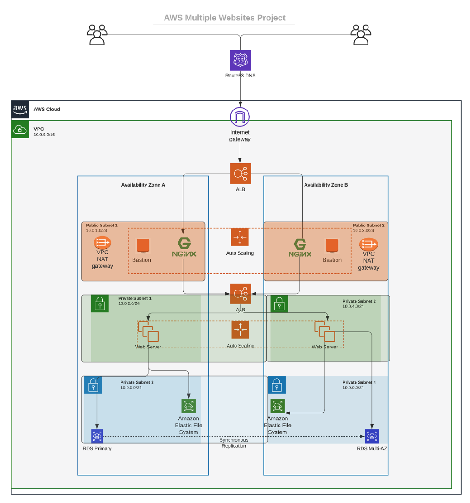

---

## Table of Contents
- [Overview](#overview)
- [Why This Architecture?](#why-this-architecture)
- [How a Request Flows Through the System](#how-a-request-flows-through-the-system)
- [Tech Stack & AWS Services](#tech-stack--aws-services)
- [Prerequisites](#prerequisites)
- [Build Walkthrough](#build-walkthrough)
- [Key Concepts Explained](#key-concepts-explained)
- [Challenges & Lessons Learned](#challenges--lessons-learned)

---

## Overview

This project provisions the infrastructure for a fictional company that needs to host two distinct websites reliably and securely:

| Website | Purpose |
|--------------|--------------------------------------------|
| **WordPress** | The company's public-facing marketing site |
| **Tooling** | An internal DevOps tooling application |

Rather than exposing the web servers directly to the internet, all traffic is funneled through a **reverse proxy layer (Nginx)**. This hides the backend, centralizes SSL termination, and gives a single, controllable entry point into the private network.

The whole environment is built for **high availability** (nothing lives in a single Availability Zone), **scalability** (Auto Scaling Groups add/remove servers on demand), and **security** (web and data tiers are locked away in private subnets, database credentials are pulled from **AWS Secrets Manager**, and access is restricted through load balancers and bastion hosts).

---

## Why This Architecture?

A naive setup would put web servers on public IPs and call it done. This design deliberately avoids that, for three reasons:

- **Security through isolation** — The WordPress and Tooling servers, and the database, never touch the public internet directly. They sit in private subnets. The only public entry points are the external load balancer and the bastion hosts. Database credentials are never hard-coded; they are fetched from AWS Secrets Manager at boot.
- **Resilience** — Every tier is duplicated across **two Availability Zones**. If one AZ fails, the application keeps serving traffic from the other.
- **Elasticity & cost efficiency** — Auto Scaling Groups launch new servers from a pre-baked image when demand rises and terminate them when it falls, so we pay for what we use without manual intervention.

---

## How a Request Flows Through the System

1. A user visits the site; **Route 53** resolves the domain name.
2. The request hits the **external (internet-facing) Application Load Balancer**.
3. The external ALB forwards traffic to the **Nginx reverse proxy** servers in the public subnets.
4. Nginx forwards the request to the **internal Application Load Balancer**.
5. The internal ALB routes to the correct backend — **WordPress** or **Tooling** — running on web servers in the private subnets.
6. The web servers read/write shared files on **Amazon EFS** and persist data in the **Multi-AZ RDS** database, using credentials retrieved from **AWS Secrets Manager**.

Administrators never SSH into servers directly — they connect through the **Bastion hosts**, the only instances permitted inbound SSH access.

---

## Tech Stack & AWS Services

| Layer | Service / Tool |
|----------------|---------------------------------------------------|
| DNS | Amazon Route 53 |
| Certificates | AWS Certificate Manager (ACM) + self-signed (Nginx/Apache) |
| Load Balancing | Application Load Balancer (external + internal) |
| Reverse Proxy | Nginx |
| Compute | Amazon EC2, Auto Scaling Groups, Launch Templates |
| Web Servers | Apache (httpd) + PHP 7.4 |
| Applications | WordPress, Tooling |
| Shared Storage | Amazon EFS (with access points) |
| Database | Amazon RDS (MySQL, Multi-AZ) |
| Secrets | AWS Secrets Manager (DB credentials) |
| Encryption | AWS KMS |
| Networking | VPC, public/private subnets, IGW, NAT Gateway, route tables |
| Access | Bastion hosts, IAM instance roles |

---

## Prerequisites

- An AWS account with permissions to create VPC, EC2, RDS, EFS, ELB, ACM, KMS, Secrets Manager and Route 53 resources.
- A registered domain name (managed in Route 53).
- An **IAM instance role** attached to the web servers granting `secretsmanager:GetSecretValue` on the database secret.
- A **Secrets Manager secret** holding the RDS connection details as JSON, for example:
  ```json
  {
    "host": "olalekan-database.xxxxxxxx.us-east-1.rds.amazonaws.com",
    "username": "olalekanadmin",
    "password": "********"
  }
  ```
- Basic familiarity with the Linux command line and RHEL/CentOS-style package management (`yum`).

---

## Build Walkthrough

> The steps below follow the order in which the infrastructure was built. Each step includes the reasoning, the commands used where relevant, and a screenshot of the result.

### 1. Networking (VPC)

Create the foundation network:

- A **VPC** with CIDR `10.0.0.0/16`.
- **Public subnets** (for Nginx, Bastion, external ALB) and **private subnets** (for web servers and the data layer), spread across two AZs.
- **Route tables** for the public and private subnets.
- An **Internet Gateway** attached to the VPC and associated with the public route table.
- A **NAT Gateway** so private instances can reach the internet for updates without being publicly reachable.

| VPC | Subnets | Route Tables |
|-----|---------|--------------|
| 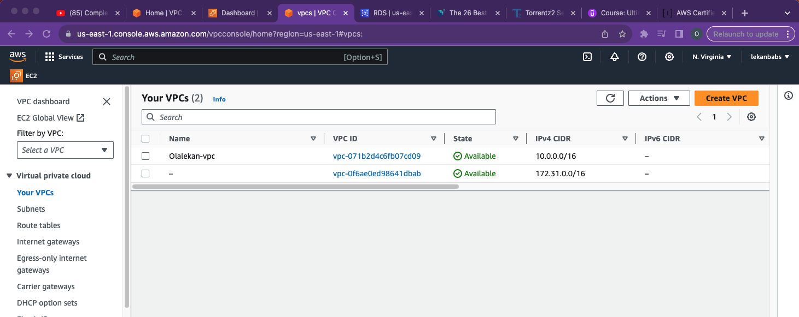 | 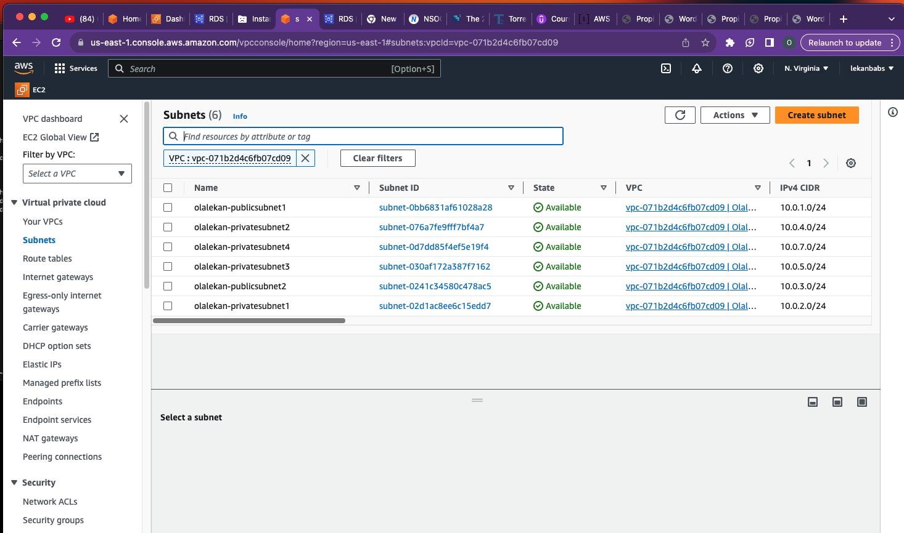 | 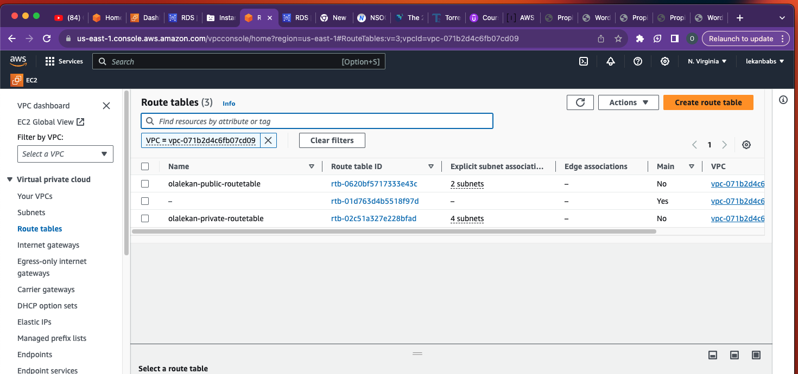 |

| Internet Gateway | NAT Gateway |
|------------------|-------------|
| 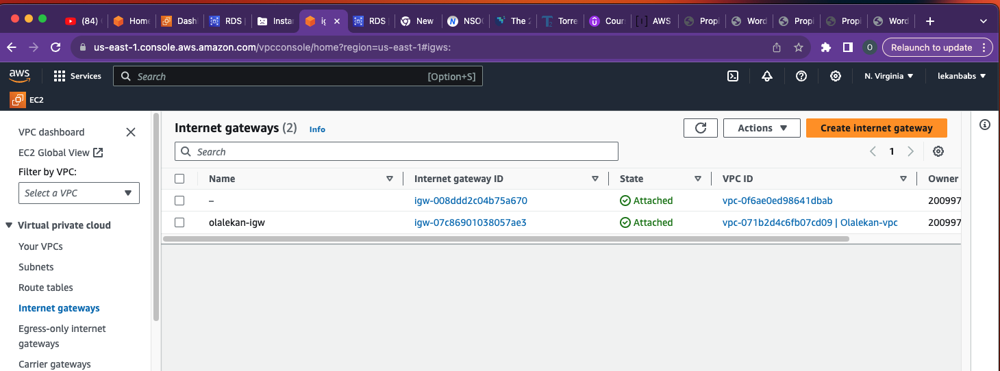 | 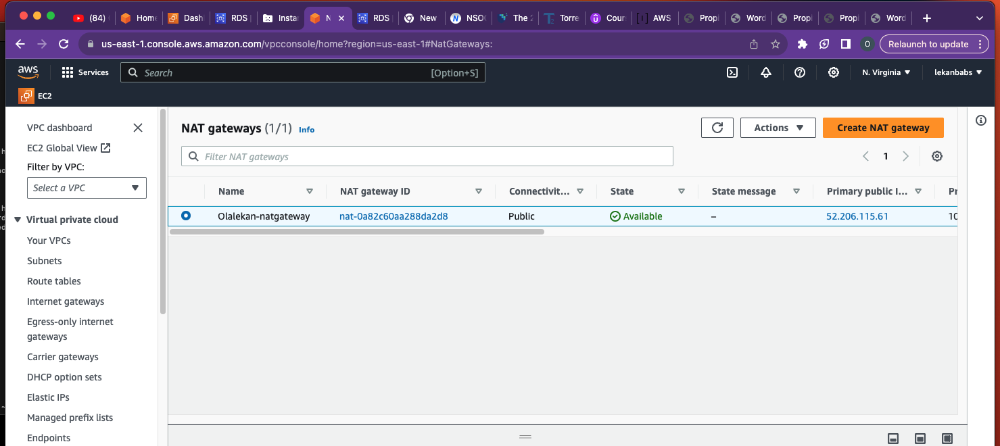 |

### 2. Security Groups

Create scoped security groups for each tier — **Nginx**, **Bastion**, **web servers**, **load balancers**, and the **data layer** — so that each component only accepts traffic from the components that legitimately need to reach it.

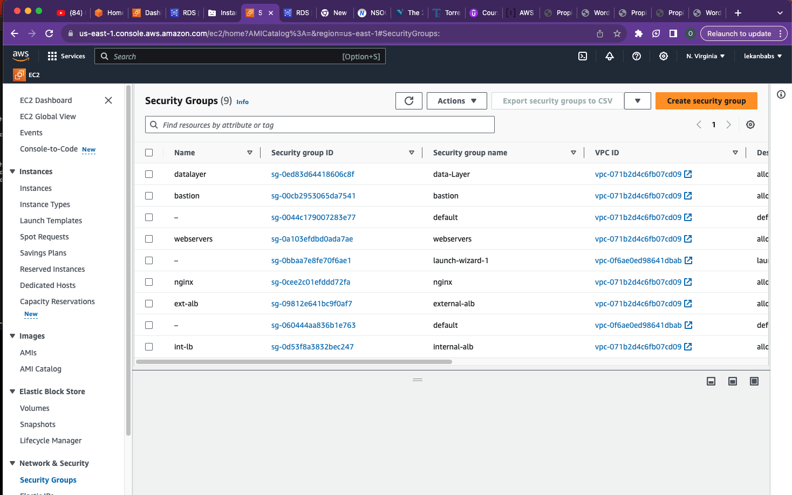

### 3. Compute (EC2 Instances)

Launch the initial EC2 instances for **Nginx**, **Bastion**, and the **web servers**. These are configured once, then captured as reusable images (AMIs) in a later step.

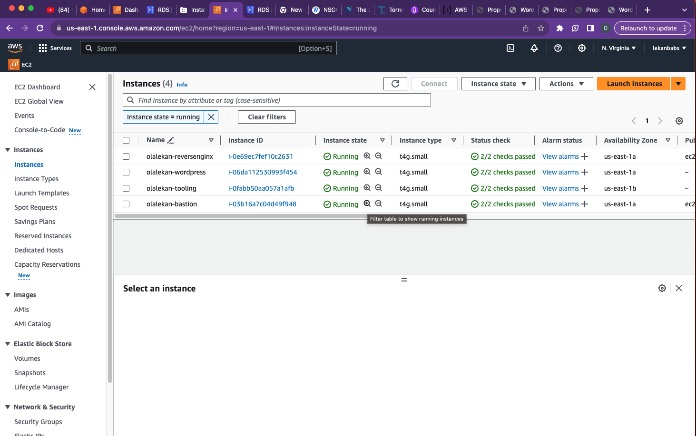

### 4. Instance Configuration & TLS Certificates

Prepare each instance with the required packages, SELinux policies, EFS utilities, and self-signed TLS certificates.

**Base packages (Bastion):**
```bash
sudo yum install -y https://dl.fedoraproject.org/pub/epel/epel-release-latest-8.noarch.rpm
sudo yum install -y dnf-utils http://rpms.remirepo.net/enterprise/remi-release-8.rpm
sudo yum install wget vim python3 telnet htop git mysql net-tools chrony -y
sudo systemctl enable --now chronyd
```

**Base packages (Nginx & web servers):** same as above.

**SELinux policies** (allow Apache to talk to the network, the database, and NFS/EFS):
```bash
sudo setsebool -P httpd_can_network_connect=1
sudo setsebool -P httpd_can_network_connect_db=1
sudo setsebool -P httpd_execmem=1
sudo setsebool -P httpd_use_nfs=1
```

**Install Amazon EFS utilities** (needed to mount EFS with TLS):
```bash
git clone https://github.com/aws/efs-utils
cd efs-utils
sudo yum install -y make rpm-build
make rpm
sudo yum install -y ./build/amazon-efs-utils*rpm
```

**Self-signed certificate for Nginx:**
```bash
sudo mkdir /etc/ssl/private
sudo chmod 700 /etc/ssl/private
openssl req -x509 -nodes -days 365 -newkey rsa:2048 \
  -keyout /etc/ssl/private/olalekan.key \
  -out /etc/ssl/certs/olalekan.crt
sudo openssl dhparam -out /etc/ssl/certs/dhparam.pem 2048
```

**Self-signed certificate for Apache:**
```bash
sudo yum install -y mod_ssl
openssl req -newkey rsa:2048 -nodes \
  -keyout /etc/pki/tls/private/olalekan.key \
  -x509 -days 365 -out /etc/pki/tls/certs/olalekan.crt
# Reference the cert/key in /etc/httpd/conf.d/ssl.conf
```

### 5. Golden Images (AMIs)

Once each instance is configured, create an **AMI** from it. These "golden images" become the starting point for the launch templates, so every auto-scaled server boots pre-configured.

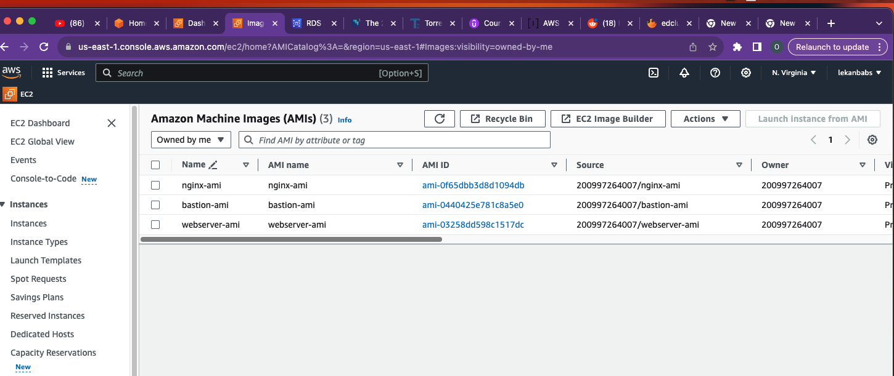

### 6. Load Balancers & Target Groups

Create **two Application Load Balancers** — one **external** (internet-facing) and one **internal** — and the **target groups** they route to.

> **Target groups** route requests to registered targets (EC2 instances) on a specified protocol/port and continuously run **health checks**. If a target fails its health check, traffic is withheld from it, so only healthy servers receive requests.

| Load Balancers | Target Group | Nginx TG |
|----------------|--------------|----------|
| 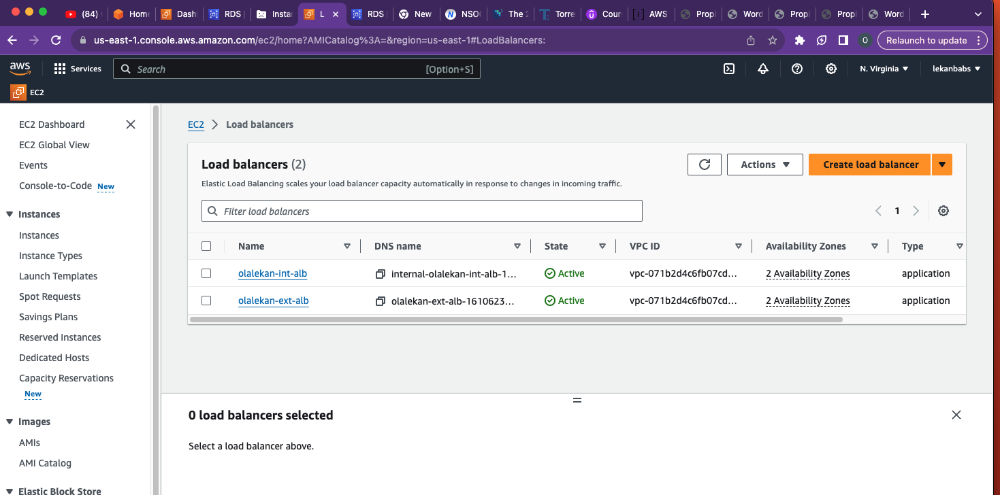 | 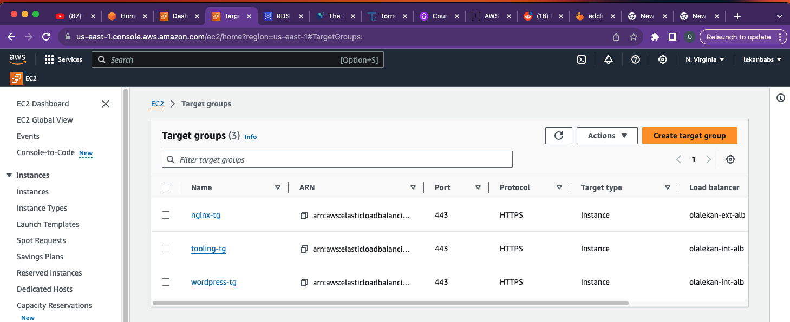 | 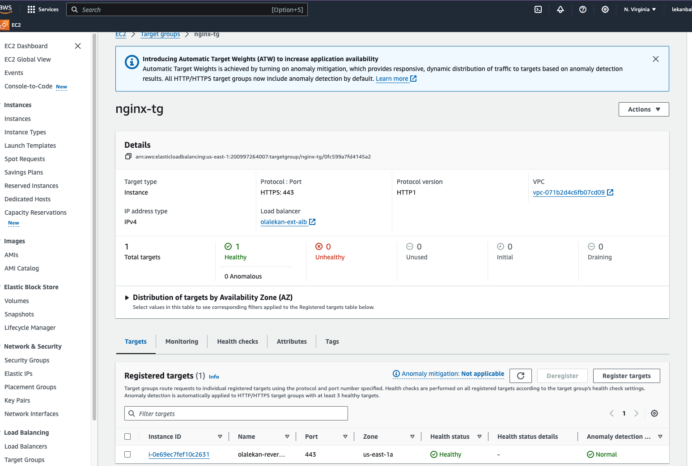 |

| Tooling TG | WordPress TG |
|------------|--------------|
| 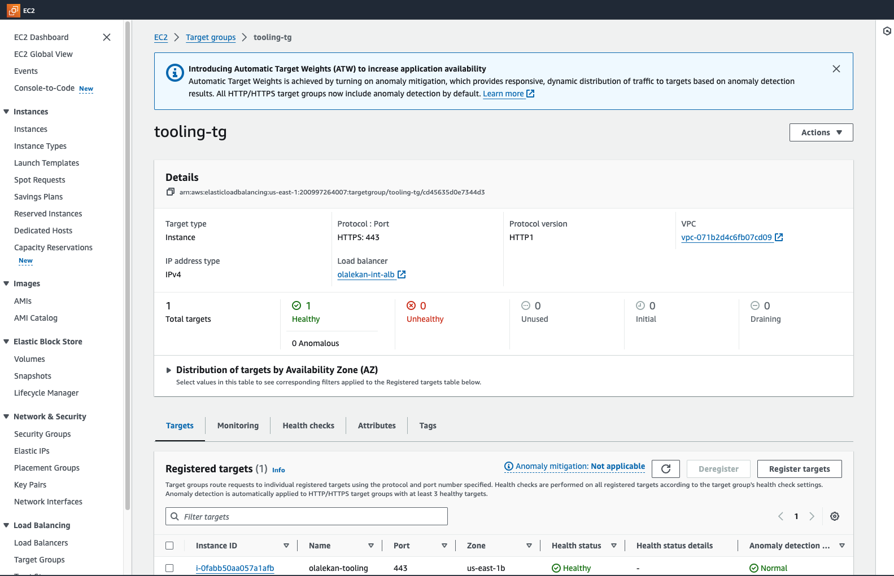 | 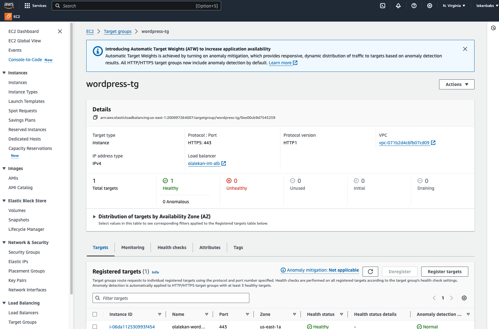 |

### 7. Data Layer (RDS + KMS + EFS)

- Create a **KMS key** for encryption at rest.
- Create a **Multi-AZ RDS (MySQL)** instance using that KMS key, with an RDS subnet group spanning the private data subnets.
- Store the RDS endpoint, username and password in an **AWS Secrets Manager** secret so the web servers can retrieve them at boot instead of hard-coding credentials.
- Create an **EFS** file system with **access points** for the WordPress and Tooling sites, so both web tiers share persistent storage.

| KMS Key | RDS Instance | RDS Subnet Group |
|---------|--------------|------------------|
| 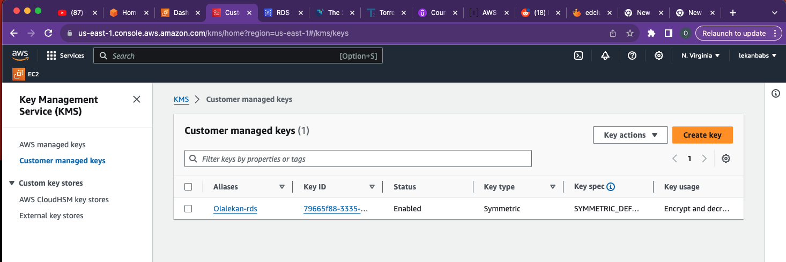 | 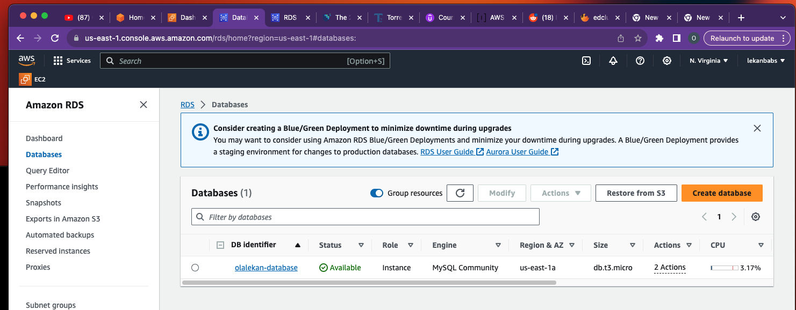 | 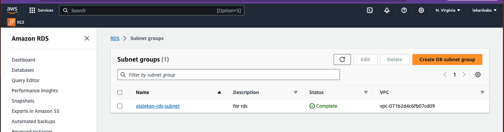 |

| EFS | Access Point | Database |
|-----|--------------|----------|
| 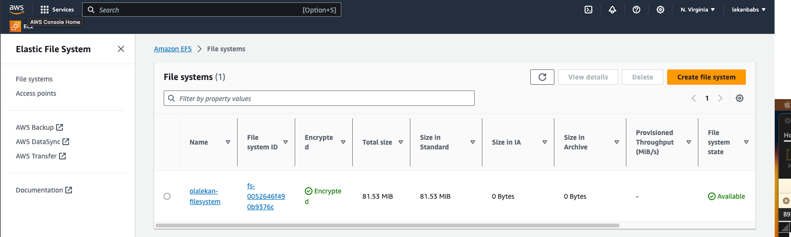 | 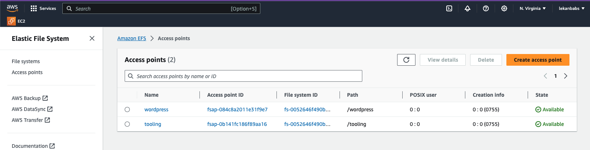 | 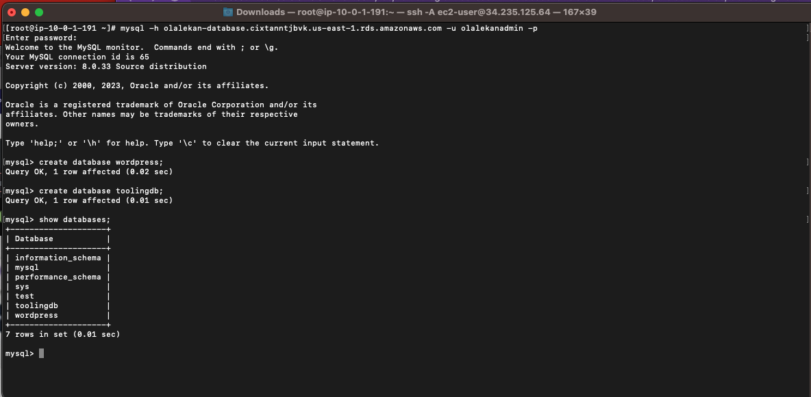 |

### 8. Launch Templates & User Data

Create **launch templates** from the AMIs and attach **user-data** scripts so each new instance configures itself on boot. The web-server scripts pull the database credentials from **AWS Secrets Manager** at launch — no secrets are baked into the AMI or committed to source control.

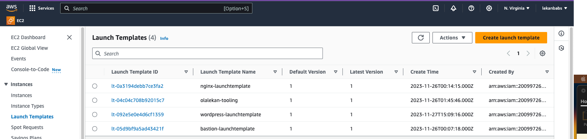

<details>
<summary><strong>Bastion user data</strong></summary>

```bash
#!/bin/bash
yum install -y mysql git tmux ansible
```
</details>

<details>
<summary><strong>Nginx user data</strong></summary>

```bash
#!/bin/bash
yum install -y nginx
systemctl enable --now nginx
git clone https://github.com/babslekson/ACS-project-config.git
mv /ACS-project-config/reverse.conf /etc/nginx/
mv /etc/nginx/nginx.conf /etc/nginx/nginx.conf-distro
cd /etc/nginx/
touch nginx.conf
sed -n 'w nginx.conf' reverse.conf
systemctl restart nginx
rm -rf reverse.conf /ACS-project-config
```
</details>

<details>
<summary><strong>Tooling user data</strong></summary>

```bash
#!/bin/bash
# --- Fetch DB credentials from AWS Secrets Manager (instance IAM role required) ---
REGION=us-east-1
SECRET_ID=prod/tooling/db
yum install -y jq awscli
SECRET=$(aws secretsmanager get-secret-value --secret-id "$SECRET_ID" --region "$REGION" --query SecretString --output text)
DB_HOST=$(echo "$SECRET" | jq -r .host)
DB_USER=$(echo "$SECRET" | jq -r .username)
DB_PASS=$(echo "$SECRET" | jq -r .password)
DB_NAME=toolingdb

# --- Mount shared storage (EFS) ---
mkdir /var/www/
mount -t efs -o tls,accesspoint=<TOOLING_ACCESS_POINT> <EFS_ID>:/ /var/www/

# --- Web server + PHP ---
yum install -y httpd
systemctl enable --now httpd
yum module reset php -y
yum module enable php:remi-7.4 -y
yum install -y php php-common php-mbstring php-opcache php-intl php-xml php-gd php-curl php-mysqlnd php-fpm php-json
systemctl enable --now php-fpm

# --- Deploy the Tooling app ---
git clone https://github.com/babslekson/tooling.git
mkdir -p /var/www/html
cp -R /tooling/html/* /var/www/html/
mysql -h "$DB_HOST" -u "$DB_USER" -p"$DB_PASS" "$DB_NAME" < /tooling/tooling-db.sql

# --- Point the app at RDS using the fetched credentials ---
cd /var/www/html/
touch healthstatus
sed -i "s/mysql.tooling.svc.cluster.local/$DB_HOST/g; s/'admin', 'admin', 'tooling'/'$DB_USER', '$DB_PASS', '$DB_NAME'/g" functions.php
chcon -t httpd_sys_rw_content_t /var/www/html/ -R
systemctl restart httpd
```
</details>

<details>
<summary><strong>WordPress user data</strong></summary>

```bash
#!/bin/bash
# --- Fetch DB credentials from AWS Secrets Manager (instance IAM role required) ---
REGION=us-east-1
SECRET_ID=prod/wordpress/db
yum install -y jq awscli
SECRET=$(aws secretsmanager get-secret-value --secret-id "$SECRET_ID" --region "$REGION" --query SecretString --output text)
DB_HOST=$(echo "$SECRET" | jq -r .host)
DB_USER=$(echo "$SECRET" | jq -r .username)
DB_PASS=$(echo "$SECRET" | jq -r .password)
DB_NAME=wordpressdb

# --- Mount shared storage (EFS) ---
mkdir /var/www/
mount -t efs -o tls,accesspoint=<WORDPRESS_ACCESS_POINT> <EFS_ID>:/ /var/www/

# --- Web server + PHP ---
yum install -y httpd
systemctl enable --now httpd
yum module reset php -y
yum module enable php:remi-7.4 -y
yum install -y php php-common php-mbstring php-opcache php-intl php-xml php-gd php-curl php-mysqlnd php-fpm php-json
systemctl enable --now php-fpm

# --- Install WordPress ---
wget http://wordpress.org/latest.tar.gz
tar xzvf latest.tar.gz && rm -rf latest.tar.gz
cp wordpress/wp-config-sample.php wordpress/wp-config.php
mkdir -p /var/www/html/
cp -R /wordpress/* /var/www/html/
cd /var/www/html/
touch healthstatus

# --- Inject the fetched credentials into wp-config.php ---
sed -i "s/localhost/$DB_HOST/g" wp-config.php
sed -i "s/username_here/$DB_USER/g" wp-config.php
sed -i "s/password_here/$DB_PASS/g" wp-config.php
sed -i "s/database_name_here/$DB_NAME/g" wp-config.php
chcon -t httpd_sys_rw_content_t /var/www/html/ -R
systemctl restart httpd
```
</details>

> **Note:** The web-server user-data scripts read the RDS host, username and password from AWS Secrets Manager (`prod/tooling/db` and `prod/wordpress/db`) using the instance's IAM role. The EFS IDs and access points shown as `<...>` are placeholders — substitute your own values.

### 9. Auto Scaling Groups

Create **Auto Scaling Groups** for the Bastion, Nginx, Tooling, and WordPress tiers, each tied to its launch template and target group, so capacity scales automatically and unhealthy instances are replaced.

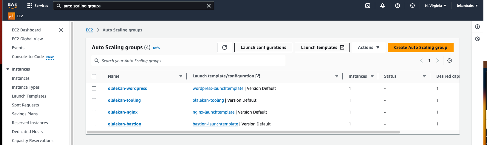

### 10. DNS with Route 53 & TLS with ACM

- Request a public certificate from **AWS Certificate Manager**.
- Create **Route 53 records** (in the hosted zone) pointing to the **external ALB**.

| Certificate Manager | Route 53 | Hosted Zone |
|---------------------|----------|-------------|
| 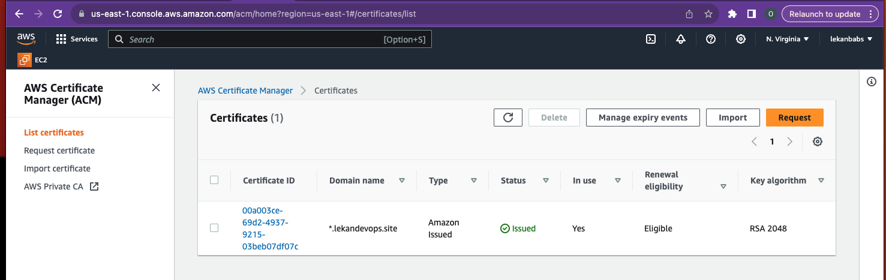 | 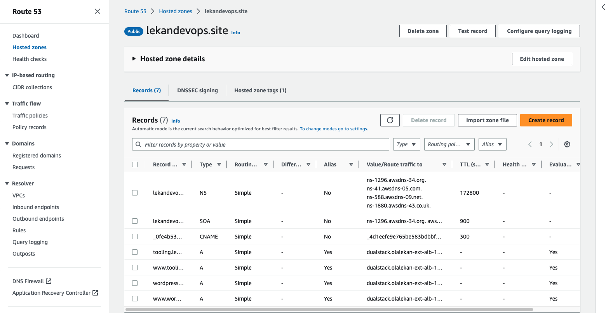 | 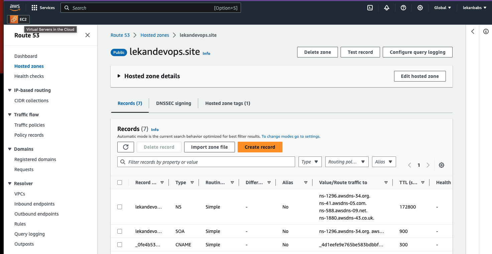 |

### 11. Verification

Confirm the target groups report **healthy**, the EC2 instances are **running**, and both sites load in the browser.

| WordPress Site | Tooling Site |
|----------------|--------------|
| 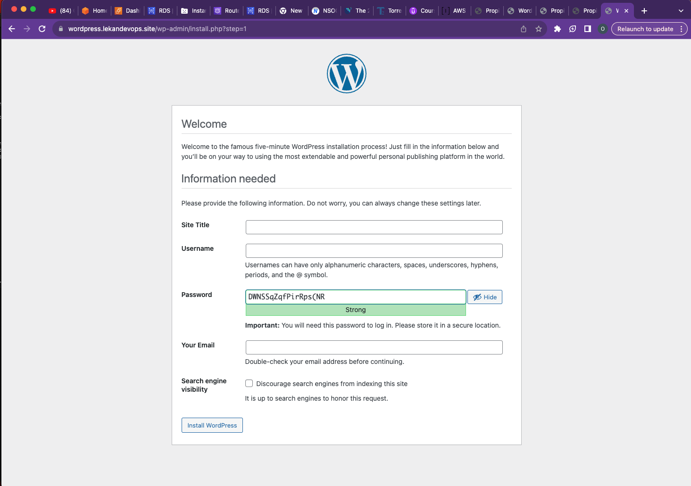 | 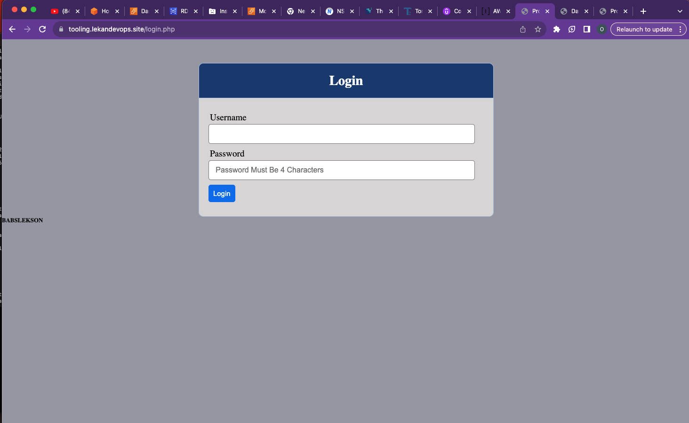 |

Both websites are up and running.

---

## Key Concepts Explained

**Reverse proxy (Nginx):** Sits between clients and the web servers. Clients only ever talk to Nginx; Nginx decides which backend serves the request. This hides internal servers, centralizes TLS, and provides a single, hardened entry point.

**External vs. internal load balancer:** The external ALB is the public front door (talks to Nginx). The internal ALB is private and only routes traffic from Nginx to the WordPress/Tooling web servers — keeping the application tier off the public internet.

**Public vs. private subnets:** Public subnets have a route to the Internet Gateway (Nginx, Bastion, external ALB live here). Private subnets do not — the web servers and database live here and reach the internet only outbound, via the NAT Gateway.

**Bastion host:** A hardened jump server in the public subnet, the single approved path for administrators to SSH into private instances.

**Secrets Manager + IAM roles:** Database credentials live in AWS Secrets Manager, and each web server assumes an IAM role granting read access to its secret. The credentials are fetched at boot, so nothing sensitive is stored in the AMI, the launch template, or this repository.

**EFS access points:** Application-specific entry points into one shared EFS file system, so WordPress and Tooling each get an isolated directory on the same durable storage.

**Multi-AZ RDS + KMS:** The database is replicated to a standby in a second AZ for failover, and encrypted at rest with a customer-managed KMS key.

---

## Challenges & Lessons Learned

_A few of the trickier parts of building this out:_

- Getting **SELinux** to allow Apache to connect to RDS and mount EFS (the `setsebool` flags).
- Correctly chaining the **two load balancers** so Nginx forwards to the internal ALB.
- Wiring **launch templates + user data + target groups + ASGs** together so instances self-configure and register automatically.
- Moving database credentials out of the user-data and into **Secrets Manager**, backed by an IAM instance role.

---

## Repository Structure

```
AWS-Cloud-Solution-Using-Reverse-Proxy-Technology_P15/
├── README.md
└── pbl15/            # Screenshots of every provisioned AWS resource
```
