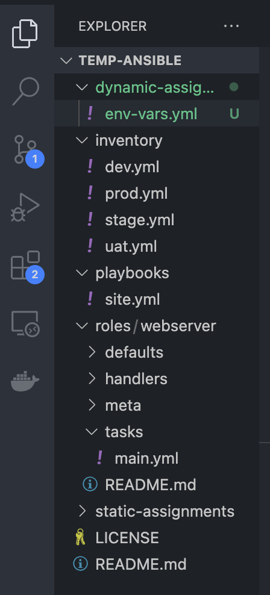
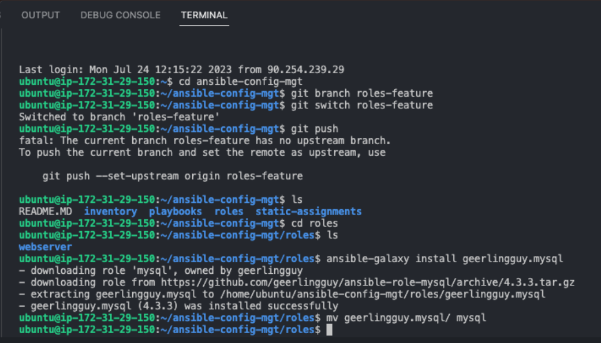

# ANSIBLE DYNAMIC ASSIGNMENTS(Include) 
In this project we will introduce [dynamic assignemts](https://docs.ansible.com/ansible/latest/user_guide/playbooks_reuse.html#includes-dynamic-re-use) by using `include` module

This module is different to the `static` module. static assignments use `import` ansible module while dynamic assignments use `include`

When the *import* module is used, all statements are pre-processed at the time playbooks are *parsed*. Meaning, when you execute `site.yml` playbook, Ansible will process all the playbooks referenced during the time it is parsing the statements. This also means that, during actual execution, if any statement changes, such statements will not be considered. Hence, it is static.
On the other hand, when include module is used, all statements are processed only during execution of the playbook. Meaning, after the statements are parsed, any changes to the statements encountered during execution will be used.
Take note that in most cases it is recommended to use static assignments for playbooks, because it is more reliable. With dynamic ones, it is hard to debug playbook problems due to its dynamic nature. However, you can use dynamic assignments for environment specific variables as we will be introducing in this project.

### introducting Dynamic Assignment into our structure 
Create a new branch in your ansible config and name it dynamic-assignments.

In ansible repo create a new folder, name it dynamic-assignments. inside this folder, a file env-vars.yml will be created. we will instruct site.yml to include this in the playbook later 


### Edit the env-vars.yml file 
```bash
---
- name: Collate Variablesfrom env specific file, if it exists
  hosts: all
  tasks: 
    - name: Looping through list of available files
      include_vars: "{{ item }}"
      with_first_found:
        - files:
            - dev.yml
            - stage.yml
            - prod.yml
            - uat.yml
          paths:
            - "{{ playbook_dir }}/../env-vars"
      tags:
        - always
```
Update the site.yml file with Dynamic Assignments
```bash
---
- hosts: all
- name: Include dynamic variables 
  tasks:
  import_playbook: ../static-assignments/common.yml 
  include: ../dynamic-assignments/env-vars.yml
  tags:
    - always

-  hosts: webservers
- name: Webserver assignment
  import_playbook: ../static-assignments/webservers.yml
```
  ### Download Ansible Roles(mysql, nginx and apache)
  ```bash
  cd roles/

ansible-galaxy install geerlingguy.mysql

mv geerlingguy.mysql/ mysql
# Note the role might install in a different location

ansible-galaxy install geerlingguy.nignx

mv geerlingguy.nignx/ nignx

ansible-galaxy install geerlingguy.apache

mv geerlingguy.apache/ apache
```


### Configure the roles according to the README.md files in the installed roles
To select the load balancer to be used. both Nginx and Apache can not be used simultaneously
- in the defaults/main.yml of the nginx role add the variable below 
```bash
enable_nginx_lb: false
load_balancer_is_required: false
```
- In the defaults/main.yml of the apache role add the variable below 
```bash
enable_apache_lb: false
load_balancer_is_required: false
```
- To activate the loas balancer add the variables below in the respective environments env-vars file
```bash
enable_nginx_lb: true
load_balancer_is_required: false
###The same must work with apache LB, so you can switch it by setting respective environmental variable to true and other to false.
```
- In the static-assignments/loadbalancers.yml file add the instructions below
```bash
---
- name: Load Balancer Set Up
  hosts: lb
  roles:
    - { role: nginx, when: enable_nginx_lb and load_balancer_is_required }
    - { role: apache, when: enable_apache_lb and load_balancer_is_required }
```
- In the playbooks/site.yml file add the instructions below
```bash
- name: Import load balancer assignment
  import_playbook: ../static-assignments/lb.yml
  when: load_balancer_is_required
```

