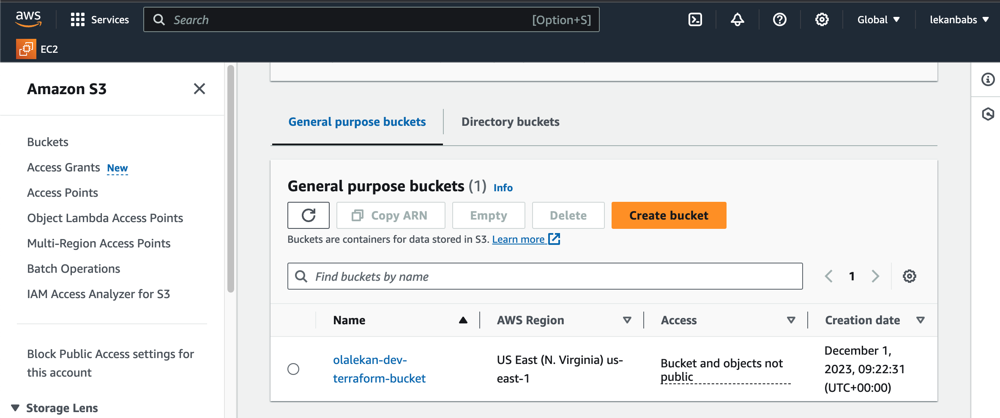
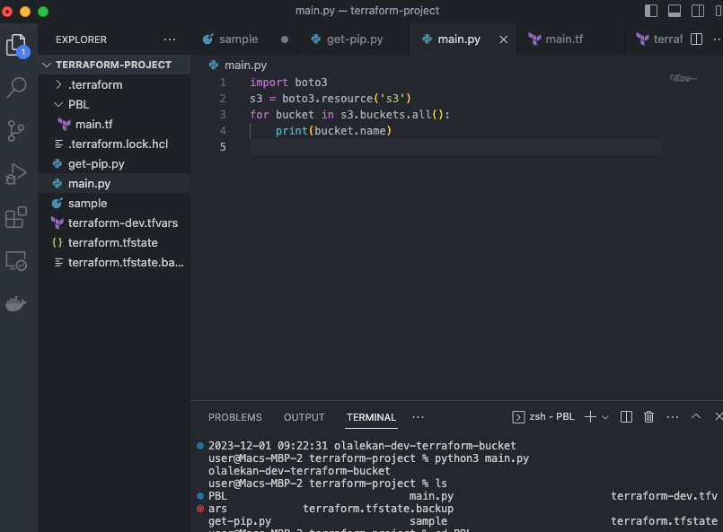
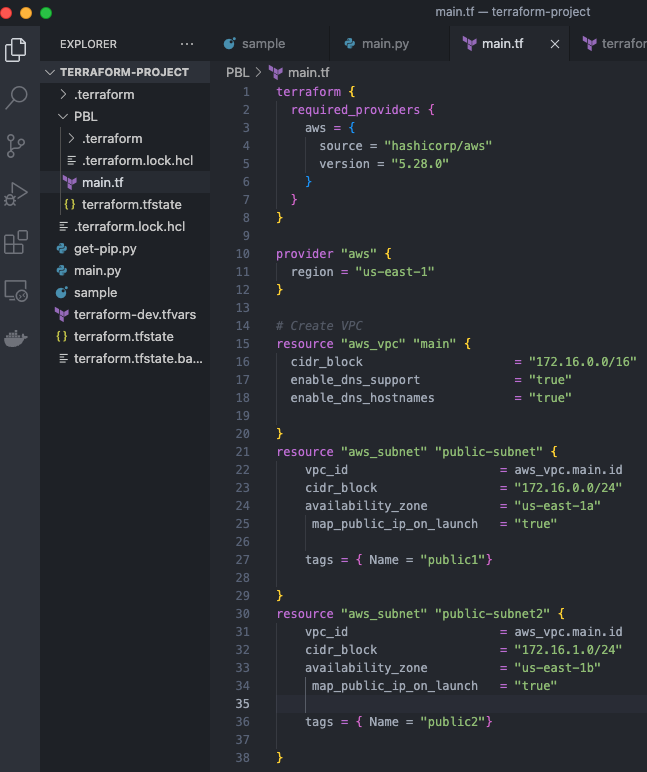
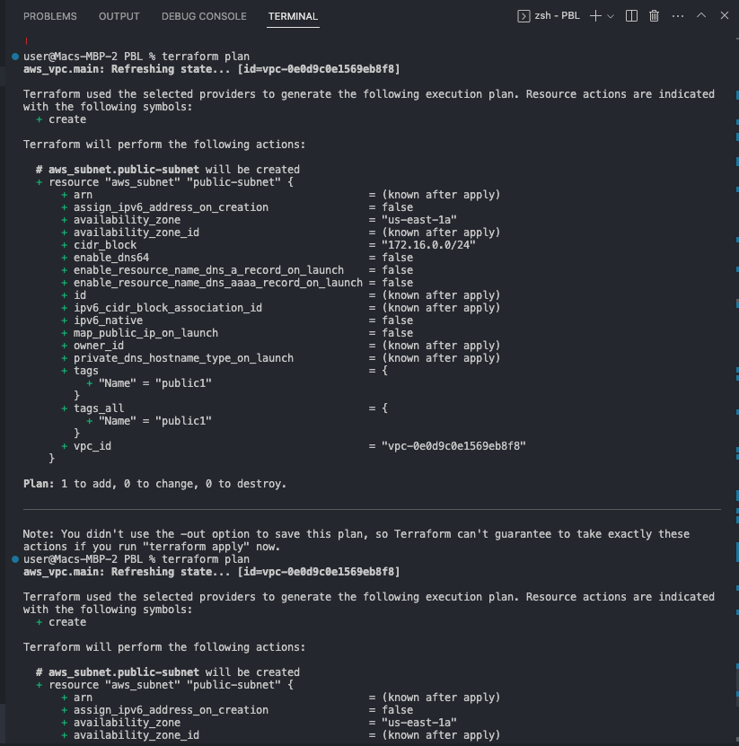
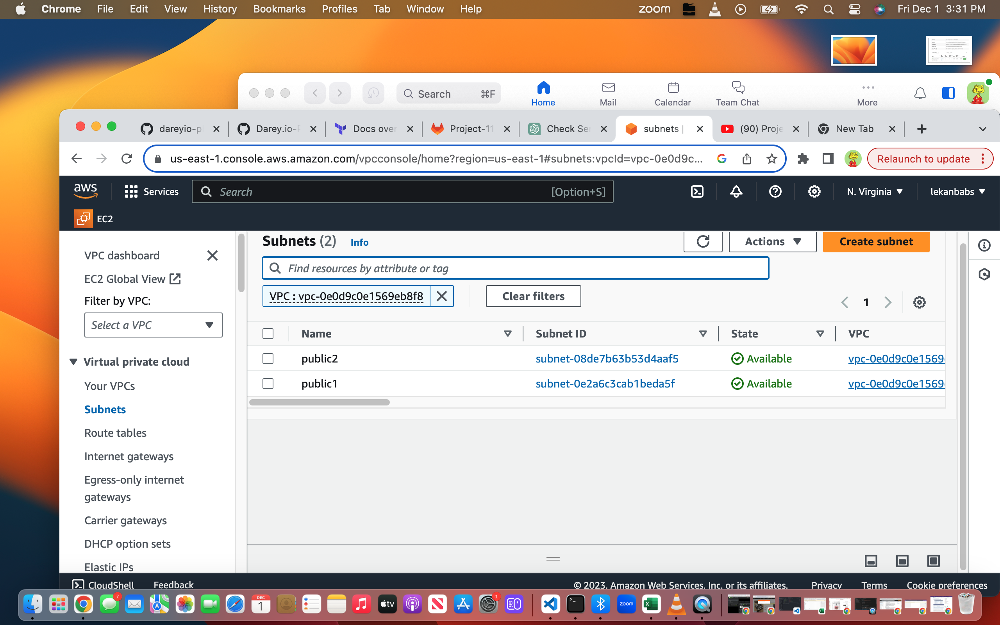
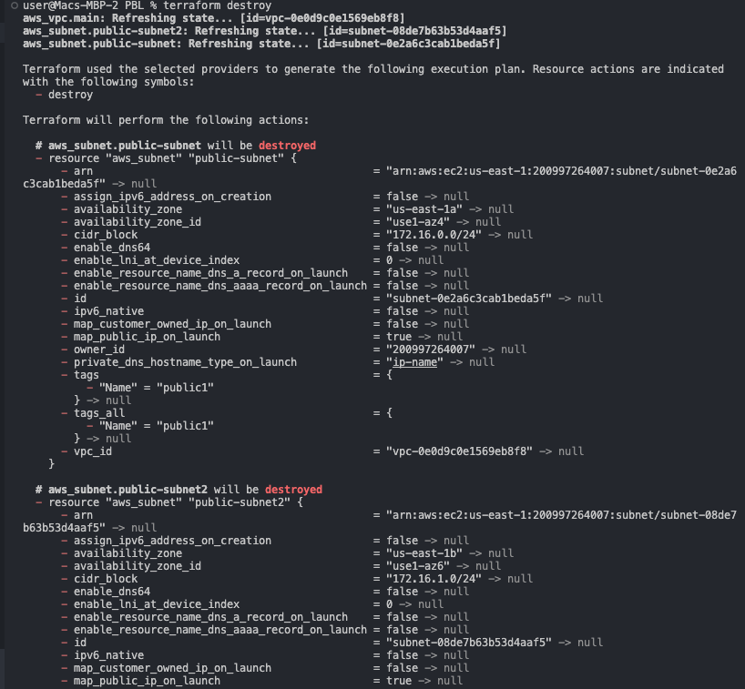
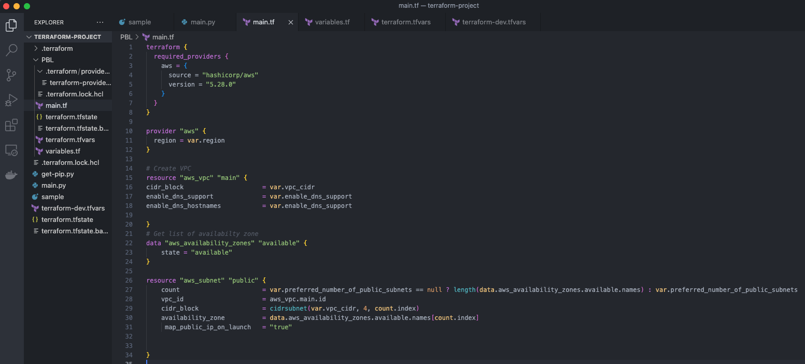
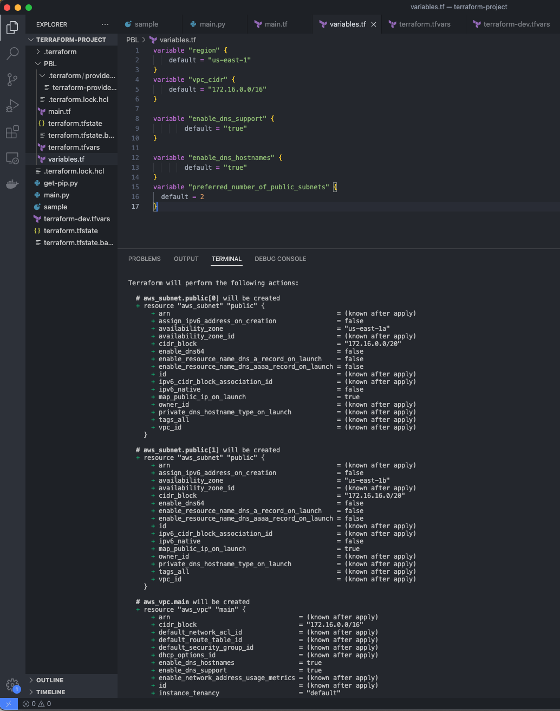
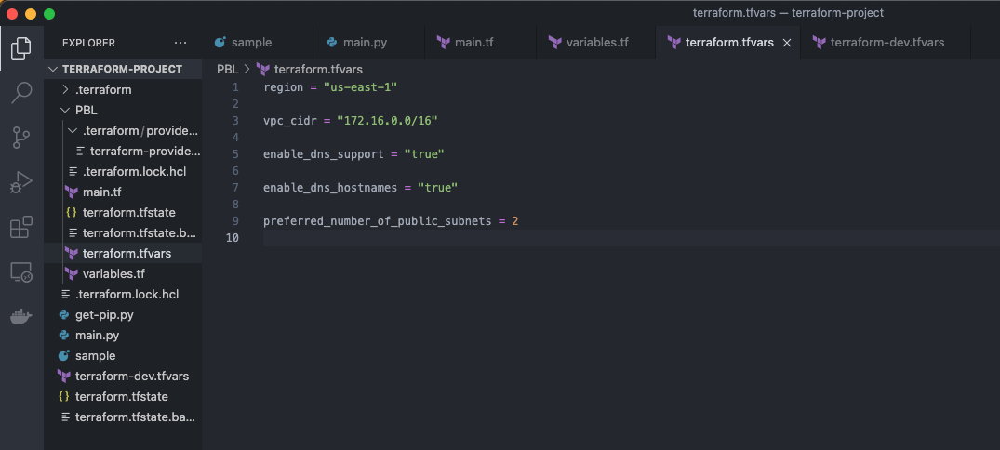

# AUTOMATE INFRACTURE WITH IAC USING TERRAFORM PART 1
----

- ### Setup Workspace
---
- #### Create S3 bucket
Create S3 bucket to store store terrfaorm state file



- Install and configure AWS CLI
```bash
# On Ubuntu
sudo apt install awscli
```
- #### Install python SDK (boto3)
```bash
pip install boto3
```
- #### Access the bucket using AWS CLI



### Create VPC 
---
- Create a directory and a file named main.tf in the directory
- Write the Provider and resources section
```bash
terraform {
  required_providers {
    aws = {
      source = "hashicorp/aws"
      version = "5.28.0"
    }
  }
}

provider "aws" {
  region = "us-east-1"
}

# Create VPC
resource "aws_vpc" "main" {
cidr_block                     = "172.16.0.0/16"
enable_dns_support             = "true"
enable_dns_hostnames           = "true"
```
- Run **terraform init**
- **Terraform plan**
- **Terraform apply**

---
### Create Subnets
```bash
# Create public subnets1
    resource "aws_subnet" "public-subnet" {
    vpc_id                     = aws_vpc.main.id
    cidr_block                 = "172.16.0.0/24"
    map_public_ip_on_launch    = true
    availability_zone          = "eu-east-1a"

    tags = { Name = "public1" } }

# Create public subnet2
    resource "aws_subnet" "public-subnet2" {
    vpc_id                     = aws_vpc.main.id
    cidr_block                 = "172.16.1.0/24"
    map_public_ip_on_launch    = true
    availability_zone          = "eu-east-1b" 
    
    tags = { Name = "public2"} }
```





- Run **terraform destroy**


### Refactor the code 
---
To refactor the code you have to

- Fix Hard coded values
- Fix multiple resource blocks
- Make the cidr_block dynamic
- Introduce variables.tf and terraform.tfvars




 


-----
Countinuation 

