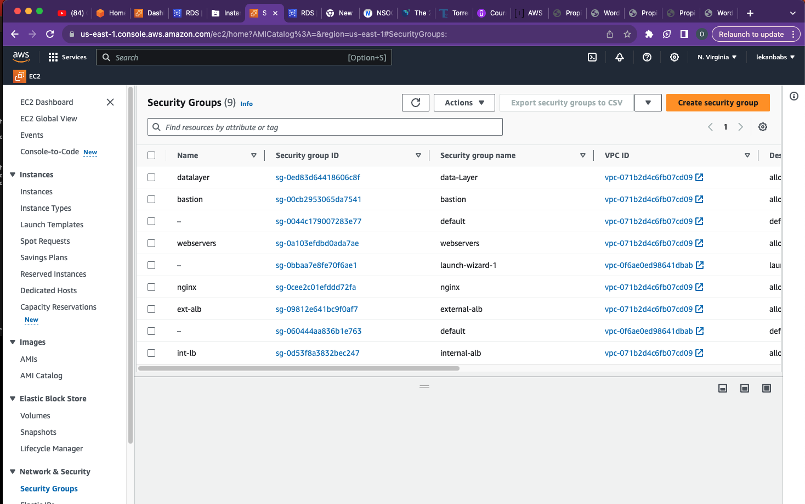

# AUTOMATE INFRASTRUCTURE WITH IAC USING TERRAFORM PART 1
---

## Setup up workspace


Currently, we will be using the local workspace on our PC to manage Terraform state files. As the project progresses, we will transition to more robust state management practices by leveraging cloud services: 
 S3 for terraform state files, dynamo db for state locking and also make use of terraform cloud workspace


## Setup Networking of the Architecture

<p align="left">
  
</p>

According to our architectural design, we require 6 subnets:

2 public subnets
2 private subnets for webservers
2 private subnets for data layer

- Create a directory and a file named main.tf in the directory
- Write the Provider and resources section
```bash
terraform {
  required_providers {
    aws = {
      source = "hashicorp/aws"
      version = "5.28.0"
    }
  }
}

provider "aws" {
  region = "var.region"
}

# Create VPC
resource "aws_vpc" "main" {
cidr_block                     = var.vpc_cidr
enable_dns_support             = var.enable_dns_support
enable_dns_hostnames           = var.enable_dns_hostnames
```
---

- Availability_zone

We need to create a single resource block that can dynamically create resources without specifying multiple blocks. Terraform has a functionality that allows us to pull data which exposes information to use. We will explore the use of Terraform's Data Sources to fetch information outside of Terraform.
```bash
data "aws_availablility_zones" "available" {
        state = "available"
        }
```
- Create 2 public subnets
```bash
resource "aws_subnet" "public" {
    count                      = var.preferred_number_of_public_subnets == null ? length(data.aws_availability_zones.available.names) : var.preferred_number_of_public_subnets
    vpc_id                     = aws_vpc.main.id
    cidr_block                 = [for i in range(2, 5, 2) : cidrsubnet(var.vpc_cidr, 8, i)]
    availability_zone          = data.aws_availability_zones.available.names[count.index]
     map_public_ip_on_launch   = "true"
```
Dynamic count
The `count` determines how many subnets will be created. 
- If `var.preferred_number_of_public_subnets` is `null`, the number of subnets created will be equal to the number of available availability zones (length(data.aws_availability_zones.available.names)).
- If `var.preferred_number_of_public_subnets` is specified, that value will be used to determine the number of subnets.

CIDR block

`[for i in range (2,5,2)]` takes care of creating the subnets with even numbers according to our architecture. Its output will be `[2,4]`
cidr_block is dynamic by making use of a function  cidrsubnet(). it accepts 3 paramenters `cidrsubnet(prefix, newbits, netnum)`
 The `prefix` parameter must be given in CIDR notation, same as for VPC.
The `newbits` parameter is the number of additional bits with which to extend the prefix. For example, if given a prefix ending with /16 and a newbits value of 4, the resulting subnet address will have length /20
The `netnum` parameter is a whole number that can be represented as a binary integer with no more than newbits binary digits, which will be used to populate the additional bits added to the prefix

- Create 4 private subnets
```bash
resource "aws_subnet" "private" {
    count                      = var.preferred_number_of_private_subnets == null ? length(data.aws_availability_zones.available.names) : var.preferred_number_of_private_subnets
    vpc_id                     = aws_vpc.main.id
    cidr_block                 = cidrsubnet(var.vpc_cidr, 8, count.index + 2)
    availability_zone          = data.aws_availability_zones.available.names[count.index]


    tags = merge (
        var.tags, 
        {
            Name = format("%s-private-subnet-%s", var.name , count.index +  1)
        },
    )
}

```
- Create `internet_gateway.tf`file
- Create Internet Gateway
```bash
resource "aws_internet_gateway" "igw" {
  vpc_id = aws_vpc.main.id

   tags = merge( var.tags,
    {
    Name = format ("%s-IGW", var.name )
    },
  )
}
```
- Create `nat_gateway.tf`file
- Create one NAT Gateway, create Elastic IP and attach it to NAT gateway

```bash
resource "aws_eip" "nat-eip" {
    
     depends_on = [aws_internet_gateway.igw]
}
resource "aws_nat_gateway" "nat" {
  allocation_id = aws_eip.nat-eip.id
  subnet_id     = element(aws_subnet.public.*.id, 0 )
    depends_on = [aws_internet_gateway.igw]

  tags = merge( var.tags,
    {
    Name = format ("%s-NAT", var.name )
    },
  )
}
```
Create `route_tables.tf` file
Create private route table
```bash
resource "aws_route_table" "private-rtb" {
  vpc_id = aws_vpc.main.id

 tags = merge( var.tags,
    {
    Name = format ("%s-private-rtb", var.name )
    },
  )
}


```
- Create route for the private route table and attach a nat gateway to it 
```bash
resource "aws_route" "private-rt" {
  route_table_id            = aws_route_table.private-rtb.id
  destination_cidr_block    = "0.0.0.0/0"
  nat_gateway_id          = aws_nat_gateway.nat.id
  ```
  - Associate all private subnets to private route table
  ```bash
  resource "aws_route_table_association" "private-route-association" {
  count = length ( aws_subnet.private[*].id)
  subnet_id      = element (aws_subnet.private[*].id , count.index)
  route_table_id = aws_route_table.private-rtb.id
  }
 ```
 - Create public route table
 ```bash
 resource "aws_route_table" "public-rtb" {
  vpc_id = aws_vpc.main.id

 tags = merge( var.tags,
    {
    Name = format ("%s-public-rtb", var.name )
    },
  )
}
 ```
- Create route for the public route table and attach a internet gateway to it 
```bash
resource "aws_route" "public-rt" {
  route_table_id            = aws_route_table.public-rtb.id
  destination_cidr_block    = "0.0.0.0/0"
  gateway_id                = aws_internet_gateway.igw.id
}

```
 - Associate all public subnets to public route table
```bash
resource "aws_route_table_association" "public-route-association" {
  count = length ( aws_subnet.public[*].id)
  subnet_id      = element (aws_subnet.public[*].id , count.index)
  route_table_id = aws_route_table.public-rtb.id
}
```
# Setup identity and Access Management 
- Create `roles.tf`
- Create `AssumeRole`
```bash
resource "aws_iam_role" "ec2_instance_role" {
name = "ec2_instance_role"
  assume_role_policy = jsonencode({
    Version = "2012-10-17"
    Statement = [
      {
        Action = "sts:AssumeRole"
        Effect = "Allow"
        Sid    = ""
        Principal = {
          Service = "ec2.amazonaws.com"
        }
      },
    ]
  })
  
  tags = merge(
    var.tags,
    {
      Name = "aws assume role"
    },
  )
}
```
- Create `IAM Policy` for this role 
```bash 
resource "aws_iam_policy" "policy" {
  name        = "ec2_instance_policy"
  description = "A test policy"
  policy = jsonencode({
    Version = "2012-10-17"
    Statement = [
      {
        Action = [
          "ec2:Describe*",
        ]
        Effect   = "Allow"
        Resource = "*"
      },
    ]

  })

  tags = merge(
    var.tags,
    {
      Name =  "aws assume policy"
    },
  )
}
```
- Attach the `Policy` to the `IAM Role`
```bash
resource "aws_iam_role_policy_attachment" "test-attach" {
        role       = aws_iam_role.ec2_instance_role.name
        policy_arn = aws_iam_policy.policy.arn
    }
```

### Create Security Group
- Create `security group`
- Create `ext-alb-sg` to allow HTTP and HTTPS traffic
```bash

# external load balancer
resource "aws_security_group" "elb" {
  name        = "external load balancer"
  description = "Allow all Tls inbound traffic"
  vpc_id      = aws_vpc.main.id

  ingress {
    description      = "http"
    from_port        = 80
    to_port          = 80
    protocol         = "tcp"
    cidr_blocks      = ["0.0.0.0/0"]
   
  }

ingress {
    description      = "https"
    from_port        = 443
    to_port          = 443
    protocol         = "tcp"
    cidr_blocks      = ["0.0.0.0/0"]
    }

egress {
    from_port        = 0
    to_port          = 0
    protocol         = "-1"
    cidr_blocks      = ["0.0.0.0/0"]
 
  }

   tags = merge(
    var.tags,
    {
        Name = format ("%s-elb-sg" , var.name ) 
    },
    ) 
}
```
- Create `bastion-sg` to SSH access
```bash
# bastion
resource "aws_security_group" "bastion" {
  name        = "bastion"
  description = "Allow ssh to bastion"
  vpc_id      = aws_vpc.main.id

  ingress {
    description      = "ssh"
    from_port        = 22
    to_port          = 22
    protocol         = "tcp"
    cidr_blocks      = ["0.0.0.0/0"]
   
  }

egress {
    from_port        = 0
    to_port          = 0
    protocol         = "-1"
    cidr_blocks      = ["0.0.0.0/0"]
 
  }

  tags = merge(
    var.tags,
    {
        Name = format ("%s-bastion-sg" , var.name ) 
    },
    ) 
}
```
- Create `Nginx-sg` to allow HTTP and HTTPS traffic from the external load balancer and SSH access from bastion instance

```bash
#  Nginx Reverse proxy server security group
resource "aws_security_group" "reverseproxy" {
  name        = "reverse-proxy"
  vpc_id      = aws_vpc.main.id

egress {
    from_port        = 0
    to_port          = 0
    protocol         = "-1"
    cidr_blocks      = ["0.0.0.0/0"]
 
  }

   tags = merge(
    var.tags,
    {
        Name = format ("%s-reverseproxy-sg" , var.name ) 
    },
    ) 
}
resource "aws_security_group_rule" "inbound-elb" {
  description       = " allow traffic from elb" 
  type              = "ingress"
  from_port         = 443
  to_port           = 443
  protocol          = "tcp"
  source_security_group_id = aws_security_group.elb.id
  security_group_id = aws_security_group.reverseproxy.id
}

resource "aws_security_group_rule" "inbound-bastion" {
  description       = " allow traffic from bastion"   
  type              = "ingress"
  from_port         = 22
  to_port           = 22
  protocol          = "tcp"
  source_security_group_id = aws_security_group.bastion.id
   security_group_id = aws_security_group.reverseproxy.id
}
```
- Create `Int-alb-sg` to allow HTTP and HTTPS traffic from the nginx reverse proxy server
```bash
# internal load balancer security group

resource "aws_security_group" "ilb" {
  name        = "internal-lb"
  vpc_id      = aws_vpc.main.id

egress {
    from_port        = 0
    to_port          = 0
    protocol         = "-1"
    cidr_blocks      = ["0.0.0.0/0"]
 
  }

   tags = merge(
    var.tags,
    {
        Name = format ("%s-ilb-sg" , var.name ) 
    },
    ) 
}
resource "aws_security_group_rule" "inbound-reverse-proxy" {
  description       = " allow traffic from proxy"   
  type              = "ingress"
  from_port         = 443
  to_port           = 443
  protocol          = "tcp"
  source_security_group_id = aws_security_group.reverseproxy.id
  security_group_id = aws_security_group.ilb.id
}
```
- Create `Webserver-sg` to allow traffic from the internal load balancer and bastion
```bash

resource "aws_security_group" "webservers" {
  name        = "webservers"
  vpc_id      = aws_vpc.main.id

egress {
    from_port        = 0
    to_port          = 0
    protocol         = "-1"
    cidr_blocks      = ["0.0.0.0/0"]
 
  }

   tags = merge(
    var.tags,
    {
        Name = format ("%s-webservers-sg" , var.name ) 
    },
    ) 
}
resource "aws_security_group_rule" "inbound-ilb" {
  description       = " allow traffic from ilb"   
  type              = "ingress"
  from_port         = 443
  to_port           = 443
  protocol          = "tcp"
  source_security_group_id = aws_security_group.ilb.id
  security_group_id = aws_security_group.webservers.id
}

resource "aws_security_group_rule" "inbound-bast" {
  description       = " allow traffic from bastion"  
  type              = "ingress"
  from_port         = 22
  to_port           = 22
  protocol          = "tcp"
  source_security_group_id = aws_security_group.bastion.id
   security_group_id = aws_security_group.webservers.id
}
```
- Create `datalayer-sg` to allow traffic from webserver on nfs and mysql port and bastion host on mysql
```bash
resource "aws_security_group" "datalayer" {
  name        = "datalayer"
  vpc_id      = aws_vpc.main.id

egress {
    from_port        = 0
    to_port          = 0
    protocol         = "-1"
    cidr_blocks      = ["0.0.0.0/0"]
 
  }

   tags = merge(
    var.tags,
    {
        Name = format ("%s-datalayer-sg" , var.name ) 
    },
    ) 
}
resource "aws_security_group_rule" "inbound-webserver-rds" {
  description       = " allow webservers access rds "   
  type              = "ingress"
  from_port         = 3306
  to_port           = 3306
  protocol          = "tcp"
  source_security_group_id = aws_security_group.webservers.id
  security_group_id = aws_security_group.datalayer.id
}

resource "aws_security_group_rule" "inbound-webservers-efs" {
  description       = " allow webservers to access efs"   
  type              = "ingress"
  from_port         = 2049
  to_port           = 2049
  protocol          = "tcp"
  source_security_group_id = aws_security_group.webservers.id
  security_group_id = aws_security_group.datalayer.id
}

resource "aws_security_group_rule" "inbound-bast-rds" {
  description       = " allow access from bastion to rds"   
  type              = "ingress"
  from_port         = 3306
  to_port           = 3306
  protocol          = "tcp"
  source_security_group_id = aws_security_group.bastion.id
  security_group_id = aws_security_group.datalayer.id
}
```
### Create certificate from ACM
- Create `cert.tf` file
- create certificate using wildcard

```bash
resource "aws_acm_certificate" "lekandevops" {
  domain_name       = "*.lekandevops.site"
  validation_method = "DNS"

  validation_option {
    domain_name       = "*.lekandevops.site"
    validation_domain = "lekandevops.site"
  }
}
resource "aws_route53_zone" "lekandevops" {
  name = "lekandevops.site"
}

resource "aws_route53_record" "lekandevops" {
  for_each = {
    for dvo in aws_acm_certificate.lekandevops.domain_validation_options : dvo.domain_name => {
      name   = dvo.resource_record_name
      record = dvo.resource_record_value
      type   = dvo.resource_record_type
    }
  }

  allow_overwrite = true
  name            = each.value.name
  records         = [each.value.record]
  ttl             = 60
  type            = each.value.type
  zone_id         = aws_route53_zone.lekandevops.zone_id
}

       
output "name_servers" {
  value = aws_route53_zone.lekandevops.name_servers
}
```
- Validate the certificate
```bash
 resource "aws_acm_certificate_validation" "lekandevops" {
        certificate_arn         = aws_acm_certificate.lekandevops.arn
        validation_record_fqdns = [for record in aws_route53_record.lekandevops : record.fqdn]
        }
```
- create records 
```bash
# for tooling
resource "aws_route53_record" "tooling" {
  zone_id = aws_route53_zone.lekandevops.zone_id
  name    = "tooling.lekandevops.site"
  type    = "A"

  alias {
    name                   = aws_lb.elb.dns_name
    zone_id                = aws_lb.elb.zone_id
    evaluate_target_health = true
  }
}


# create records for wordpress
resource "aws_route53_record" "wordpress" {
  zone_id = aws_route53_zone.lekandevops.zone_id
  name    = "wordpress.lekandevops.site"
  type    = "A"

  alias {
    name                   = aws_lb.elb.dns_name
    zone_id                = aws_lb.elb.zone_id
    evaluate_target_health = true
  }
}
```
### Create an external application load balancer, internal load balancer 
- create `alb.tf` file
- create `ext-alb` to balancr traffic between the nginx instances
```bash 
resource "aws_lb" "elb" {
  name               = var.name
  internal           = false
  ip_address_type    = "ipv4"
  load_balancer_type = "application"
  security_groups    = [var.elb-sg]
  subnets            = [for subnet in aws_subnet.public : subnet.id]

  

  tags = merge(var.tags,
        {
            Name = format("%s-elb", var.name)
            },
  )
}
#  target group for reverse proxy
resource "aws_lb_target_group" "nginx-tg" {
  name         = "nginx-tg"
  port         = 443
  protocol     = "HTTPS"
  vpc_id       = aws_vpc.main.id
  health_check {
    enabled             = "true"
    interval            =  10
    path                = "/healthcheck"
    port                = 443
    protocol            = "HTTPS"
    timeout             = 5
    unhealthy_threshold = 2
    healthy_threshold   = 5
    } 
}

 # Route traffic from external load balancer to reverse proxy target group

resource "aws_lb_listener" "elb-listener" {
  load_balancer_arn = aws_lb.elb.arn
  port              = "443"
  protocol          = "HTTPS"
  certificate_arn   = aws_acm_certificate.lekandevops.arn

  default_action {
    type             = "forward"
    target_group_arn = aws_lb_target_group.nginx-tg.arn
  }
}

resource "aws_lb" "ilb" {

  name               = "ilb"
  internal           = "true"
  ip_address_type    = "ipv4"
  load_balancer_type = "application"
  security_groups    = [aws_security_group.ilb.id]
  subnets            = [aws_subnet.private[0].id, aws_subnet.private[1].id]

  

  tags = {
    Environment = "production"
  }
}
# target group for tooling
resource "aws_lb_target_group" "tooling-tg" {
  name         = "tooling-tg"
  port         = 443
  protocol     = "HTTPS"
  vpc_id       = aws_vpc.main.id
  health_check {
    enabled             = "true"
    interval            =  10
    path                = "/healthcheck"
    port                = 443
    protocol            = "HTTPS"
    timeout             = 5
    unhealthy_threshold = 2
    healthy_threshold   = 5
    } 
}

# target group for wordpress
resource "aws_lb_target_group" "wordpress-tg" {
  name         = "wordpress-tg"
  port         = 443
  protocol     = "HTTPS"
  vpc_id       = aws_vpc.main.id
  health_check {
    enabled             = "true"
    interval            =  10
    path                = "/healthcheck"
    port                = 443
    protocol            = "HTTPS"
    timeout             = 5
    unhealthy_threshold = 2
    healthy_threshold   = 5
    } 
}


resource "aws_lb_listener" "web-listener" {
  load_balancer_arn = aws_lb.ilb.arn
  port              = "443"
  protocol          = "HTTPS"
  certificate_arn   = aws_acm_certificate.lekandevops.arn

  default_action {
    type             = "forward"
    target_group_arn = aws_lb_target_group.wordpress-tg.arn
  }
}

resource "aws_lb_listener_rule" "tooling-listener" {
  listener_arn = aws_lb_listener.web-listener.arn
  priority     = 99

  action {
    type             = "forward"
    target_group_arn = aws_lb_target_group.tooling-tg.arn
  }

  condition {
    host_header {
      values = ["tooling.lekandevops.site"]
    }
  }
}
```
Create an Auto scaling groups
- Create `asg-bastion-nginx.tf` file
- Create SNS topic for the autoscaling groups
```bash
# creating sns topic for all the auto scaling groups
resource "aws_sns_topic" "olalekan-sns" {
 name = "Default_CloudWatch_Alarms_Topic"
}
# creating notification for all the auto scaling groups
resource "aws_autoscaling_notification" "olalekan_notifications" {
 group_names = [
   aws_autoscaling_group.bastion.name,
   aws_autoscaling_group.reverseproxy.name,
   aws_autoscaling_group.wordpress.name,
   aws_autoscaling_group.tooling.name,
 ]
 notifications = [
   "autoscaling:EC2_INSTANCE_LAUNCH",
   "autoscaling:EC2_INSTANCE_TERMINATE",
   "autoscaling:EC2_INSTANCE_LAUNCH_ERROR",
   "autoscaling:EC2_INSTANCE_TERMINATE_ERROR",
 ]

 topic_arn = aws_sns_topic.olalekan-sns.arn
}
resource "random_shuffle" "az_list" {
 input        = data.aws_availability_zones.available.names
}

# create launch template for bastion
resource "aws_launch_template" "bastion" {
  name = "bastion"
  image_id = var.ami
  instance_type = "t2.micro"
  key_name = var.keypair
  monitoring {
    enabled = true
    }
  placement {
    availability_zone = "random_shuffle.az_list.result"
  }
  iam_instance_profile {
   name = aws_iam_instance_profile.ip.id
  }
  lifecycle {
   create_before_destroy = true
 }
  vpc_security_group_ids = [aws_security_group.bastion.id]

  tag_specifications {
    resource_type = "instance"

    tags = {
      Name = "test"
    }
  }

  user_data = filebase64("${path.module}/bastion.sh")
}

# autoscaling for bastion
resource "aws_autoscaling_group" "bastion" {
  name                      = "bastion-asg"
  max_size                  = 2
  min_size                  = 1
  health_check_grace_period = 300
  health_check_type         = "ELB"
  desired_capacity          = 1
  force_delete              = true
  vpc_zone_identifier       = [aws_subnet.public[0].id, aws_subnet.public[1].id]
  launch_template  {
                      id      = aws_launch_template.bastion.id
                      version = "$Latest"
                    }
  tag {
    key                 = "Name"
    value               = "bastion-launch-template"
    propagate_at_launch = true
  }
}

# launch template for reverseproxy
resource "aws_launch_template" "reverseproxy" {
  name = "reverseproxy"
  image_id = var.ami
  instance_type = "t2.micro"
  key_name = var.keypair
  monitoring {
    enabled = true
  }
  placement {
    availability_zone = "random_shuffle.az_list.result"
  }
  vpc_security_group_ids = [aws_security_group.reverseproxy.id]

  tag_specifications {
    resource_type = "instance"

    tags = {
      Name = "test"
    }
  }

  user_data = filebase64("${path.module}/reverseproxy.sh")
}

# autoscaling for reverse proxy
resource "aws_autoscaling_group" "reverseproxy" {
  name                      = "reverseproxy-asg"
  max_size                  = 2
  min_size                  = 1
  health_check_grace_period = 300
  health_check_type         = "ELB"
  desired_capacity          = 1
  force_delete              = true
  vpc_zone_identifier       = [aws_subnet.public[0].id, aws_subnet.public[1].id]
  launch_template  {
                      id      = aws_launch_template.reverseproxy.id
                      version = "$Latest"
  }
  tag {
    key                 = "Name"
    value               = "reverseproxy-launch-template"
    propagate_at_launch = true
  }
}
# attaching autoscaling group of nginx to external load balancer
resource "aws_autoscaling_attachment" "asg_attachment_reverseproxy" {
 autoscaling_group_name = aws_autoscaling_group.reverseproxy.id
 lb_target_group_arn   = aws_lb_target_group.nginx-tg.arn
}


# launch template for tooling

resource "aws_launch_template" "tooling" {
  name = "tooling"
  image_id = var.ami
  instance_type = "t2.micro"
  key_name = var.keypair
  monitoring {
    enabled = true
  }
  placement {
    availability_zone = "random_shuffle.az_list.result"
  }
  vpc_security_group_ids = [aws_security_group.webservers.id]
  tag_specifications {
    resource_type = "instance"

    tags = {
      Name = "test"
    }
  }

  user_data = filebase64("${path.module}/tooling.sh")
}
# autoscaling for tooling
resource "aws_autoscaling_group" "tooling" {
  name                      = "tooling-asg"
  max_size                  = 2
  min_size                  = 1
  health_check_grace_period = 300
  health_check_type         = "ELB"
  desired_capacity          = 1
  force_delete              = true
  vpc_zone_identifier       = [aws_subnet.private[0].id, aws_subnet.private[1].id]
  launch_template  {
                      id      = aws_launch_template.tooling.id
                      version = "$Latest"
  }
  
  tag {
    key                 = "Name"
    value               = "tooling-launch-template"
    propagate_at_launch = true
  }
}
# attaching autoscaling group of  tooling application to internal loadbalancer
resource "aws_autoscaling_attachment" "asg_attachment_tooling" {
  autoscaling_group_name = aws_autoscaling_group.tooling.id
  lb_target_group_arn   = aws_lb_target_group.tooling-tg.arn
}

# launch template for wordpress
resource "aws_launch_template" "wordpress" {
  name = "wordpress"
  image_id = var.ami
  instance_type = "t2.micro"
  key_name = var.keypair
  monitoring {
    enabled = true
  }
  placement {
    availability_zone = "random_shuffle.az_list.result"
  }
  vpc_security_group_ids = [aws_security_group.webservers.id]

  tag_specifications {
    resource_type = "instance"

    tags = {
      Name = "test"
    }
  }

  user_data = filebase64("${path.module}/wordpress.sh")
}

# autoscaling for wordpress
resource "aws_autoscaling_group" "wordpress" {
  name                      = "wordpress-asg"
  max_size                  = 2
  min_size                  = 1
  health_check_grace_period = 300
  health_check_type         = "ELB"
  desired_capacity          = 1
  force_delete              = true

 
  vpc_zone_identifier       = [aws_subnet.private[0].id, aws_subnet.private[1].id]
  launch_template  {
                      id      = aws_launch_template.wordpress.id
                      version = "$Latest" 
  }
  tag {
    key                 = "Name"
    value               = "wordpress-launch-template"
    propagate_at_launch = true
  }
}
# attaching autoscaling group of wordpress application to internal loadbalancer
resource "aws_autoscaling_attachment" "asg_attachment_wordpress" {
  autoscaling_group_name = aws_autoscaling_group.wordpress.id
  lb_target_group_arn   = aws_lb_target_group.wordpress-tg.arn
  ```
  ### Create Elastic file system
  - Create `efs.tf` file
  - Create a key from AWS key management System
  ```bash
  resource "aws_kms_key" "kms-key" {
  description = "KMS key"
  policy      = <<EOF
  {
  "Version": "2012-10-17",
  "Id": "kms-key-policy",
  "Statement": [
    {
      "Sid": "Enable IAM User Permissions",
      "Effect": "Allow",
      "Principal": { "AWS": "arn:aws:iam::${var.account_no}:user/terraform-user" },
      "Action": "kms:*",
      "Resource": "*"
    }
  ]
}
EOF
}

# create key alias
resource "aws_kms_alias" "alias" {
  name          = "alias/kms"
  target_key_id = aws_kms_key.kms-key.key_id
}
```
- Create Elastic file system
```bash
resource "aws_efs_file_system" "efs" {
  creation_token = "efs"
  encrypted      = true
  kms_key_id     = aws_kms_key.kms-key.arn

  tags = {
    Name = "efs"
  }
}

resource "aws_efs_mount_target" "efs-mtg-1" {
  file_system_id = aws_efs_file_system.efs.id
  subnet_id      = aws_subnet.private[0].id 
  security_groups = [aws_security_group.datalayer.id]
}
resource "aws_efs_mount_target" "efs-mtg-2" {
  file_system_id = aws_efs_file_system.efs.id
  subnet_id      = aws_subnet.private[1].id
  security_groups = [aws_security_group.datalayer.id]
}


resource "aws_efs_access_point" "tooling" {
  file_system_id = aws_efs_file_system.efs.id
  root_directory {
                    path = "/tooling"
                    creation_info {

                        owner_gid  = 0 
                        owner_uid  = 0
                        permissions = 0775
                    }
                 }
  posix_user {
                gid = 0
                uid = 0
  }

}

resource "aws_efs_access_point" "wordpress" {
  file_system_id = aws_efs_file_system.efs.id
  root_directory {
                    path = "/wordpress"
                    creation_info {

                        owner_gid  = 0 
                        owner_uid  = 0
                        permissions = 0775
                    }
                 }
  posix_user {
                gid = 0
                uid = 0
  }

}
```
### Create Relational Database
- Create `rds.tf` file
- Create subnet group for the RDS instance
```bash
resource "aws_db_instance" "rds" {


  allocated_storage    = 10
  db_name              = "test"
  engine               = "mysql"
  engine_version       = "5.7"
  instance_class       = "db.t3.micro"
  username             = var.master_username
  password             = var.master_password
  parameter_group_name = "default.mysql5.7"
  skip_final_snapshot  = true
  db_subnet_group_name = aws_db_subnet_group.rds-subnet-dbgroup.id
  vpc_security_group_ids = [aws_security_group.datalayer.id]


}

resource "aws_db_subnet_group" "rds-subnet-dbgroup" {
  name       = "rds-subnet-dbgroup"
  subnet_ids = [aws_subnet.private[2].id, aws_subnet.private[3].id]

  tags = {
    Name = "rds-subnet-dbgroup"
  }
}
```
- Terraform apply



