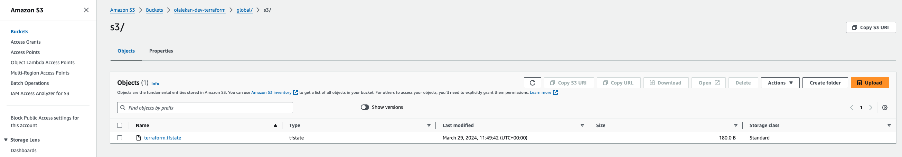
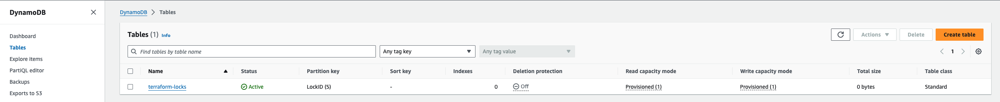
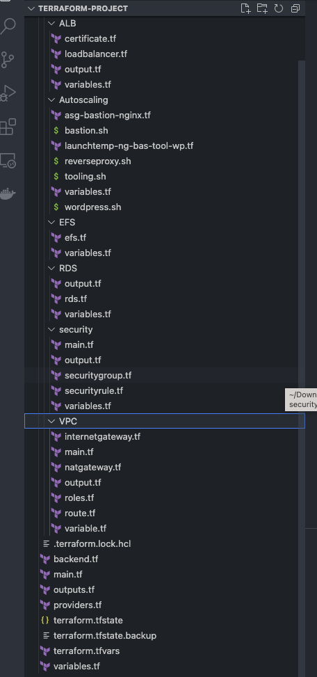
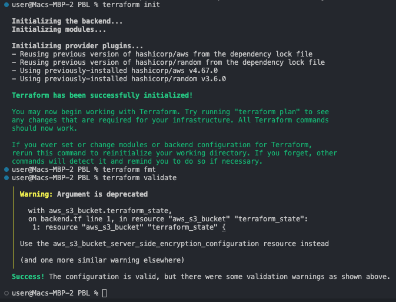
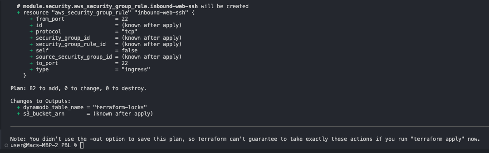

### AUTOMATE INFRACTRUCTURE WITH IAC USING TERRAFORM PART 2
----
### Introducting Backend on S3
- Create a file and name it backend.tf
``` bash
resource "aws_s3_bucket" "terraform_state" {
  bucket = "olalekan-dev-terraform"
  # Enable versioning so we can see the full revision history of our state files
  versioning {
    enabled = true
  }
  # Enable server-side encryption by default
  server_side_encryption_configuration {
    rule {
      apply_server_side_encryption_by_default {
        sse_algorithm = "AES256"
      }
    }
  }
}

```
- Create a DynamoDB table for the lock file and consistency checks
```bash
resource "aws_dynamodb_table" "terraform_locks" {
  name         = "terraform-locks"
  billing_mode = "PAY_PER_REQUEST"
  hash_key     = "LockID"
  attribute {
    name = "LockID"
    type = "S"
  }
}
```
- Configure the s3 backend
```bash
terraform {
  backend "s3" {
    bucket         = "olalekan-dev-terraform"
    key            = "global/s3/terraform.tfstate"
    region         = "us-east-1"
    dynamodb_table = "terraform-locks"
    encrypt        = true
  }
}
```
- Verify the changes




#### Refactoring Terraform using Modules
- Setup the modules directory



- Run `terraform init` to initialize the modules

- Run `terraform fmt` to format the files

- Run `terraform validate` to validate codes



- Run `terraform plan`

