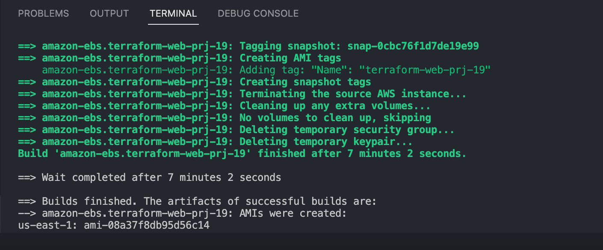
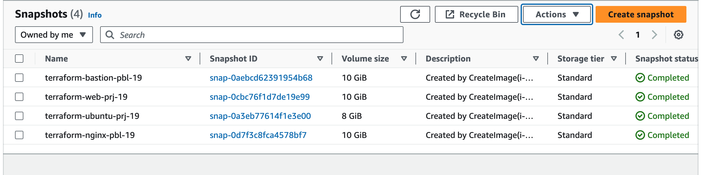
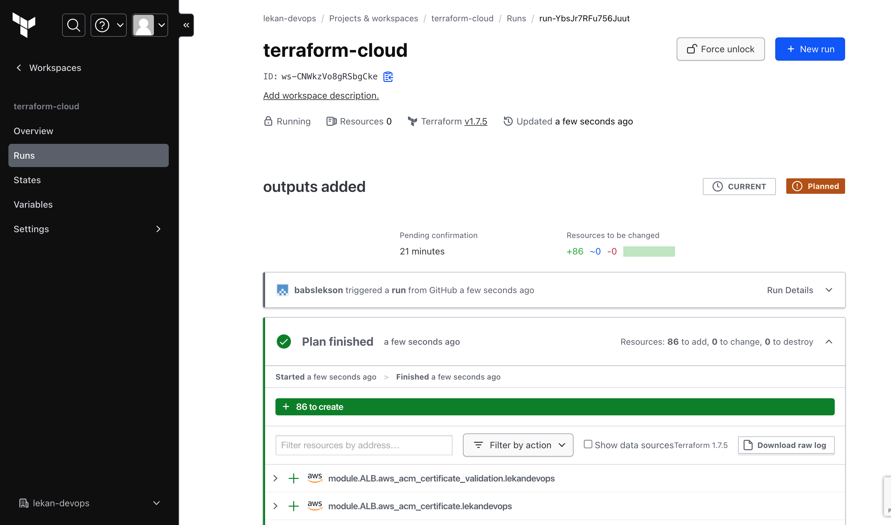

# Automate Infracture With Iac Using Terraform Part 3

In this final phase of our project, we elevate our infrastructure deployment to a more sophisticated and streamlined level. We'll integrate Terraform Cloud for enhanced collaboration and automated workflows, utilize Packer for creating custom AMIs, and implement Ansible for efficient server configuration.

Terraform Cloud is a managed service that provides you with Terraform CLI to provision infrastructure, either on demand or in response to various events

Ansible is an open-source automation tool that simplifies software provisioning, configuration management, and application deployment. It uses a declarative language to describe system configurations and automates the process of bringing servers to a desired state.

Packer is an open-source tool for creating identical machine images for multiple platforms from a single source configuration. It automates the process of creating pre-configured, consistent machine images for use in cloud environments.

## STEP 1
Le us explore how we can migrate our codes to Terraform Cloud and manage our AWS infrastructure from there:

1. Create a Terraform Cloud account
2. Create an organisation and configure a workspace
3. Use `version control workflow`

We will use version control workflow as the most common and recommended way to run Terraform commands triggered from our git repository.

Create a repository and push all your terraform cloud to the repository

4. Configure variable on 
Terraform Cloud supports two types of variables: 

`environment variables` and `Terraform variables`. Either type can be marked as sensitive, which prevents them from being displayed in the Terraform Cloud web UI and makes them write-only.

Set two environment variables: AWS_ACCESS_KEY_ID and AWS_SECRET_ACCESS_KEY, set the values that we used in previous project. These credentials will be used to privision AWS infrastructure by Terraform Cloud.

5. We are now ready to execute our Terraform scripts. 

However, as discussed in our previous project, we'll be incorporating Packer to build our images and Ansible to configure the infrastructure. This necessitates some modifications to our existing setup. To see what these changes will look like, please refer to this [repository](https://github.com/babslekson/terraform-cloud). It provides a comprehensive example of the integrated setup we're aiming for.

The files that would be added are packer-ami and ansible

6. Test automated `terraform plan`

By now, you have tried to launch plan and apply manually from Terraform Cloud web console. But since we have an integration with GitHub, the process can be triggered automatically. To observe automatic plan execution, make a modification to any of the .tf files and revisit the "Runs" tab. You'll notice that a plan is automatically initiated. However, manual approval is still required for the apply stage. To enable automatic application as well, rename the `terraform.tfvars` file to `terraform.auto.tfvars`.

