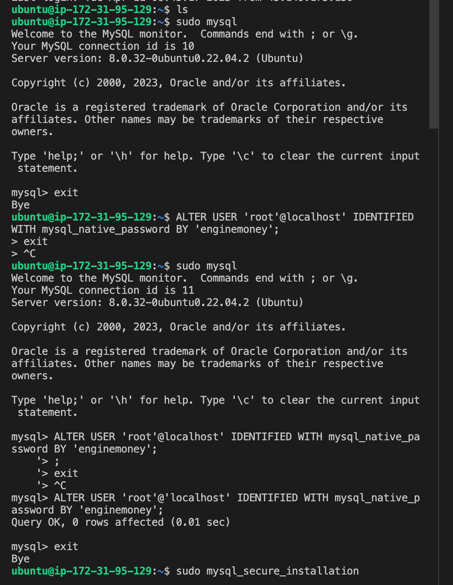
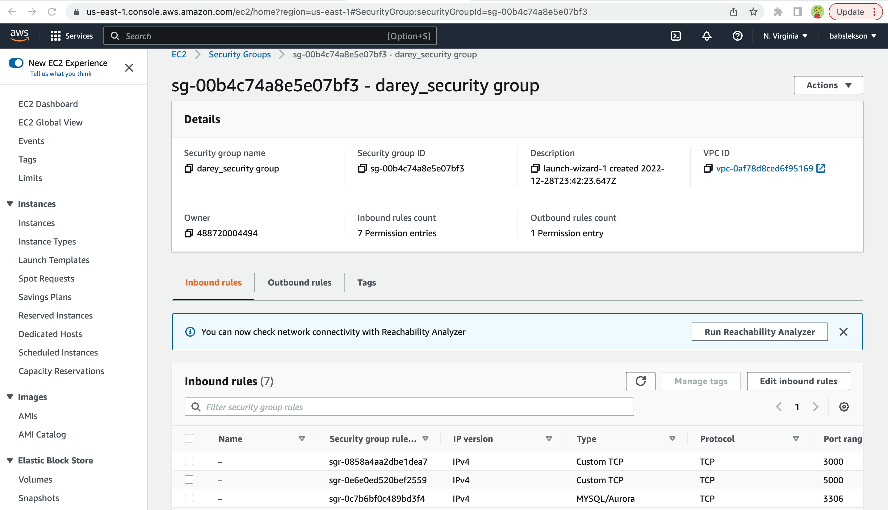
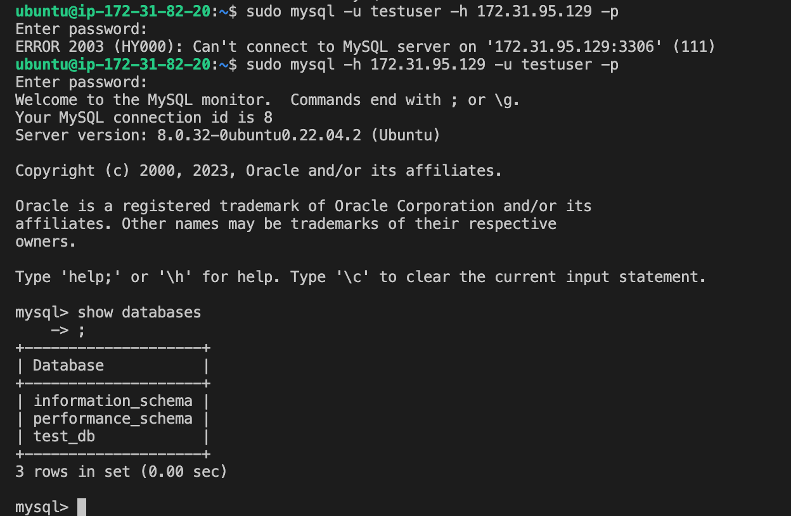

# IMPLEMENT A CLIENT SERVER ARCHITECTURE USING MYSQL DATABASE MANAGEMENT SYSTEM (DBMS)
---
## STEP 0
---
## Create two EC2 instances


## STEP 1
---
### Install mysql-server software on A (mysql server) and configure mysql
```bash
sudo apt install mysql-server

sudo mysql

sudo vim /etc/mysql/mysql.conf.d/mysqld.cnf
```


## STEP 2
---
### Open the MySQL port on the security group to allow remote access to the database


## STEP 3
---
### Install mysql-client software on A (mysql client) connect to the server
```bash
sudo apt install mysql-client

sudo mysql -u test_user -p
```

