# DEVOPS TOOLING WEBSITE SOLUTION
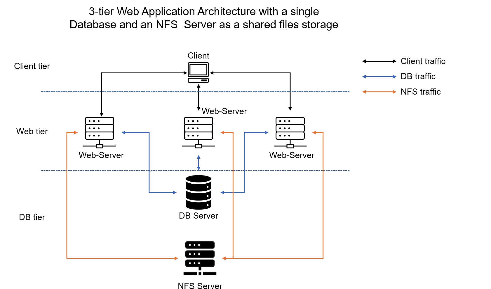

## STEP 1
---
### PREPARE NFS SERVER
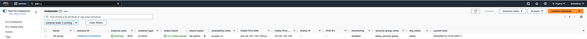

### ATTACH 3 EBS VOLUMES TO NFS Server
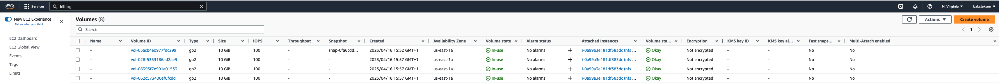

### CONNECT TO THE NFS SERVER INSTANCE AND CREATE A SINGLE LOGICAL VOLUME FOR THE 3 VOLUMES

```bash
# Inspect blockdevices attached to the server
lsblk

# Check mount points and free space
df -h

# Partition the 3 volumes as Linux LVM
sudo gdisk /dev/xvdf
sudo gdisk /dev/xvdg
sudo gdisk /dev/xvdh
```

```bash
# Check the new configured partitions
lsblk

# Install lvm2
sudo yum install lvm2

# Check available
sudo lvmdiskscan

# Mark each of the 3 volumes as physcal volume to be used by LVM
sudo pvcreate /dev/xvdf1
sudo pvcreate /dev/xvdg1
sudo pvcreate /dev/xvdh1

# Verify the physical volumes has been created successfully
sudo pvs

# Add all Physical volumes to one Volume Group
sudo vgcreate webdata-vg /dev/xvdf1 /dev/xvdg1 /dev/xvdh1

# Verify the Volume Group has been created
sudo vgs

# Create two Logical Volumes from the Volume Group
sudo lvcreate -n lv-apps -L 9G nfs-vg
sudo lvcreate -n lv-logs -L 9G nfs-vg
sudo lvcreate -n lv-opt  -L 9G nfs-vg

# Verify the Logical Volumes have been created
sudo lvs

# Verify the entire Setup
sudo vgdisplay -v
sudo lsblk
```
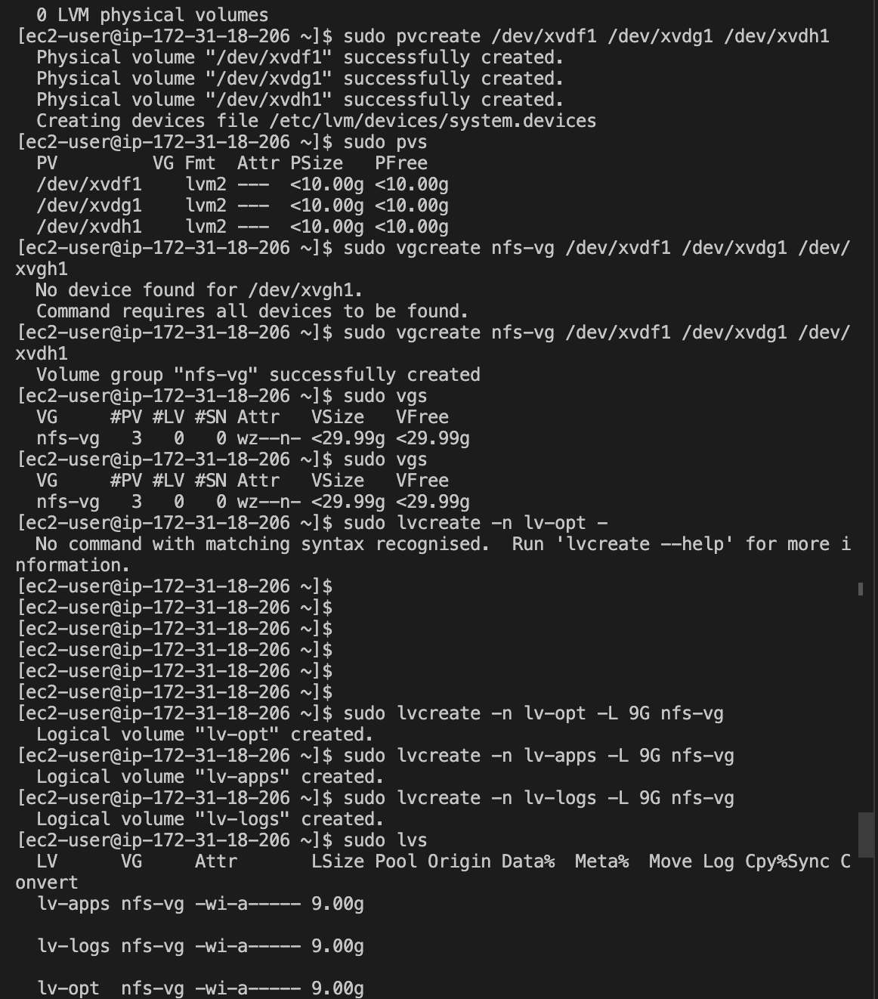
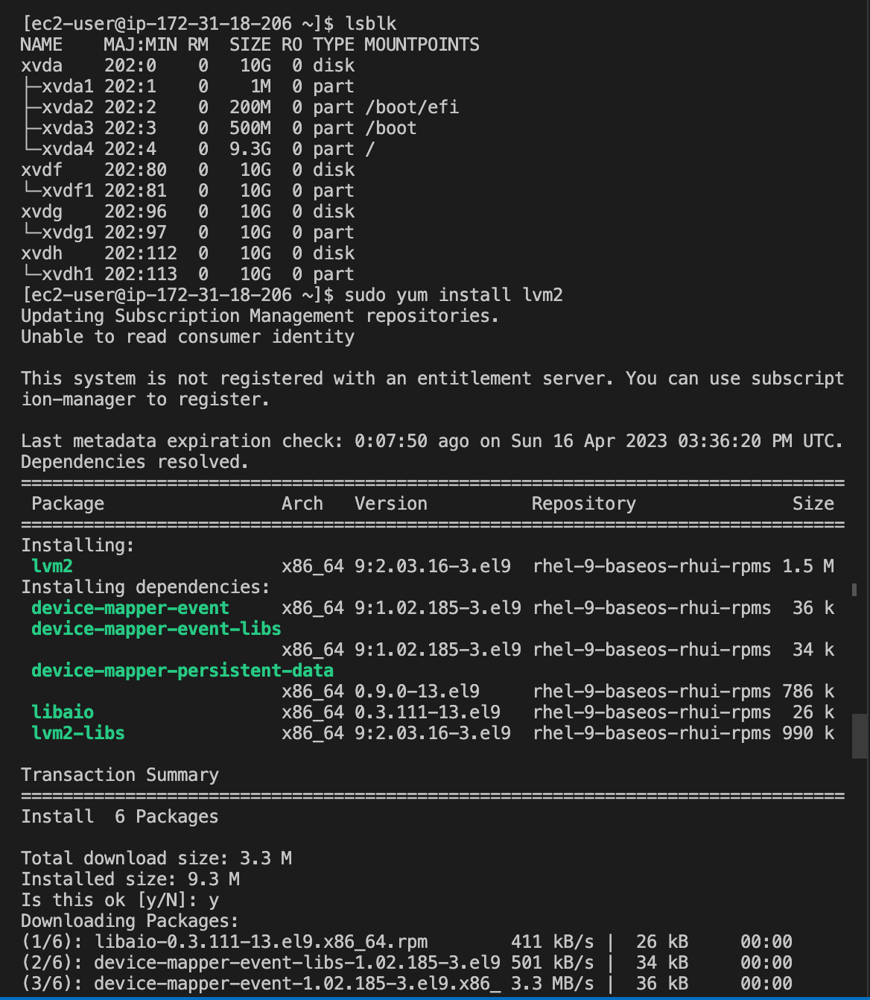
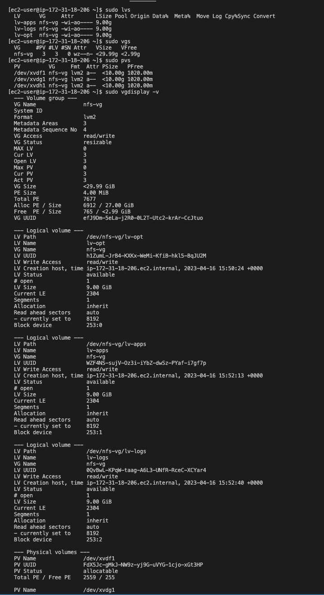
---

```bash
# Format the Logical volumes with ext4 FileSystem
sudo mkfs -t xfs /dev/nfs-vg/lv-opt
sudo mkfs -t xfs /dev/nfs-vg/lv-apps
sudo mkfs -t xfs /dev/nfs-vg/lv-logs
```
```bash
# Create /mnt/apps directory to store  website files
sudo mkdir -p /mnt/apps

# Create /mnt/log directory to store website logs
sudo mkdir -p /mnt/logs

# Mount lv-apps on /mnt/apps
sudo mount /dev/nfs-vg/lv-apps /mnt/apps

# Mount lv-logs on /mnt/logs
sudo mount /dev/nfs-vg/lv-logs /mnt/logs

# Mount lv-opt on /mnt/opt
sudo mount /dev/nfs-vg/lv-opt /mnt/opt
```
```bash
# Check the block id of the Logical volumes
sudo blkid

# Update the /etc/fstab file 
sudo vi /etc/fstab

# Test the configuration
sudo mount -a

# Restart the daemon
sudo systemctl daemon-reload

#Verify setup
df -h
```
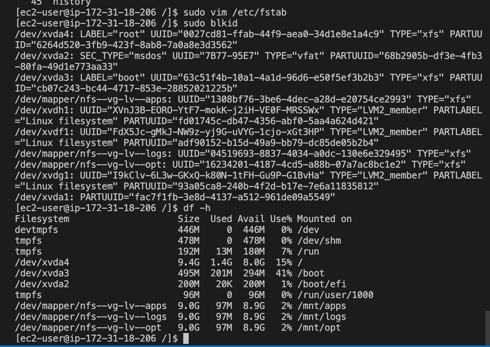
---
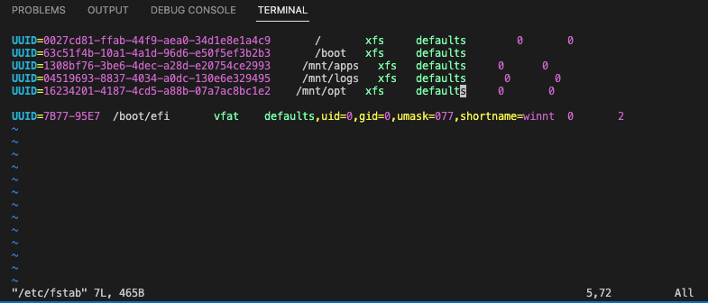

### INSTALL NFS SERVER AND EXPORT MOUNTS FOR WEBSERVERS' SUBNET CIDR TO CONNECT AS CLIENT

Export the mounts for webservers' subnet cidr to connect as clients. For simplicity, you will install your all three Web Servers inside the same subnet, but in production set up you would probably want to separate each tier inside its own subnet for higher level of security.
To check your subnet cidr - open your EC2 details in AWS web console and locate 'Networking' tab and open a Subnet link

```bash
sudo yum -y update
sudo yum install nfs-utils -y
sudo systemctl start nfs-server.service
sudo systemctl enable nfs-server.service
sudo systemctl status nfs-server.service
```
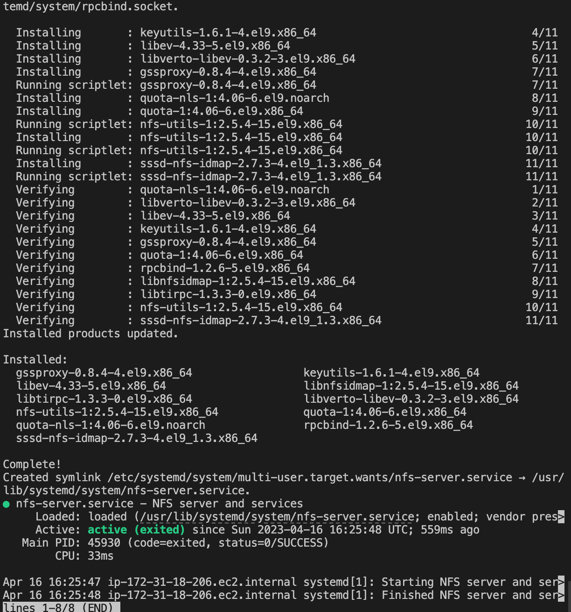


```bash
#set up permission that will allow our Web servers to read, write and execute files on NFS
sudo chown -R nobody: /mnt/apps
sudo chown -R nobody: /mnt/logs
sudo chown -R nobody: /mnt/opt

sudo chmod -R 777 /mnt/apps
sudo chmod -R 777 /mnt/logs
sudo chmod -R 777 /mnt/opt
# restart nfs server
sudo systemctl restart nfs-server.service
```
### CONFIGURE ACCESS TO NFS
```bash
sudo vi /etc/exports

/mnt/apps <Subnet-CIDR>(rw,sync,no_all_squash,no_root_squash)
/mnt/logs <Subnet-CIDR>(rw,sync,no_all_squash,no_root_squash)
/mnt/opt <Subnet-CIDR>(rw,sync,no_all_squash,no_root_squash)

Esc + :wq!

sudo exportfs -arv
```
### CHECK NFS PORT
```bash
rpcinfo -p | grep nfs
```
### SET INBOUND RULE FOR NFS

In order for NFS server to be accessible from your client, you must open following ports: TCP 111, UDP 111, UDP 2049

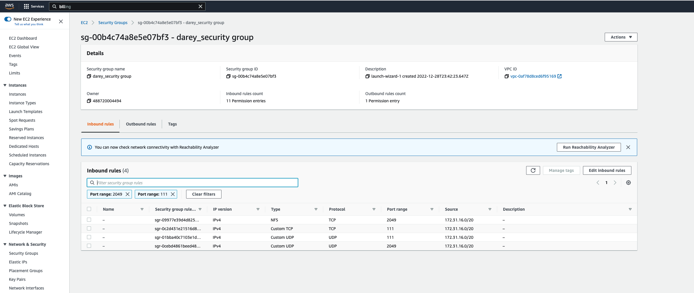
> RESTART NFS SERVER
```bash
sudo systemctl restart nfs-server
```
## STEP 2
---
### CONFIGURE THE DATABASE SERVER AND ALLOW ACCESS ONLY FROM WEBSERVER SUBNET CIDR
```bash
sudo apt update && sudo apt upgrade
sudo apt install mysql-server
```
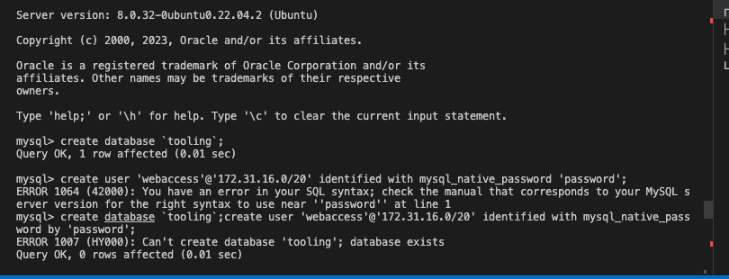
---
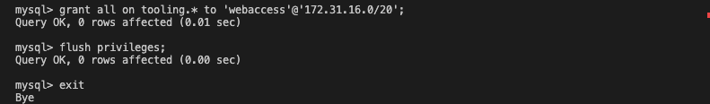
---
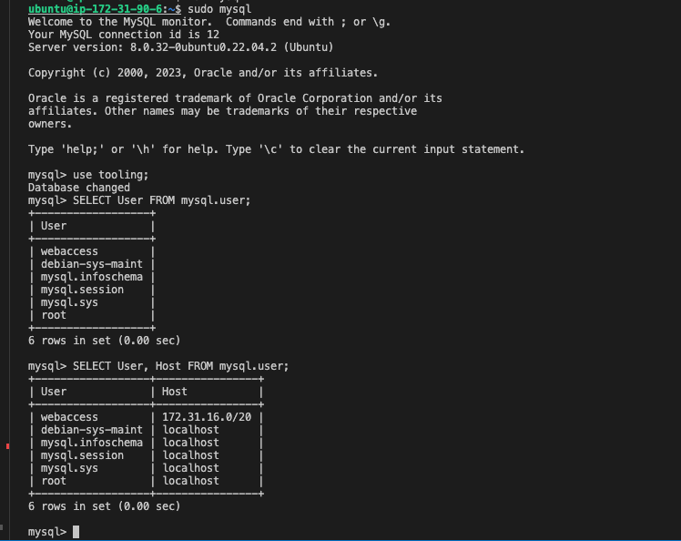

## STEP 3
---
### PREPARE WEBSERVERS

During the next steps we will do following:

- Configure NFS client (this step must be done on all three servers)
- Deploy a Tooling application to our Web Servers into a shared NFS folder
- Configure the Web Servers to work with a single MySQL database

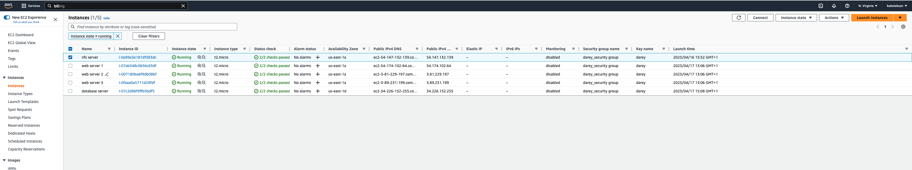
### INSTALL NFS CLIENT ON THE WEB SERVERS 
```bash
sudo yum install nfs-utils nfs4-acl-tools -y
```
### Mount /var/www/ and target the NFS server’s export for apps
```bash
sudo mkdir /var/www/
sudo mount -t nfs -o rw,nosuid 172.31.18.206:/mnt/apps /var/www
df -h
```
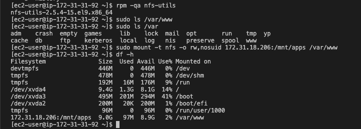
```bash
sudo vi /etc/fstab
#add following line
<NFS-Server-Private-IP-Address>:/mnt/apps /var/www nfs defaults 0 0
```
### INSTALL REMI'S REPOSITORY,APACHE AND PHP
```bash
sudo yum install httpd -y

sudo dnf install https://dl.fedoraproject.org/pub/epel/epel-release-latest-8.noarch.rpm

sudo dnf install dnf-utils http://rpms.remirepo.net/enterprise/remi-release-8.rpm

sudo dnf module reset php

sudo dnf module enable php:remi-7.4

sudo dnf install php php-opcache php-gd php-curl php-mysqlnd

sudo systemctl start php-fpm

sudo systemctl enable php-fpm

setsebool -P httpd_execmem 1
```
### Verify that Apache files and directories are available on the Web Server in /var/www and also on the NFS server in /mnt/apps.
> Create touch.txt on web server and check if it will be on nfs server 

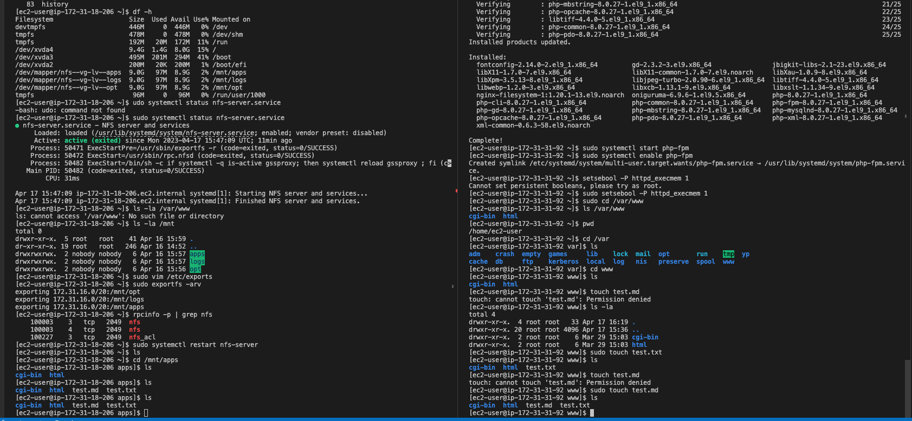
> left side of the screenshot is the nfs server, right side of the screenshot is the webserver
### Locate log folder for Apache on the Web Server and mount it to NFS server’s export for logs
```bash 
sudo mount -t nfs -o rw,nosuid 172.31.18.206:/mnt/log /var/log/httpd
df -h
```
```bash
sudo vi /etc/fstab

#add following line
<NFS-Server-Private-IP-Address>:/mnt/log /var/log/httpd nfs defaults 0 0
```
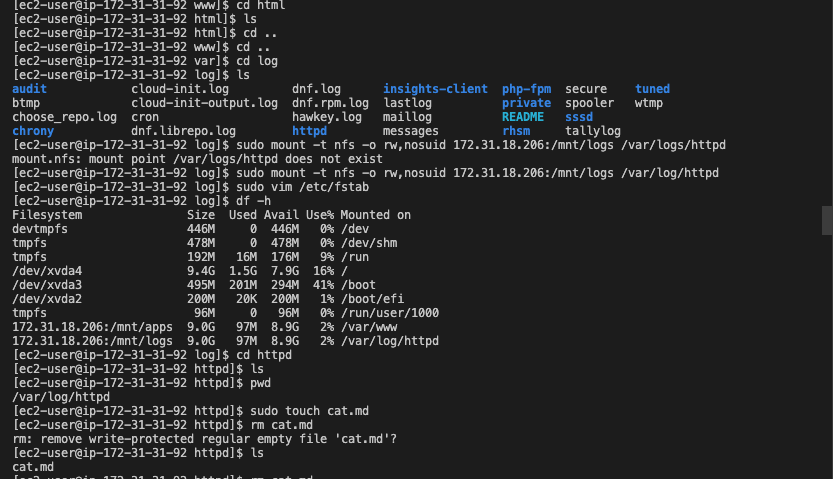
>verify if webserver log is mounted to nfs

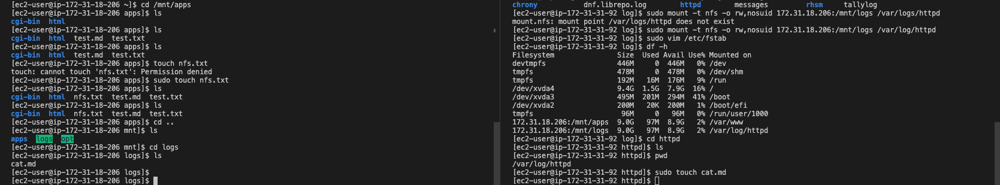
>left side of the screenshot is the nfs server, right side of the screenshot is the webserver

### Clone Git hub Repo And Set Up The Website
```bash
git clone https://github.com/babslekson/tooling.git
cd tooling

sudo cp -R html/. /var/www/html

# Disable SELinux
sudo setenforce 0

sudo vi /etc/sysconfig/selinux

# Edit DB details
sudo vi /var/www/html/functions.php

#install sql client
sudo yum install mysql -y

sudo mysql -h 172.31.90.6 -u webaccess -p tooling < tooling-db.sql
# restart Apache 

sudo systemctl restart httpd
```
>Open the website in your browser 

>http://\<Web-Server-Public-IP-Address-or-Public-DNS-Name>/index.php 

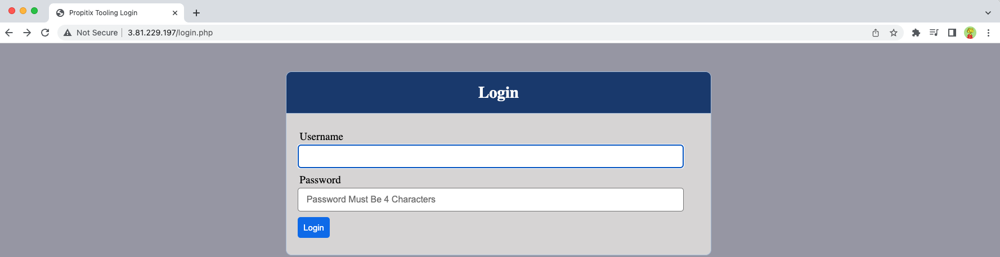

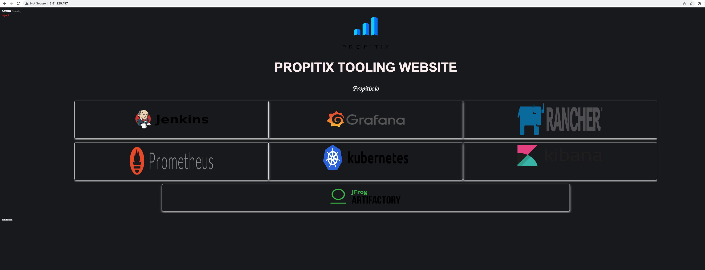

Continuation of this project is adding load balancer to distribute traffic to three webservers. link()

