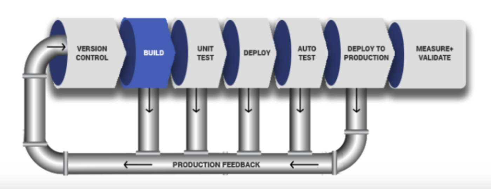
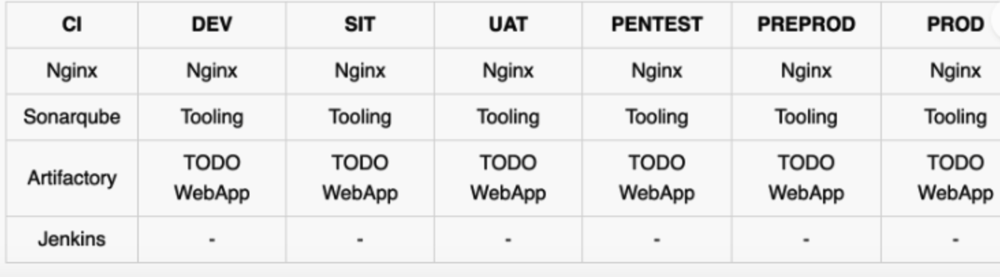
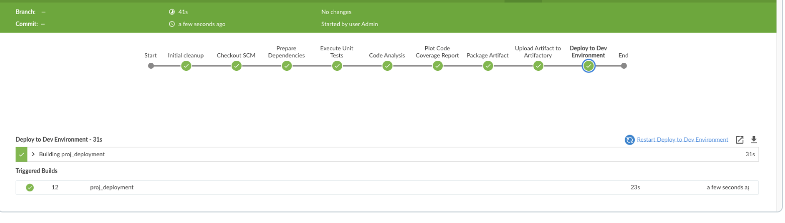

# End to End Continous Integration (CI) project using JENKINS | ANSIBLE | ARTIFACTORY | SONARQUBE | PHP
---
## Part 1 - Introduction to Continuous integration
Continuous Integration (CI) is a software development practice where members of a team integrate their code changes into a shared repository frequently, typically multiple times a day. Each integration is verified by an automated build process, which includes compiling the code, running automated tests, and performing other checks to ensure that the newly integrated code does not introduce errors or break existing functionality.

**CI concept is not only about committing your code.** There is a general workflow, which includes:

- **Run tests locally**: Before developers commit their code to a central repository, it is recommended to test the code locally. So, a Test-Driven Development (TDD) approach is commonly used in combination with CI. Developers write tests for their code called unit-tests, and before they commit their work, they run their tests locally. This practice helps a team to avoid having one developer's work-in-progress code from breaking other developers' copy of the codebase.
- **Compile code in CI**: After testing codes locally, developers commit and push their work to a central repository. Rather than building the code into an executable locally, a dedicated CI server picks up the code and runs the build there. In this project we will be using Jenkins as our CI server. Jenkins can also be confirgure to build the project on the CI sever after every commit or a specific times depending the the project requirement. Build happens either periodically - by polling the repository at some configured schedule, or after every commit. Having a CI server where builds run is a good practice for a team, as everyone has visibility into each commit and its corresponding builds.
- **Run further tests in CI**: Even though tests have been run locally by developers, it is important to run the unit-tests on the CI server as well. But, rather than focusing solely on unit-tests, there are other kinds of tests and code analysis that can be run in the CI server. These are extremely critical to determining the overall quality of code being developed, how it interacts with other developers' work, and how vulnerable it is to attacks. A CI server can use different tools for Static Code Analysis, Code Coverage Analysis, Code smells Analysis, and Compliance Analysis. In addition, it can run other types of tests such as Integration and Penetration tests. Other tasks performed by a CI server include production of code documentation from the source code and facilitate manual quality assurance (QA) testing processes.
- **Deploy an artifact from CI**: At this stage, the difference between CI and CD is spelt out. As you now know, CI is Continuous Integration, which is everything we have been discussing so far. CD on the other hand is Continuous Delivery which ensures that software checked into the mainline is always ready to be deployed to users. The deployment here is manually triggered after certain QA tasks are passed successfully. There is another CD known as Continuous Deployment which is also about deploying the software to the users, but rather than manual, it makes the entire process fully automated. Thus, Continuous Deployment is just one step ahead in automation than Continuous Delivery.
The diagram below is a graphical representation of the CI steps. Let's take a deeper look at each step:



1. - **Version control**: Also known as source control or revision control, is a system that records changes to a file or set of files over time so that you can recall specific versions later. Softwares like GitHub and Gitlab are common verson control systems out there.
2. - **Build**: This refers to the process of compiling source code files, linking necessary libraries, and generating executable files or other deliverables from the source code. The build process is ususally different depending on the type of language or technology used. Compiled languages such as C and C++, the codes are converted to machine codes that can be understood by the target machine. Interpreted languages on the other hand usually have an intepreter installed on the target machine. The interpreter would be responsible for transalting the codes to that understood by the target machine. Examples of interpreted languages are Java, Javascript, PhP, etc.
3. - **Unit Test**: Here, individual units or components of a software application are tested in isolation to ensure they behave as expected. A unit typically refers to the smallest testable part of an application, such as a function, method, or class.
4. - **Deploy**: Once the tests are passed, the next phase is to deploy the compiled or packaged code into an artifact repository. This is where all the various versions of code including the latest will be stored. The CI tool will have to pick up the code from this location to proceed with the remaining parts of the pipeline.
5. - **Auto Test**: Apart from Unit testing, there are many other kinds of tests that are required to analyse the quality of code and determine how vulnerable the software will be to external or internal attacks. These tests must be automated, and there can be multiple environments created to fulfil different test requirements. For example, a server dedicated for Integration Testing will have the code deployed there to conduct integration tests. Once that passes, there can be other sub-layers in the testing phase in which the code will be deployed to, so as to conduct further tests. Such are User Acceptance Testing (UAT), and another can be Penetration Testing. These servers will be named according to what they have been designed to do in those environments. A UAT server is generally be used for UAT, SIT server is for Systems Integration Testing, PEN Server is for Penetration Testing and they can be named whatever the naming style or convention in which the team is used. An environment does not necessarily have to reside on one single server. In most cases it might be a stack as you have defined in your Ansible Inventory. All the servers in the inventory/dev are considered as Dev Environment. The same goes for inventory/stage (Staging Environment), inventory/preprod (Pre-production environment), inventory/prod (Production environment), etc. So, it is all down to naming convention as agreed and used company or team wide.
6. - **Deploy to production**: Once all the tests have been conducted and either the release manager or whoever has the authority to authorize the release to the production server is happy, he gives green light to hit the deploy button to ship the release to production environment. This is an Ideal Continuous Delivery Pipeline. If the entire pipeline was automated and no human is required to manually give the Go decision, then this would be considered as Continuous Deployment. Because the cycle will be repeated, and every time there is a code commit and push, it causes the pipeline to trigger, and the loop continues over and over again.
7. Measure and Validate: This is where live users are interacting with the application and feedback is being collected for further improvements and bug fixes. There are many metrics that must be determined and observed here. We will quickly go through 13 metrics that MUST be considered.

## Common Best Practices of CI/CD

Continuous Integration (CI) and Continuous Delivery/Continuous Deployment (CD) are integral practices in modern software development, aimed at automating and streamlining the process of building, testing, and delivering software. Here are some common best practices associated with CI/CD:

- **Automate Everything**: Aim to automate every aspect of the software development lifecycle, including code compilation, testing, deployment, and infrastructure provisioning, etc.
- **Version Control**: Utilize a version control system (e.g., Git, Subversion) to manage source code and configuration files. All changes should be committed to version control, enabling collaboration, traceability, and rollback if necessary.
- **Frequent Commits**: Developers should be emcouraged to make commit small and frequent changes to the codebase. This practice facilitates easier integration, reduces the risk of conflicts, and allows for more granular tracking of changes.
- **Automated Builds**: Set up automated build processes to compile code, run unit tests, and generate artifacts. Continuous integration servers (e.g., Jenkins, GitLab CI, Travis CI) can automatically trigger builds whenever changes are pushed to the repository.
- **Automated Testing**: Implement automated testing at different levels (unit, integration, end-to-end) to validate the functionality, performance, and reliability of the software. Automated tests should be run as part of the CI pipeline to provide rapid feedback on code changes.
- **Isolated Environments**: Use isolated environments for testing and deployment, such as staging and production environments.
- **Immutable Infrastructure**: Adopt the principle of immutable infrastructure, where infrastructure components are treated as disposable and are never modified in place. Instead, new instances are created and deployed with each change, promoting consistency and reproducibility.
- **Monitoring and Feedback**: Implement monitoring and alerting mechanisms to track the health and performance of applications in production.
- **Infrastructure as Code (IaC)**: Define infrastructure configurations using code (e.g., using tools like Terraform, AWS CloudFormation) to automate provisioning, configuration, and management of infrastructure resources. IaC enables reproducibility, consistency, and scalability of infrastructure.
- **Security and Compliance**: Integrate security and compliance checks into the CI/CD pipeline to identify vulnerabilities, enforce policies, and ensure regulatory compliance.

## Part 2 - Common Success Metrics in DevOps
DevOps emphasizes the importance of continuous delivery or deployment, striving to efficiently deliver high-quality code at a rapid pace. While this ambition is commendable, However, it's important to be careful not to break things as we move fast. By meticulously tracking metrics, organizations can gain insights into their delivery speed and identify potential bottlenecks beforehand. Ultimately, DevOps aims to bolster Velocity, Quality, and Performance in software delivery processes. Let's take a look at some KPIs in DevOps:

- **Deployment Frequency**: This metric measures how often new code changes are deployed to production. A higher deployment frequency indicates that teams are delivering new features and fixes more frequently, enabling faster time-to-market and responsiveness to customer needs.
- **Lead Time for Changes**: Lead time for changes measures the time it takes from initiating a change to deploying it into production. A shorter lead time indicates faster delivery of features and fixes, improving agility and competitiveness.
- **Mean Time to Recovery (MTTR)**: MTTR measures the average time it takes to recover from failures or incidents in production. A lower MTTR indicates that teams can detect and resolve issues more quickly, minimizing downtime and customer impact.
- **Mean time to detection (MTTD)**: When problems happen, it is important that we identify them quickly. The last thing we want is to have a major partial or complete system outage and not know about it. Having robust application monitoring and good observability tools in place will help us detect issues quickly. Once they are detected, we also must fix them quickly!
- **Percentage of passed automated tests**: To increase velocity, it is highly recommended that the development team makes extensive usage of unit and functional testing. Since DevOps relies heavily on automation, tracking how well automated tests work is a good DevOps metrics. It is good to know how often code changes break tests.
- **Change Failure Rate**: Change failure rate measures the percentage of changes (e.g., deployments) that result in failures or incidents in production. A lower change failure rate indicates a more reliable and resilient system, with fewer disruptions to users.
- **Defect escape rate**: Do you know how many software defects are being found in production versus QA? If you want to ship code fast, you need to have confidence that you can find software defects before they get to production. Defect escape rate is a great DevOps metric to track how often those defects make it to production.
- **Deployment Success Rate**: Deployment success rate measures the percentage of deployments that are successful without causing incidents or failures in production. A higher deployment success rate indicates that teams are delivering changes more reliably and with fewer issues.
- **Availability**: The last thing we ever want is for our application to be down. Depending on the type of application and how we deploy it, we may have a little downtime as part of scheduled maintenance. It is highly recommended to track this metric and all unplanned outages. Most software companies build status pages to track this. Such as this Google Products Status Page.
- **Code and Test Coverage**: Code and test coverage metrics assess the percentage of code covered by automated tests and the percentage of requirements covered by automated tests. Higher coverage indicates a more comprehensive and reliable test suite, reducing the risk of regressions and defects.
- **Infrastructure as Code (IaC) Compliance**: For organizations practicing infrastructure as code (IaC), compliance metrics measure the adherence of infrastructure configurations to predefined policies and standards. Higher compliance indicates better control and security of infrastructure resources
- **Application usage & traffic**: After a deployment, we want to see if the number of transactions or users accessing our system looks normal. If we suddenly have no traffic or a giant spike in traffic, something could be wrong. An attacker may be routing traffic elsewhere, or initiating a DDOS attack
- **Application performance**: Before we even perform a deployment, we should configure monitoring tools like Retrace, DataDog, New Relic, or AppDynamics to look for performance problems, hidden errors, and other issues. During and after the deployment, we should also look for any changes in overall application performance and establish some benchmarks to know when things deviate from the norm.
These and many more metrics are often tracked and analyzed using tools and platforms specifically designed for DevOps and continuous improvement such as monitoring and observability tools, version control systems, CI/CD pipelines, and agile project management tools. By regularly monitoring and optimizing these metrics, organizations can continuously improve their DevOps practices and achieve better outcomes in software delivery and operational performance.

## Part 3 - SIMULATING A TYPICAL CI/CD PIPELINE FOR A PHP BASED APPLICATION
### Step 1
- Create jenkins/ansible server. i used same server for both jenkins and ansible
We will focus on these envirmoinment initially
- Ci
- Dev
- Pentest

Both SIT – For System Integration Testing and UAT – User Acceptance Testing do not require a lot of extra installation or configuration. They are basically the webservers holding our applications. But Pentest – For Penetration testing is where we will conduct security related tests, so some other tools and specific configurations will be needed. In some cases, it will also be used for Performance and Load testing. Otherwise, that can also be a separate environment on its own. It all depends on decisions made by the company and the team running the show.

We will be using Nginx to serve as a reverse proxy for our sites and tools. Each environment setup is represented in the below table and diagrams.



| Servers            | Subdomains                         |
|--------------------|------------------------------------|
| Jenkins            | [www.ci.infradev.lekandevops.site](https://www.ci.infradev.lekandevops.site)   |
| Sonarqube          | [www.ci.sonarqube.lekandevops.site](https://www.sonarqube.infradev.lekandevops.site)|
| Artifactory        | [www.artifacts.infradev.lekandevops.site](https://www.artifacts.infradev.lekandevops.site)  |
| Production Tooling | [www.tooling.lekandevops.site](https://www.tooling.lekandevops.site)             |
| Pentest Tooling        | [www.tooling.pentest.lekandevops.site](http://www.tooling.pentest.lekandevops.site)  |
| UAT Tooling            | [www.tooling.uat.lekandevops.site](http://www.tooling.uat.lekandevops.site)          |
| SIT Tooling            | [www.tooling.sit.lekandevops.site](http://www.tooling.sit.lekandevops.site)          |
| Dev Tooling            | [www.tooling.dev.lekandevops.site](http://www.tooling.dev.lekandevops.site)          |
| Production TODO-WebApp | [www.todo.lekandevops.site](http://www.todo.lekandevops.site)                        |
| Pre-Prod TODO-WebApp   | [www.todo.preprod.lekandevops.site](http://www.todo.preprod.lekandevops.site)        |
| Pentest TODO-WebApp    | [www.todo.pentest.lekandevops.site](http://www.todo.pentest.lekandevops.site)        |
| UAT TODO-WebApp        | [www.todo.uat.lekandevops.site](http://www.todo.uat.lekandevops.site)                |
| SIT TODO-WebApp        | [www.todo.sit.lekandevops.site](http://www.todo.sit.lekandevops.site)                |
| Dev TODO-WebApp        | [www.todo.dev.lekandevops.site](http://www.todo.dev.lekandevops.site)                |

Overview
The CI/CD pipeline is designed to automate the build, testing, analysis, packaging, and deployment processes for the PHP application. The following components are involved:

- **Ansible Repository**: An Ansible repository has been created to set up and configure the environments required for the CI/CD pipeline, including the CI environments, web servers, nginx, Artifactory, SonarQube, and databases. [Ansible Repository](https://github.com/babslekson/ansible-config-mgt/blob/pj14)

- **PHP Application Repository**: The PHP application repository contains the source code for the Todo application, which is the subject of this CI/CD pipeline. [PHP-Todo Repository](https://github.com/babslekson/todo_php/tree/pj14)
- **Jenkins Pipeline**: A Jenkins pipeline is responsible for executing the CI/CD tasks, such as checking out the code, running unit tests, performing code analysis, packaging the application, uploading artifacts to Artifactory, and triggering deployment to the development environment.[PHP Jenkins pipeline](https://github.com/babslekson/todo_php/blob/pj14/Jenkinsfile)

- **Artifactory**: Artifactory is used as an artifact repository to store and manage the packaged application artifacts.
- **SonarQube**: SonarQube is integrated into the pipeline for code quality analysis and to ensure that the code meets the defined quality standards before deployment.



Pipeline Workflow
The CI/CD pipeline follows the following workflow:

Initial Cleanup: The workspace is cleaned up to ensure a fresh build environment.

Checkout Source Code: The PHP application source code is checked out from the Git repository.

Prepare Dependencies: The required dependencies are installed, the database is migrated, and the application key is generated.

Execute Unit Tests: Unit tests for the PHP application are executed.

Code Analysis: The code is analyzed using the phploc tool, and various metrics are generated and plotted.

SonarQube Quality Gate: The code is analyzed by SonarQube to ensure it meets the defined quality standards.

Package Artifact: The application is packaged as a ZIP file.

Upload Artifact to Artifactory: The packaged artifact is uploaded to Artifactory for storage and distribution.

Deploy to Dev Environment: The Ansible playbook is triggered to deploy the application to the development environment.


Video Illustration
A video illustration of the project is available, demonstrating the end-to-end CI/CD pipeline in action.


### Dependences to be installed
------
```bash
yum install -y https://dl.fedoraproject.org/pub/epel/epel-release-latest-8.noarch.rpm
yum install -y dnf-utils http://rpms.remirepo.net/enterprise/remi-release-8.rpm
yum install python3 python3-pip wget unzip git -y
python3 -m pip install --upgrade setuptools
python3 -m pip install --upgrade pip
python3 -m pip install PyMySQL
python3 -m pip install mysql-connector-python
python3 -m pip install psycopg2==2.7.5 --ignore-installed
```
Installing JAVA
```bash
sudo yum install java-11-openjdk-devel -y
```
Install php
```bash
yum module reset php -y
yum module enable php:remi-7.4 -y
yum install -y php php-common php-mbstring php-opcache php-intl php-xml php-gd php-curl php-mysqlnd php-fpm php-json
systemctl start php-fpm
systemctl enable php-fpm
```
Ansible dependencies to install
------

For Mysql Database
ansible-galaxy collection install community.mysql
For Postgresql Database
ansible-galaxy collection install community.postgresql
Install composer
-------
```bash
curl -sS https://getcomposer.org/installer | php
sudo mv composer.phar /usr/bin/composer
# Verify Composer is installed or not
composer --version
# Install phpunit, phploc
--------

sudo dnf --enablerepo=remi install php-phpunit-phploc
wget -O phpunit https://phar.phpunit.de/phpunit-7.phar
chmod +x phpunit
sudo yum install php-xdebug
### for database connection
DB_CONNECTION=mysql DB_PORT=3306

sudo vi /etc/mysql/mysql.conf.d/mysqld.cnf sudo yum install mysql -y
```