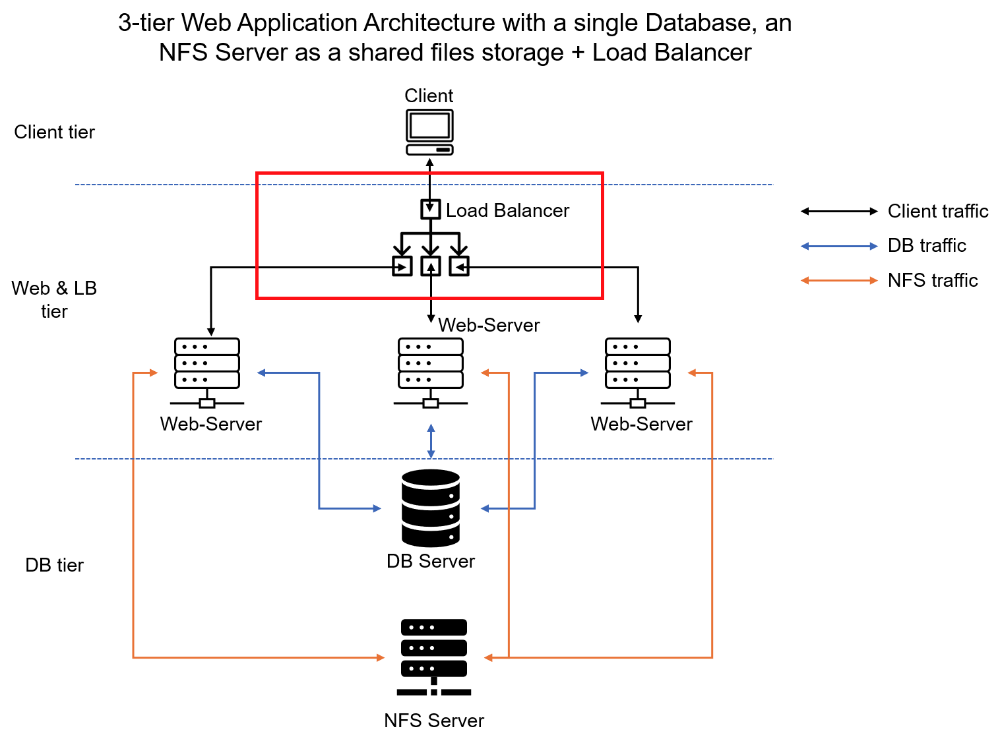
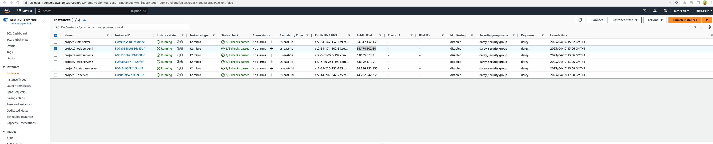
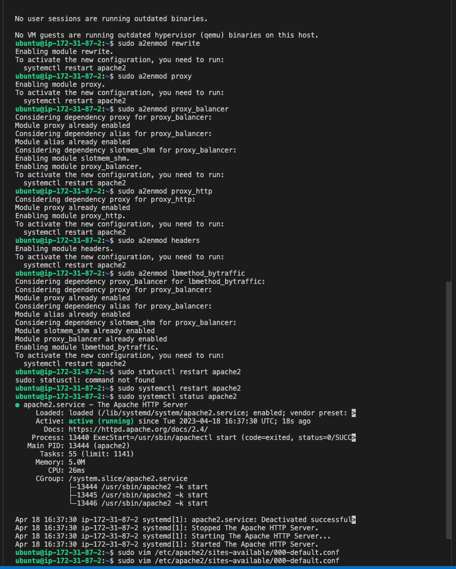
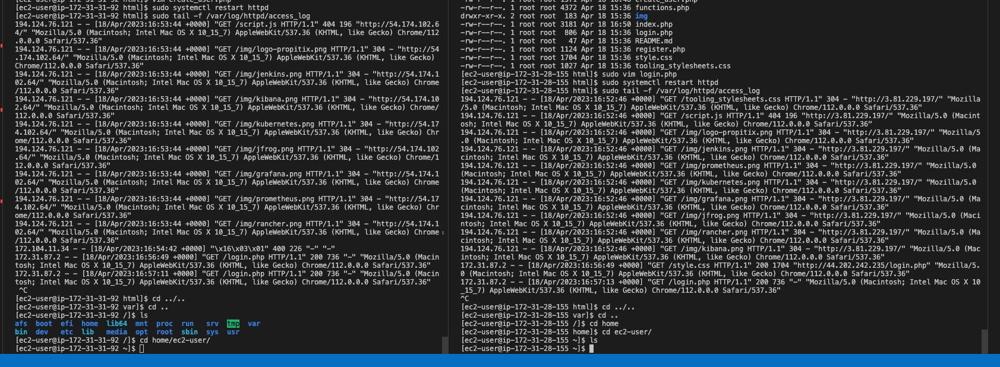

# CONFIGURE LOAD BALANCER FOR DEVOPS TOOLING WEBSITE


you might be wondering how a user will be accessing each of the webservers using 3 different IP addreses or 3 different DNS names.
We had 3 Web Servers and each of them had its own public IP address and public DNS name. A client has to access them by using different URLs, which is not a nice user experience to remember addresses/names of even 3 servers. 

In order to hide all this complexity and to have a single point of access with a single public IP address/name, a Load Balancer can be used. A Load Balancer (LB) distributes clients' requests among underlying Web Servers and makes sure that the load is distributed in an optimal way. Lets get started!

### CREATE LOAD BALANCER SERVER

### Install Apache Load Balancer on apache-lb server and configure to point traffic coming to LB to the Web Servers

```bash
#Install apache2
sudo apt update
sudo apt install apache2 -y
sudo apt-get install libxml2-dev

#Enable following modules:
sudo a2enmod rewrite
sudo a2enmod proxy
sudo a2enmod proxy_balancer
sudo a2enmod proxy_http
sudo a2enmod headers
sudo a2enmod lbmethod_bytraffic

#Restart apache2 service
sudo systemctl restart apache2
```
### Configure load balancing
```bash
sudo vim /etc/apache2/sites-available/000-default.conf
#Add this configuration into this section <VirtualHost *:80>  </VirtualHost>

<Proxy "balancer://mycluster">
               BalancerMember http://<WebServer1-Private-IP-Address>:80 loadfactor=5 timeout=1
               BalancerMember http://<WebServer2-Private-IP-Address>:80 loadfactor=5 timeout=1
               BalancerMember http://<WebServer2-Private-IP-Address>:80 loadfactor=5 timeout=1
               ProxySet lbmethod=bytraffic
               # ProxySet lbmethod=byrequests
        </Proxy>

        ProxyPreserveHost On
        ProxyPass / balancer://mycluster/
        ProxyPassReverse / balancer://mycluster/

#Restart apache server
sudo systemctl restart apache2
```

> Access load balancer public ip


#### check the servers if they receive HTTP GET requests from your LB 
```bash
sudo tail -f /var/log/httpd/access_log
```


### Continuation: Project 9 - Integrating Jenkins for Continuous Integration
In the next phase of our [project](https://github.com/babslekson/dareyio-pbl/blob/main/Tooling-Website-Deployment-Automation-With-Continuous-Integration_P9/README.md)
, we will leverage Jenkins' continuous integration (CI) capabilities to streamline our development workflow. By integrating Jenkins with our GitHub repository, we will ensure that every change made to the source code in GitHub is automatically reflected in our Tooling Website.

Stay tuned for an in-depth guide on setting up Jenkins, configuring it to work with our GitHub repository, and automating our deployment process to enhance the reliability and efficiency of our development pipeline.
