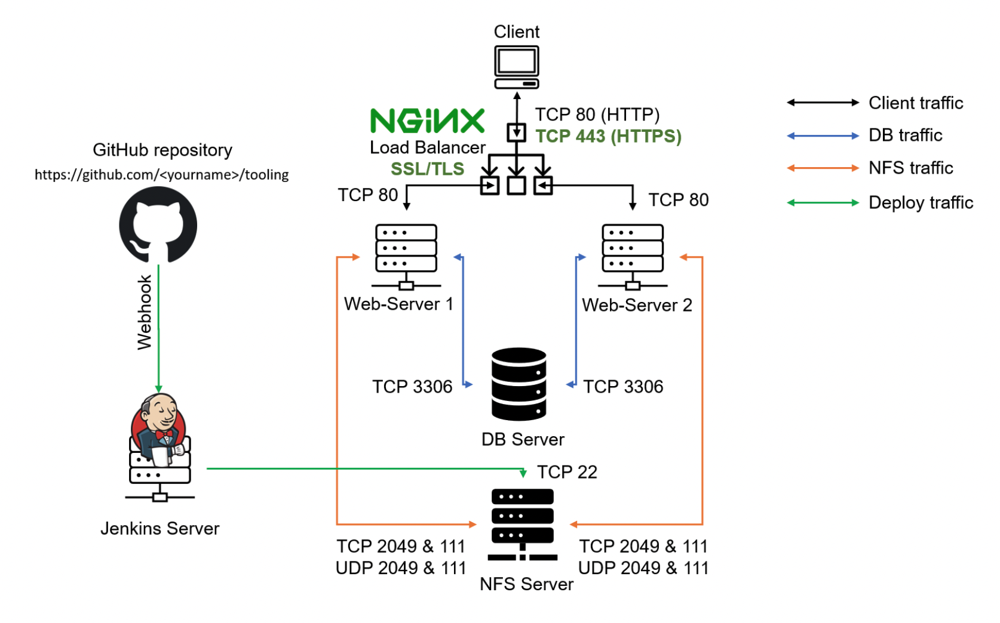
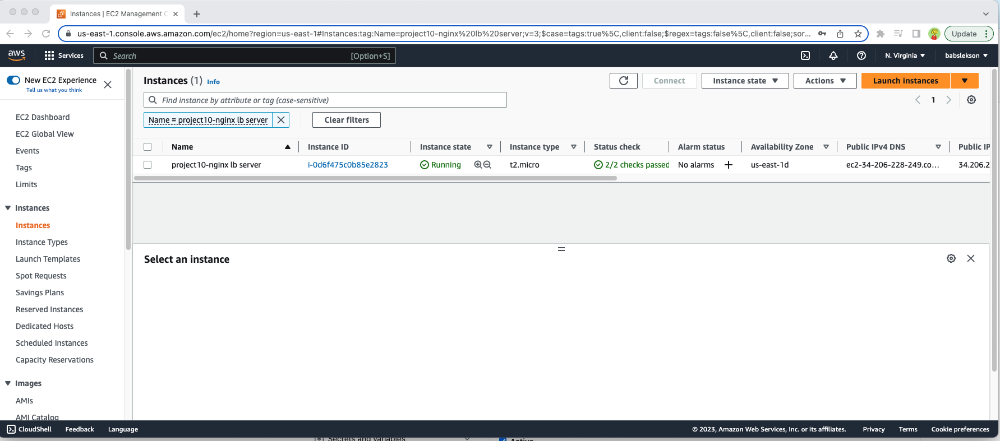
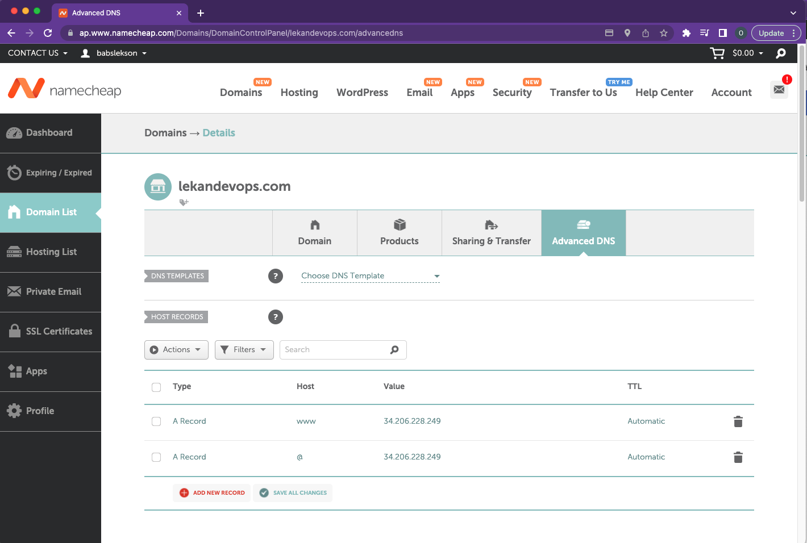
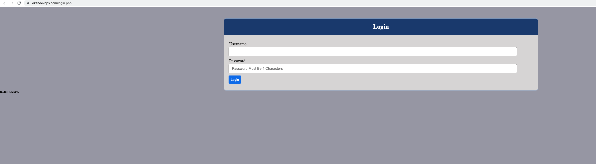

# LOAD BALANCER SOLUTION WITH NGINX AND SSL/TLS



It is extremely important to ensure that connections to the Web solutions are secure and information is [encrypted in transit](https://security.berkeley.edu/data-encryption-transit-guideline). 
When data is moving between a client (browser) and a Web Server over the Internet - it passes through multiple network devices and, if the data is not encrypted, it can be relatively easy intercepted by someone who has access to the intermediate equipment. This kind of information security threat is called [Man-In-The-Middle (MIMT) attack.](https://en.wikipedia.org/wiki/Man-in-the-middle_attack)

[SSL and its newer version, TSL](https://en.wikipedia.org/wiki/Secure_Sockets_Layer) - is a security technology that protects connection from MITM attacks by creating an encrypted session between browser and Web server. Here we will refer this family of cryptographic protocols as SSL/TLS - even though SSL was replaced by TLS, the term is still being widely used.

SSL/TLS uses [digital certificates](https://en.wikipedia.org/wiki/Public_key_certificate) to identify and validate a Website. A browser reads the certificate issued by a [Certificate Authority (CA)](https://en.wikipedia.org/wiki/Certificate_authority) to make sure that the website is registered in the CA so it can be trusted to establish a secured connection.

In this project we will register the tooling website with [LetsEnrcypt](https://letsencrypt.org/) Certificate Authority, to automate certificate issuance, shell client recommended by LetsEncrypt - [cetrbot](https://certbot.eff.org/) will be used.

This project consists of two parts:
1. Configure Nginx as a Load Balancer
2. Register a new domain name and configure secured connection using SSL/TLS certificates

## CONFIGURE NGINX AS A LOAD BALANCER
```bash
sudo apt update 
sudo apt install nginx
```
### Configure Nginx LB using Web Servers’ names
```bash
sudo vim /etc/hosts

#add the following 
<webserver-ip-addresss> Web1
<webserver-ip-address> Web2

esq + wq
```
#### Open default nginx configuration file
```bash
sudo vim /etc/nginx/nginx.conf
#insert following configuration into http section

 upstream myproject {
    server Web1 weight=5;
    server Web2 weight=5;
  }

server {
    listen 80;
    server_name www.domain.com;
    location / {
      proxy_pass http://myproject;
    }
  }

#comment out this line
#       include /etc/nginx/sites-enabled/*;
```
#### Restart nginx server 
```bash
sudo systemctl restart nginx
sudo systemctl status nginx
```
## REGISTER A NEW DOMAIN NAME AND CONFIGURE SECURED CONNECTION USING SSL/TLS CERTIFICATES
---
#### Assign elastic ip address to the nginx server 

#### Associate Domain name 


#### Configure Nginx to recognize the domain name
```bash
sudo vim /etc/nginx/nginx.conf

#Update your nginx.conf with server_name www.<your-domain-name.com> instead of server_name www.domain.com
```
### Install certbot and request for an SSL/TLS certificate
```bash
#verify snap is active 
sudo systemctl status snapd

# install certbot
sudo snap install --classic certbot

# Request certificate
sudo ln -s /snap/bin/certbot /usr/bin/certbot
sudo certbot --nginx
```
#### Set up periodical renewal of your SSL/TLS certificate
```bash
# Test renewal command
sudo certbot renew --dry-run

#configure a cronjob to run the command twice a day
crontab -e

#Add following line:

* */12 * * *   root /usr/bin/certbot renew > /dev/null 2>&1
```




