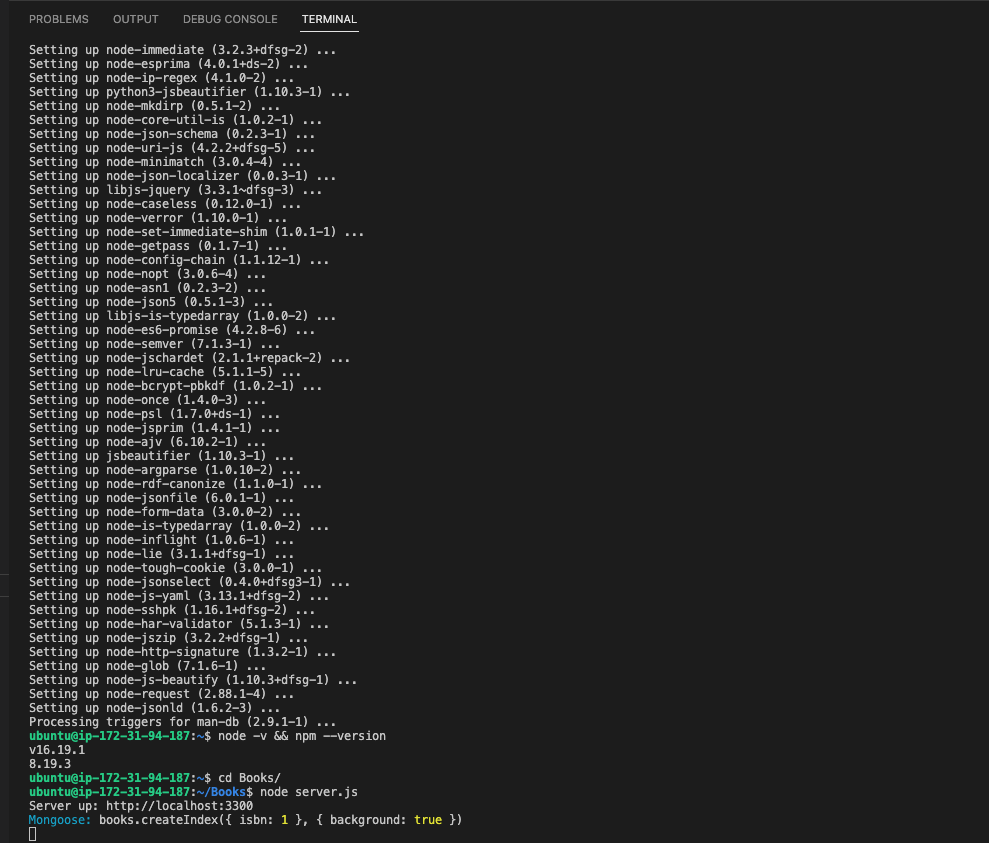
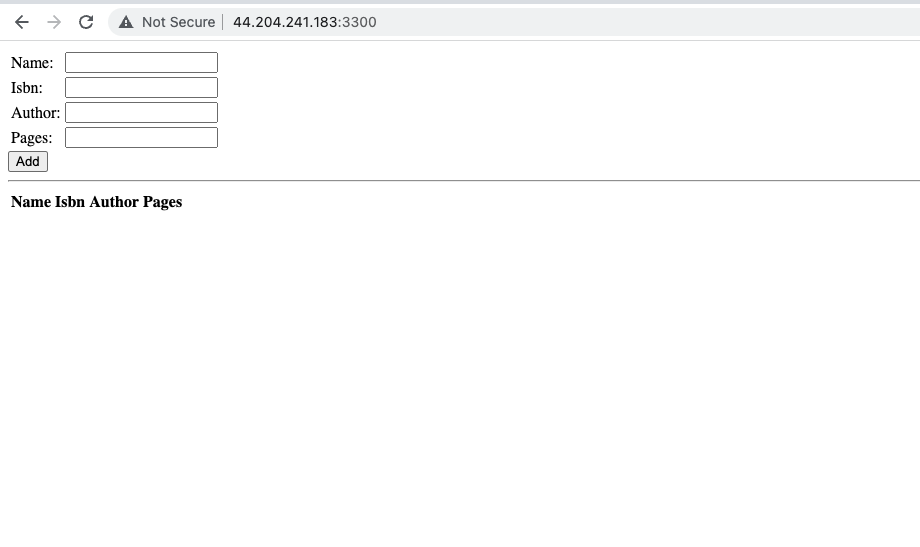

# MEAN STACK IMPLEMENTATION
In this project we are going to implement a simple Book Register web form using MEAN stack.
MEAN Stack is a combination of following components:

MongoDB (Document database) - Stores and allows to retrieve data.

Express (Back-end application framework) - Makes requests to Database for Reads and Writes.

Angular (Front-end application framework) - Handles Client and Server Requests

Node.js (JavaScript runtime environment) - Accepts requests and displays results to end user
## STEP 0
---
### Create EC2 instance 

## STEP 1
---
### Install node.js
```bash
# Update Ubuntu Repositories
sudo apt update

# Upgrade ubuntu packages
sudo apt upgrade

# Install necessary packages
sudo apt -y install curl dirmngr apt-transport-https lsb-release ca-certificates

# Install nodejs 14 repository
curl -sL https://deb.nodesource.com/setup_14.x | sudo -E bash -

# Install Nodejs
sudo apt install -y nodejs
```
## STEP 2
---
### Install Mongodb
```bash
sudo apt-key adv --keyserver hkp://keyserver.ubuntu.com:80 --recv 0C49F3730359A14518585931BC711F9BA15703C6

echo "deb [ arch=amd64 ] https://repo.mongodb.org/apt/ubuntu trusty/mongodb-org/3.4 multiverse" | sudo tee /etc/apt/sources.list.d/mongodb-org-3.4.list

# Install MongoDB
sudo apt install -y mongodb

# Start MongoDB
sudo service mongodb start

# Verify MongoDB is active
sudo systemctl status mongodb
```
**Install body-parser package**
We need 'body-parser' package to help us process JSON files passed in requests to the server.

```bash
sudo apt install -y npm
sudo npm install body-parser
```
## STEP 3
### Install Express Server And Set Up Routes
```bash
mkdir Books && cd Books

npm init

npm install express body-parser mongoose

vim server.js

# Routes
mkdir apps && cd apps

vim routes.js

# Models
mkdir models && cd models

vim book.js
```
**Content of Server.js**
```bash
var express = require('express');
var bodyParser = require('body-parser');
var app = express();

app.use(express.static(__dirname + '/public'));
app.use(bodyParser.json());

require('./apps/routes')(app);

app.set('port', 3300);

app.listen(app.get('port'), function() {
    console.log('Server up: http://localhost:' + app.get('port'));
});
```
**Content of route.js**
```bash
var Book = require('./models/book');
module.exports = function(app) {
  app.get('/book', function(req, res) {
    Book.find({}, function(err, result) {
      if ( err ) throw err;
      res.json(result);
    });
  }); 
  app.post('/book', function(req, res) {
    var book = new Book( {
      name:req.body.name,
      isbn:req.body.isbn,
      author:req.body.author,
      pages:req.body.pages
    });
    book.save(function(err, result) {
      if ( err ) throw err;
      res.json( {
        message:"Successfully added book",
        book:result
      });
    });
  });
  app.delete("/book/:isbn", function(req, res) {
    Book.findOneAndRemove(req.query, function(err, result) {
      if ( err ) throw err;
      res.json( {
        message: "Successfully deleted the book",
        book: result
      });
    });
  });
  var path = require('path');
  app.get('*', function(req, res) {
    res.sendfile(path.join(__dirname + '/public', 'index.html'));
  });
};
```
**Content of book.js**
```bash
var mongoose = require('mongoose');
var dbHost = 'mongodb://localhost:27017/test';
mongoose.connect(dbHost);
mongoose.connection;
mongoose.set('debug', true);
var bookSchema = mongoose.Schema( {
  name: String,
  isbn: {type: String, index: true},
  author: String,
  pages: Number
});
var Book = mongoose.model('Book', bookSchema);
module.exports = mongoose.model('Book', bookSchema);
```
**Access the routes with AngularJS**
AngularJS provides a web framework for creating dynamic views in your web applications. In this project, we use AngularJS to connect our web page with Express and perform actions on our book register.
```bash
cd ../..

mkdir public && cd public

vim script.js

vim index.html
```
**Content of Script.js**
```bash
var app = angular.module('myApp', []);
app.controller('myCtrl', function($scope, $http) {
  $http( {
    method: 'GET',
    url: '/book'
  }).then(function successCallback(response) {
    $scope.books = response.data;
  }, function errorCallback(response) {
    console.log('Error: ' + response);
  });
  $scope.del_book = function(book) {
    $http( {
      method: 'DELETE',
      url: '/book/:isbn',
      params: {'isbn': book.isbn}
    }).then(function successCallback(response) {
      console.log(response);
    }, function errorCallback(response) {
      console.log('Error: ' + response);
    });
  };
  $scope.add_book = function() {
    var body = '{ "name": "' + $scope.Name + 
    '", "isbn": "' + $scope.Isbn +
    '", "author": "' + $scope.Author + 
    '", "pages": "' + $scope.Pages + '" }';
    $http({
      method: 'POST',
      url: '/book',
      data: body
    }).then(function successCallback(response) {
      console.log(response);
    }, function errorCallback(response) {
      console.log('Error: ' + response);
    });
  };
});
```
**Content of index.html**
```bash
<!doctype html>
<html ng-app="myApp" ng-controller="myCtrl">
  <head>
    <script src="https://ajax.googleapis.com/ajax/libs/angularjs/1.6.4/angular.min.js"></script>
    <script src="script.js"></script>
  </head>
  <body>
    <div>
      <table>
        <tr>
          <td>Name:</td>
          <td><input type="text" ng-model="Name"></td>
        </tr>
        <tr>
          <td>Isbn:</td>
          <td><input type="text" ng-model="Isbn"></td>
        </tr>
        <tr>
          <td>Author:</td>
          <td><input type="text" ng-model="Author"></td>
        </tr>
        <tr>
          <td>Pages:</td>
          <td><input type="number" ng-model="Pages"></td>
        </tr>
      </table>
      <button ng-click="add_book()">Add</button>
    </div>
    <hr>
    <div>
      <table>
        <tr>
          <th>Name</th>
          <th>Isbn</th>
          <th>Author</th>
          <th>Pages</th>

        </tr>
        <tr ng-repeat="book in books">
          <td>{{book.name}}</td>
          <td>{{book.isbn}}</td>
          <td>{{book.author}}</td>
          <td>{{book.pages}}</td>

          <td><input type="button" value="Delete" data-ng-click="del_book(book)"></td>
        </tr>
      </table>
    </div>
  </body>
</html>
```
### Run the App
```bash
cd ..

node server.js
```

