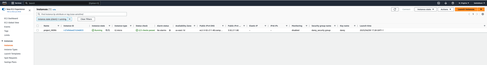
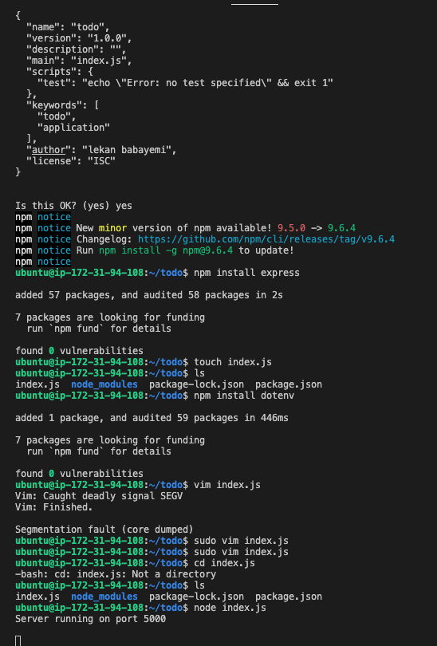
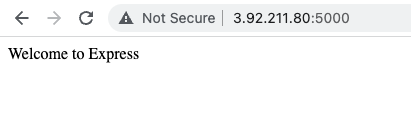
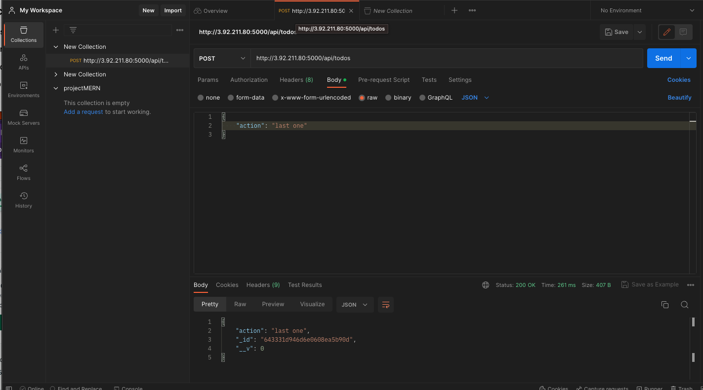
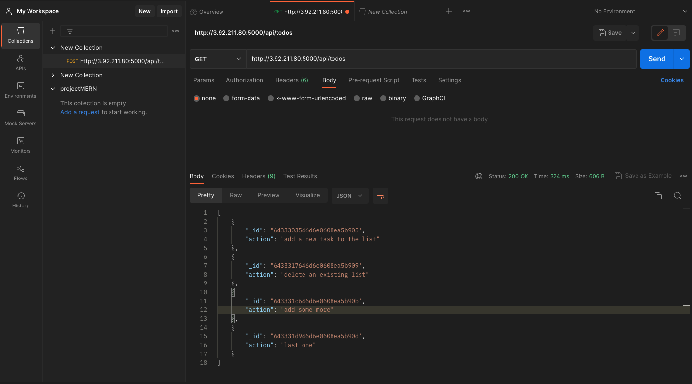
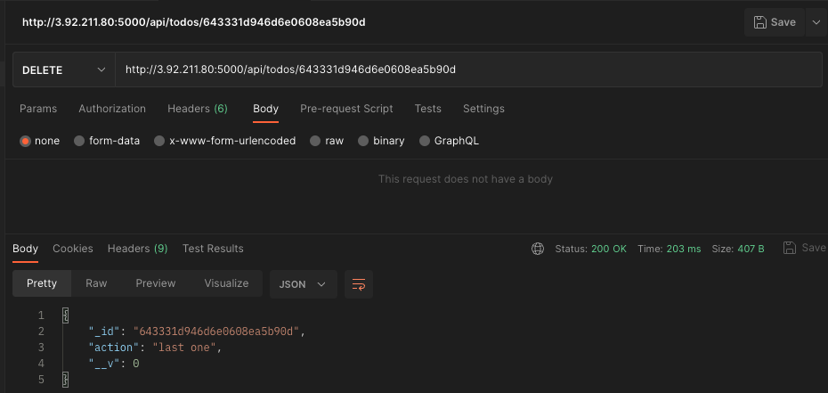
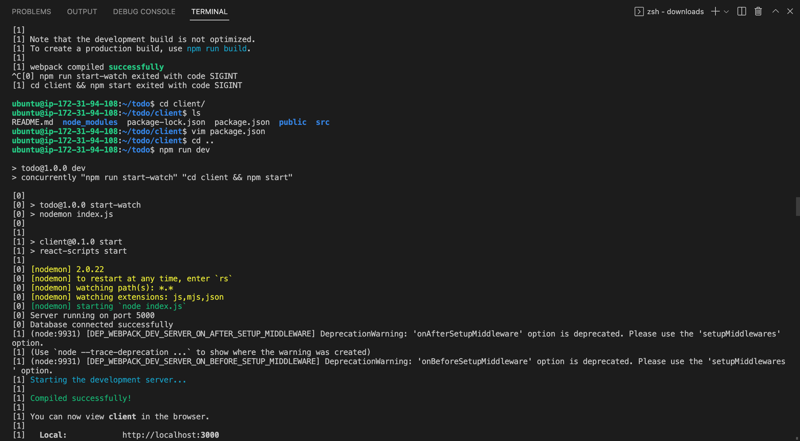
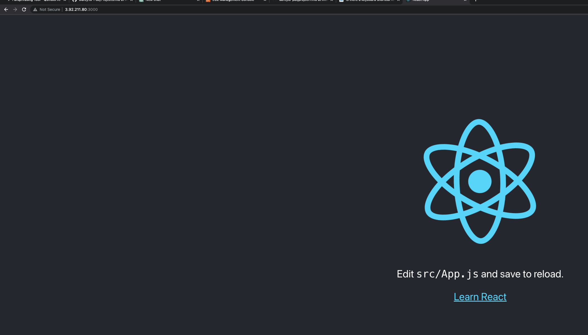
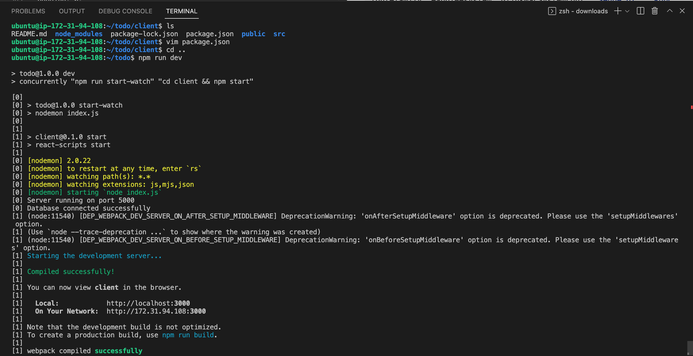
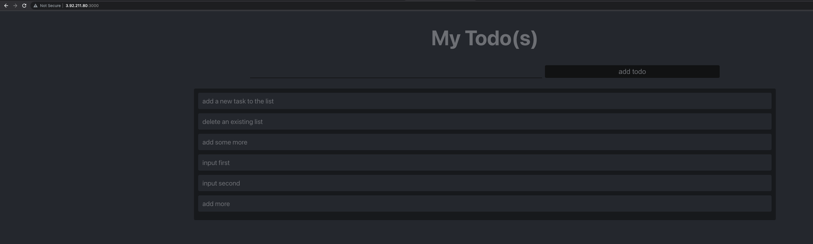

# MERN STACK IMPLEMENTATION

In this project, we will implement a web solution based on MERN stack in AWS Cloud
MERN Web stack consists of following components:

MongoDB: A document-based, No-SQL database used to store application data in a form of documents.

ExpressJS: A server side Web Application framework for Node.js.

ReactJS: A frontend framework developed by Facebook. It is based on JavaScript, used to build User Interface (UI) components.

Node.js: A JavaScript runtime environment. It is used to run JavaScript on a machine rather than in a browser.
## STEP 0
---
### Create EC2 instance

##STEP 1
---
### Backend configuration
```bash
sudo apt update && sudo apt upgrade -y
```
```bash
# Installing Node 14 cause react requires 14 or older to run
curl -sL https://deb.nodesource.com/setup_14.x | sudo -E bash -

# Install Nodejs
sudo apt install -y nodejs

# Verify Nodejs is installed
node -v

# Node Package Manager installed with Nodejs
npm -v
```
### Application Setup 
```bash
mkdir todo 
cd todo
npm init
```
## STEP 2
### Install express.js and create Routes directory
```bash
npm install express
#create index.js file
touch index.js
#install dotenv module
npm install dotenv

# Edit Index.js
vim index.js
```
content of index.js
```bash
const express = require('express');
require('dotenv').config();

const app = express();

const port = process.env.PORT || 5000;

app.use((req, res, next) => {
res.header("Access-Control-Allow-Origin", "\*");
res.header("Access-Control-Allow-Headers", "Origin, X-Requested-With, Content-Type, Accept");
next();
});

app.use((req, res, next) => {
res.send('Welcome to Express');
});

app.listen(port, () => {
console.log(`Server running on port ${port}`)
});
```
    
**run index.js**
```bash
node index.js
```


>Visit http://\<Public-IP-Address>:5000


**Routes**
```bash
mkdir routes

cd routes

touch api.js

vim api.js
```
**content of api.js**
```bash
const express = require ('express');
const router = express.Router();

router.get('/todos', (req, res, next) => {

});

router.post('/todos', (req, res, next) => {

});

router.delete('/todos/:id', (req, res, next) => {

})

module.exports = router;
```
**Models**
```bash
# Install mongoose ORM
npm install mongoose

mkdir models

cd models
	
touch todo.js

vim todo.js
```
**Content of todo.js**
```bash
vim ../routes/api.js
```
```bash
const mongoose = require('mongoose');
const Schema = mongoose.Schema;

//create schema for todo
const TodoSchema = new Schema({
action: {
type: String,
required: [true, 'The todo text field is required']
}
})

//create model for todo
const Todo = mongoose.model('todo', TodoSchema);

module.exports = Todo;
```
**update content of api.js**
```bash
const express = require ('express');
const router = express.Router();
const Todo = require('../models/todo');

router.get('/todos', (req, res, next) => {

//this will return all the data, exposing only the id and action field to the client
Todo.find({}, 'action')
.then(data => res.json(data))
.catch(next)
});

router.post('/todos', (req, res, next) => {
if(req.body.action){
Todo.create(req.body)
.then(data => res.json(data))
.catch(next)
}else {
res.json({
error: "The input field is empty"
})
}
});

router.delete('/todos/:id', (req, res, next) => {
Todo.findOneAndDelete({"_id": req.params.id})
.then(data => res.json(data))
.catch(next)
})

module.exports = router;
```
**Create mongodb database and add connection string to .env**
```bash
touch .env
vim .env
```
**Content of .env**
```bash
DB = 'mongodb+srv://<username>:<password>@<network-address>/<dbname>?retryWrites=true&w=majority'
```
Ensure to fill out the database connection string
**Update the content of index.js**
```bash
vim index.js
```
```bash
const express = require('express');
const bodyParser = require('body-parser');
const mongoose = require('mongoose');
const routes = require('./routes/api');
const path = require('path');
require('dotenv').config();

const app = express();

const port = process.env.PORT || 5000;

//connect to the database
mongoose.connect(process.env.DB, { useNewUrlParser: true, useUnifiedTopology: true })
.then(() => console.log(`Database connected successfully`))
.catch(err => console.log(err));

//since mongoose promise is depreciated, we overide it with node's promise
mongoose.Promise = global.Promise;

app.use((req, res, next) => {
res.header("Access-Control-Allow-Origin", "\*");
res.header("Access-Control-Allow-Headers", "Origin, X-Requested-With, Content-Type, Accept");
next();
});

app.use(bodyParser.json());

app.use('/api', routes);

app.use((err, req, res, next) => {
console.log(err);
next();
});

app.listen(port, () => {
console.log(`Server running on port ${port}`)
});
```
**Start the server**
```bash
node index.js
```
***Test the routes using postman**




##STEP 3
---
###FRONTEND CREATION
```bash
# Create react app
npx create-react-app client

# Install concurrently to run multiple commands
npm install concurrently --save-dev

# Install nodemon to run and monitor the server
npm install nodemon --save-dev

# Open the package.json to add scripts
vim package.json
```
**Add to package.json**
```bash
"scripts": {
"start": "node index.js",
"start-watch": "nodemon index.js",
"dev": "concurrently \"npm run start-watch\" \"cd client && npm start\""
},
```
**Configure proxy in package.json**
```bash
cd client
vim package.json
```
**add to client/package.json**
```bash
"proxy": "http://localhost:5000"
```
**Run the client**
```bash
npm run dev
```

>Visit http://\<Public-IP-Address>:3000


###Create React components
```bash
cd client

cd src

mkdir components

cd components
	
touch Input.js ListTodo.js Todo.js

vim Input.js
```
**content of Input.js**
```bash
import React, { Component } from 'react';
import axios from 'axios';

class Input extends Component {

state = {
action: ""
}

addTodo = () => {
const task = {action: this.state.action}

    if(task.action && task.action.length > 0){
      axios.post('/api/todos', task)
        .then(res => {
          if(res.data){
            this.props.getTodos();
            this.setState({action: ""})
          }
        })
        .catch(err => console.log(err))
    }else {
      console.log('input field required')
    }

}

handleChange = (e) => {
this.setState({
action: e.target.value
})
}

render() {
let { action } = this.state;
return (
<div>
<input type="text" onChange={this.handleChange} value={action} />
<button onClick={this.addTodo}>add todo</button>
</div>
)
}
}

export default Input
```
**Install Axios**
```bash
# Move to clients folder
cd ../..

npm install axios
```
**Frontend creation continued**
```bash
# Go to components folder
cd src/components

# open TodoList.js
vim TodoList.js
```
**Content of ListTodo.js**
```bash
import React from 'react';

const ListTodo = ({ todos, deleteTodo }) => {

return (
<ul>
{
todos &&
todos.length > 0 ?
(
todos.map(todo => {
return (
<li key={todo._id} onClick={() => deleteTodo(todo._id)}>{todo.action}</li>
)
})
)
:
(
<li>No todo(s) left</li>
)
}
</ul>
)
}

export default ListTodo
```
**Content of Todo.js**
```bash 
Vim todo.js
```
```bash
import React, {Component} from 'react';
import axios from 'axios';

import Input from './Input';
import ListTodo from './ListTodo';

class Todo extends Component {

state = {
todos: []
}

componentDidMount(){
this.getTodos();
}

getTodos = () => {
axios.get('/api/todos')
.then(res => {
if(res.data){
this.setState({
todos: res.data
})
}
})
.catch(err => console.log(err))
}

deleteTodo = (id) => {

    axios.delete(`/api/todos/${id}`)
      .then(res => {
        if(res.data){
          this.getTodos()
        }
      })
      .catch(err => console.log(err))

}

render() {
let { todos } = this.state;

    return(
      <div>
        <h1>My Todo(s)</h1>
        <Input getTodos={this.getTodos}/>
        <ListTodo todos={todos} deleteTodo={this.deleteTodo}/>
      </div>
    )

}
}

export default Todo;
```
**Content of App.js**
```bash
# Move to src folder
cd ..

vim App.js
```

```bash
import React from 'react';

import Todo from './components/Todo';
import './App.css';

const App = () => {
return (
<div className="App">
<Todo />
</div>
);
}

export default App;
```
**content of App.css**
```bash
.App {
text-align: center;
font-size: calc(10px + 2vmin);
width: 60%;
margin-left: auto;
margin-right: auto;
}

input {
height: 40px;
width: 50%;
border: none;
border-bottom: 2px #101113 solid;
background: none;
font-size: 1.5rem;
color: #787a80;
}

input:focus {
outline: none;
}

button {
width: 25%;
height: 45px;
border: none;
margin-left: 10px;
font-size: 25px;
background: #101113;
border-radius: 5px;
color: #787a80;
cursor: pointer;
}

button:focus {
outline: none;
}

ul {
list-style: none;
text-align: left;
padding: 15px;
background: #171a1f;
border-radius: 5px;
}

li {
padding: 15px;
font-size: 1.5rem;
margin-bottom: 15px;
background: #282c34;
border-radius: 5px;
overflow-wrap: break-word;
cursor: pointer;
}

@media only screen and (min-width: 300px) {
.App {
width: 80%;
}

input {
width: 100%
}

button {
width: 100%;
margin-top: 15px;
margin-left: 0;
}
}

@media only screen and (min-width: 640px) {
.App {
width: 60%;
}

input {
width: 50%;
}

button {
width: 30%;
margin-left: 10px;
margin-top: 0;
}
}
```
**content of index.css**
```bash
vim index.css
```
```bash
body {
margin: 0;
padding: 0;
font-family: -apple-system, BlinkMacSystemFont, "Segoe UI", "Roboto", "Oxygen",
"Ubuntu", "Cantarell", "Fira Sans", "Droid Sans", "Helvetica Neue",
sans-serif;
-webkit-font-smoothing: antialiased;
-moz-osx-font-smoothing: grayscale;
box-sizing: border-box;
background-color: #282c34;
color: #787a80;
}

code {
font-family: source-code-pro, Menlo, Monaco, Consolas, "Courier New",
monospace;
}
```
**Run the slack**
```bash
# Go to the Todo folder
cd ../..

npm run dev
```


