# TOOLING WEBSITE DEPLOYMENT AUTOMATION WITH CONTINUOUS INTEGRATION.
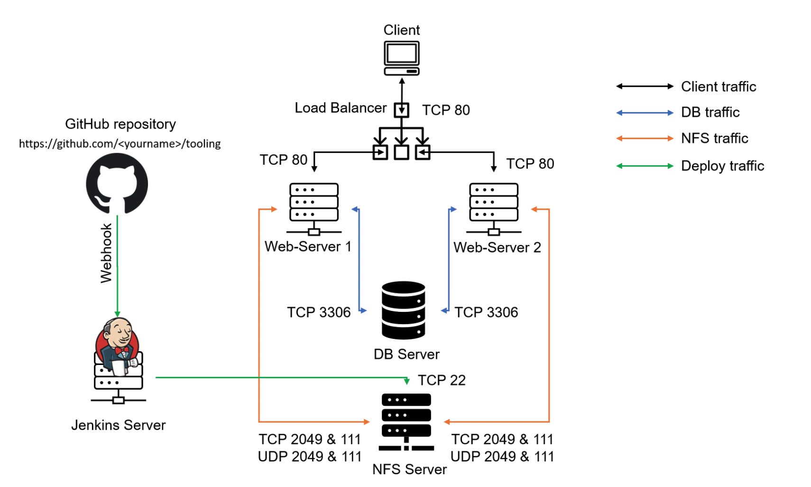

In previous [Project](https://github.com/babslekson/Devops-pbl/blob/main/Load-Balancer-Solution-With-Apache_P8/README.md) we introduced horizontal scalability concept, which allow us to add new Web Servers to our Tooling Website and have successfully deployed a set up with 2 Web Servers and also a Load Balancer to distribute traffic between them. If it is just two or three servers - it is not a big deal to configure them manually. Imagine that you would need to repeat the same task over and over again adding dozens or even hundreds of servers.

DevOps is about Agility, and speedy release of software and web solutions. One of the ways to guarantee fast and repeatable deployments is Automation of routine tasks.
In this project we are going to start automating part of our routine tasks with a free and open source automation server - Jenkins

In this project we are going to utilize Jenkins CI capabilities to make sure that every change made to the source code in GitHub https://github.com/babslekson/tooling will be automatically be updated to the Tooling Website.

## INSTALL AND CONFIGURE JENKINS SERVER
### Install Jenkins server
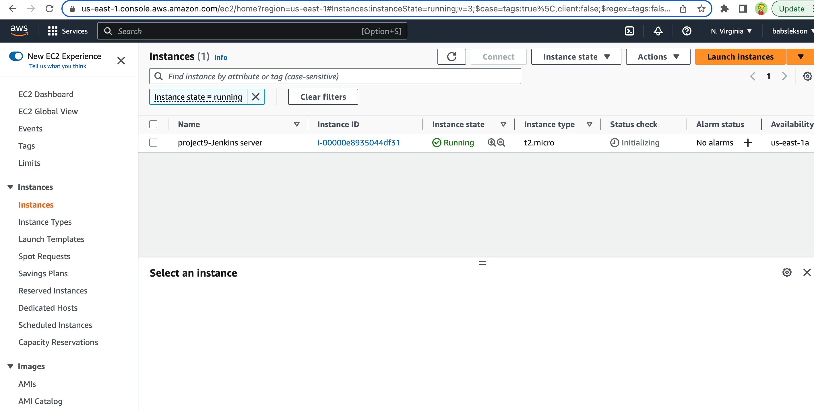
### Install JDK
```bash
sudo apt update
sudo apt install default-jdk-headless
```
### Install Jenkins

```bash
wget -q -O - https://pkg.jenkins.io/debian-stable/jenkins.io.key | sudo apt-key add -

sudo sh -c 'echo deb https://pkg.jenkins.io/debian-stable binary/ > \
    /etc/apt/sources.list.d/jenkins.list'

curl -fsSL https://pkg.jenkins.io/debian-stable/jenkins.io-2023.key | sudo tee \
  /usr/share/keyrings/jenkins-keyring.asc > /dev/null

echo deb [signed-by=/usr/share/keyrings/jenkins-keyring.asc] \
  https://pkg.jenkins.io/debian-stable binary/ | sudo tee \
  /etc/apt/sources.list.d/jenkins.list > /dev/null
sudo apt update 
sudo apt install jenkins

#verify Jenkins is up and running
sudo systemctl status jenkins
```
Open TCP port 8080 to access jenkins server
> Access Jenkins server http://\<Jenkins-Server-Public-IP-Address>:8080

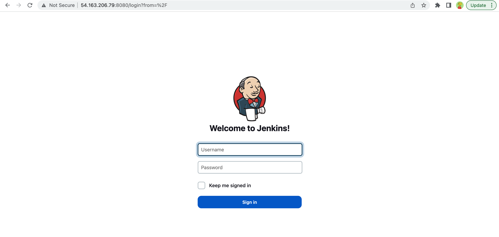


Retrieve password from jenkins server
```bash
sudo cat /var/lib/jenkins/secrets/initialAdminPassword
```
## CONFIGURE JENKINS TO RETRIEVE SOURCE CODES FROM GITHUB USING WEBHOOKS
---
### Enable webhook on Github
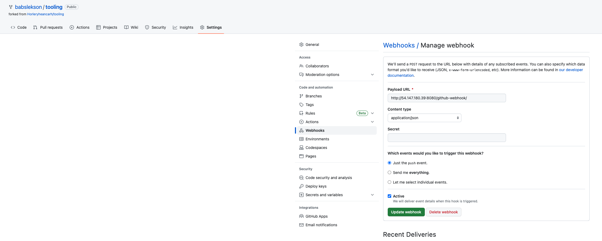
### Create a freestyle project on jenkins and allow access to tooling github repository
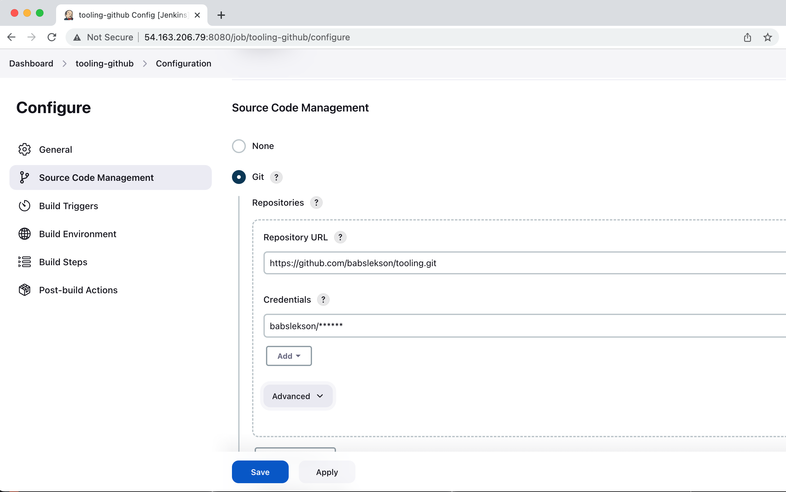
### Configure triggering the job from GitHub webhook
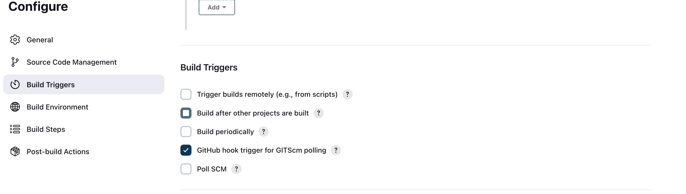
### Configure Post-build Actions to archive all the files
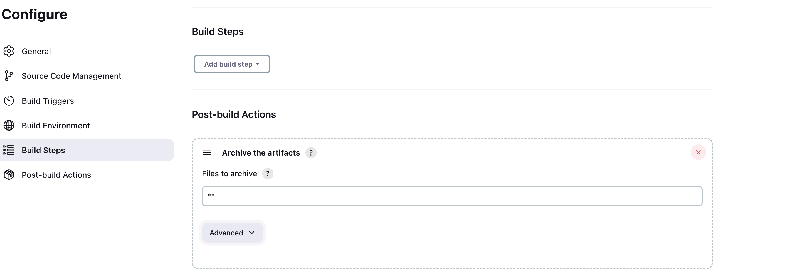
```bash
#check artifact on jenkins server
 ls /var/lib/jenkins/jobs/tooling_github/builds/<build_number>/archive/
 ```
 ## CONFIGURE JENKINS TO COPY FILES TO NFS SERVER VIA SSH
 ### Install publish over ssh plugin 
 ---
 
 #### Configure the freestyle project to copy artifacts over to NFS server
 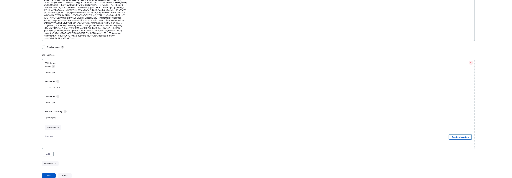

#### Open project configuration page and add another Post-build Action
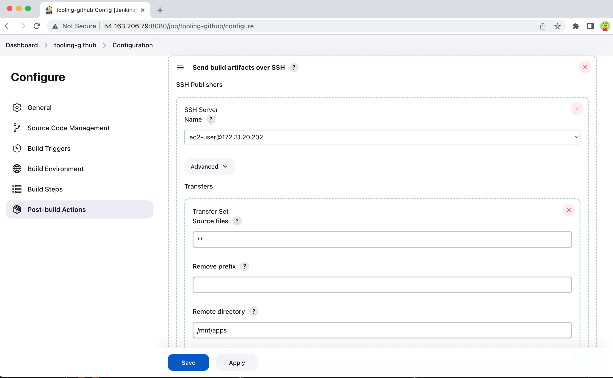

#### Test configuration by changing the readme on Github
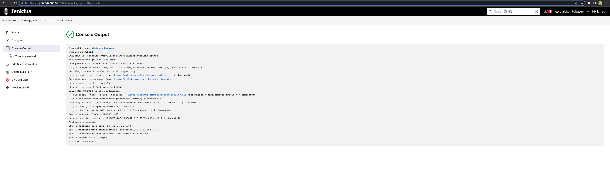

#### Verify changes in NFS server
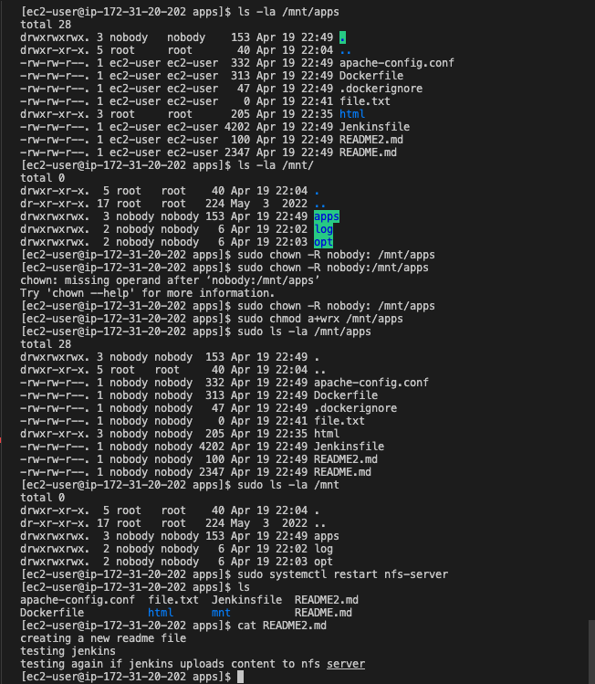 

### Continuation: Configuring TLS/SSL
In the next [project](https://github.com/babslekson/Devops-pbl/blob/main/Load-Balancer-Solution-With-Nginx-and-SSL_TLS_P10/README.md), we will enhance the security of our web solutions by registering the Tooling Website with Let's Encrypt Certificate Authority. This automated process will ensure the issuance of SSL/TLS certificates using the certbot shell client recommended by Let's Encrypt. Securing our connections with TLS/SSL encryption is crucial to safeguarding user data during transit.