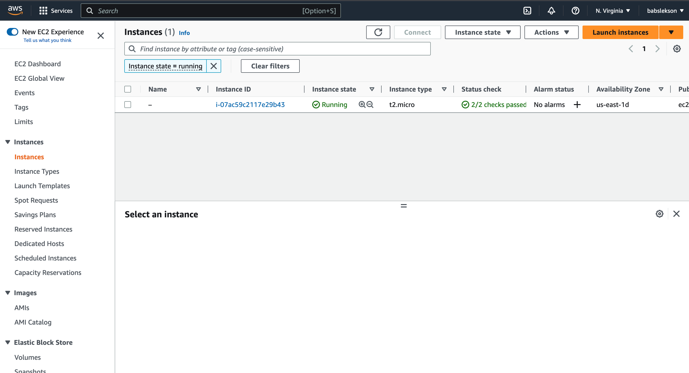
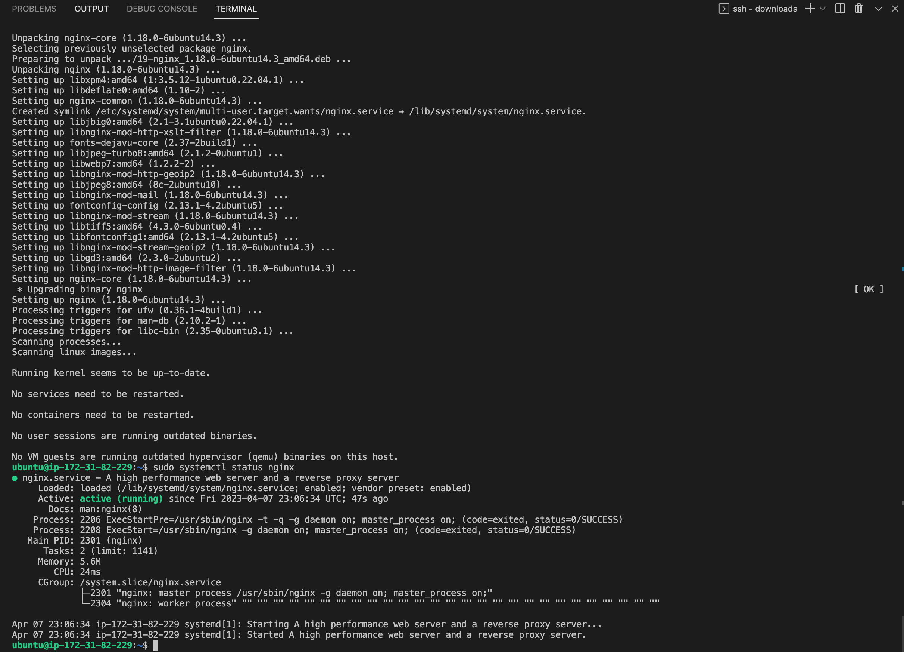
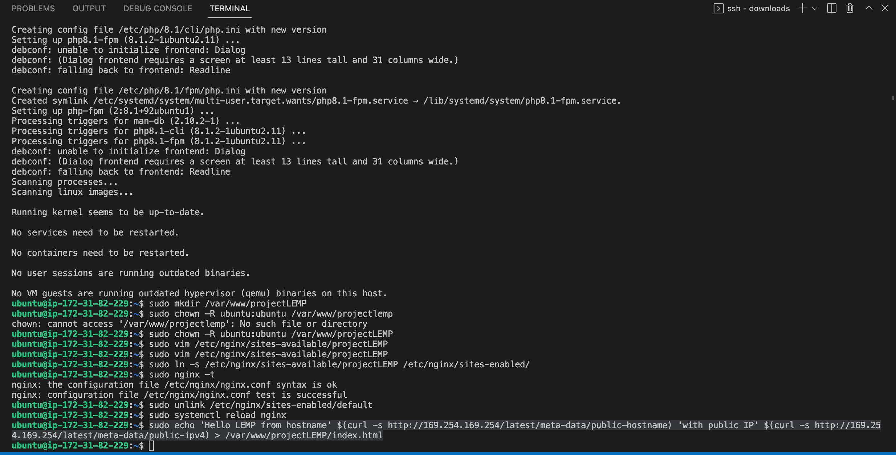
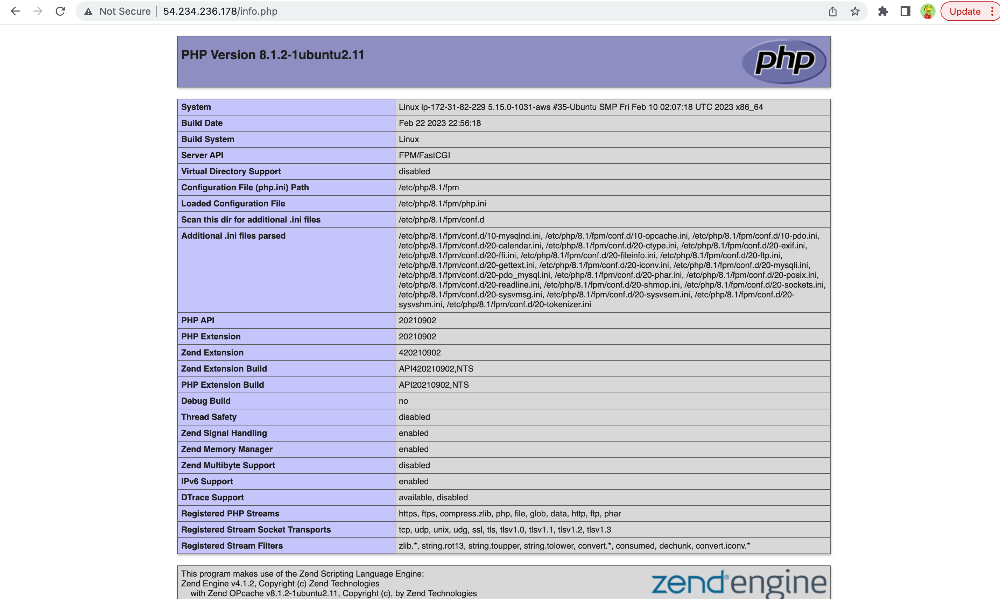
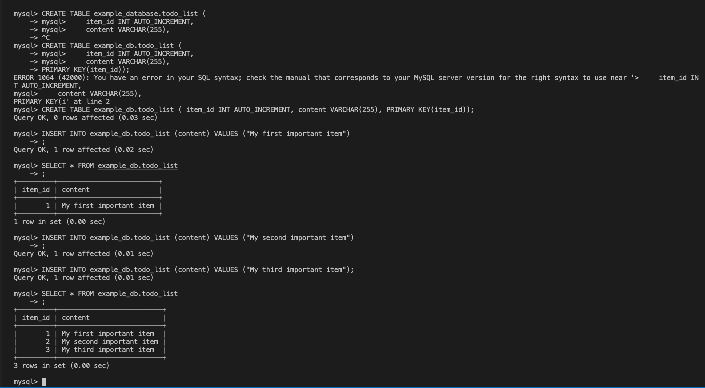

# LEMP STACK INSTALLATION
---
## STEP 0
---
### Create and launch EC2 instance

## Installing NGINX server
```bash
sudo apt update
sudo apt install nginx

#verify nginx server
sudo systemctl status nginx
```


## NGINX on instance URL

## STEP 2
### Installing mysql
```bash
sudo apt install mysql-server
# Setup
sudo mysql_secure_installation

sudo mysql
```

## STEP 3
---
### Installing PHP
```bash
sudo apt install php-fpm php-mysql
```
## STEP 4
---
### Configure NGINX to use PHP processor
```bash
sudo mkdir /var/www/projectLEMP

#change ownership
sudo chown -R ubuntu:ubuntu /var/www/projectLEMP

# New config file in nginx's sites-available
sudo vim /etc/nginx/sites-available/projectLEMP
```
content of config
```bash
#/etc/nginx/sites-available/projectLEMP

server {
    listen 80;
    server_name projectLEMP www.projectLEMP;
    root /var/www/projectLEMP;

    index index.html index.htm index.php;

    location / {
        try_files $uri $uri/ =404;
    }

    location ~ \.php$ {
        include snippets/fastcgi-php.conf;
        fastcgi_pass unix:/var/run/php/php8.1-fpm.sock;
     }

    location ~ /\.ht {
        deny all;
    }

}
```
```bash
# Activate configuration by linking to the config file from Nginx’s sites-enabled directory
sudo ln -s /etc/nginx/sites-available/projectLEMP /etc/nginx/sites-enabled/

# Test config file for syntax errors
sudo nginx -t

# Disable nginx default host
sudo unlink /etc/nginx/sites-enabled/default

# Restart nginx
sudo systemctl reload nginx

# Create index.html file in the /var/www/projectlemp directory
sudo echo 'Hello LEMP from hostname' $(curl -s http://169.254.169.254/latest/meta-data/public-hostname) 'with public IP' $(curl -s http://169.254.169.254/latest/meta-data/public-ipv4) > /var/www/projectLEMP/index.html
```

>Open website URL using IP address

http://\<Public-Ip_Address>:80


## STEP 5
---
### Testing PHP with NGINX
```bash
sudo vim /var/www/projectLEMP/info.php
```
>content of info.php
```bash
<?php
phpinfo();
```
>Visit the URL http://server_IP/info.php



## STEP 6
---
### Retrieving data from MySQL database with PHP
```bash
# Connect to MySQL
sudo mysql

# create database
mysql> CREATE DATABASE `example_db`;

# create user
mysql> CREATE USER 'testuser'@'%' IDENTIFIED WITH mysql_native_password BY 'password';

# grant access
mysql> GRANT ALL ON example_db.* TO 'testuser'@'%';

# exit mysql
mysql> exit

# log into mysql as testuser
mysql -u example_user -p

mysql> SHOW DATABASES;
```
>Create and populate table as shown in the screenshot below



>create a PHP script that will connect to MySQL
```bash
sudo vim /var/www/projectLEMP/todo_list.php
```
content of todo_list.php
```bash
<?php
$user = "example_user";
$password = "password";
$database = "example_db";
$table = "todo_list";

try {
  $db = new PDO("mysql:host=localhost;dbname=$database", $user, $password);
  echo "<h2>TODO</h2><ol>";
  foreach($db->query("SELECT content FROM $table") as $row) {
    echo "<li>" . $row['content'] . "</li>";
  }
  echo "</ol>";
} catch (PDOException $e) {
    print "Error!: " . $e->getMessage() . "<br/>";
    die();
}
```
>Visit the URL http://server_IP/todo_list.php


