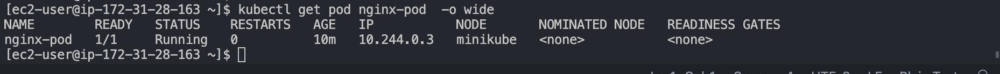
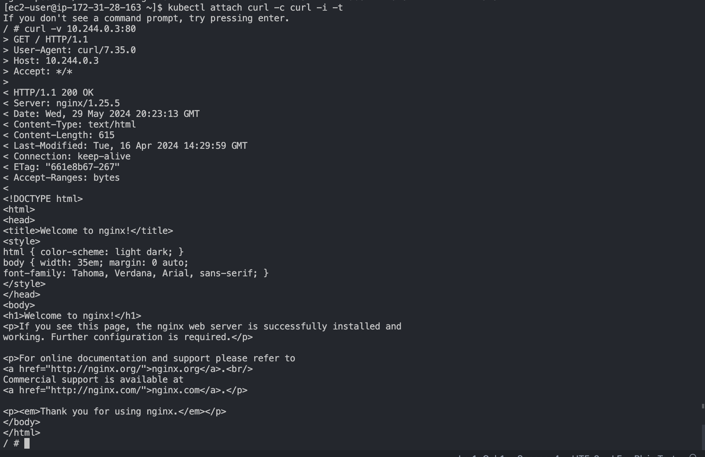
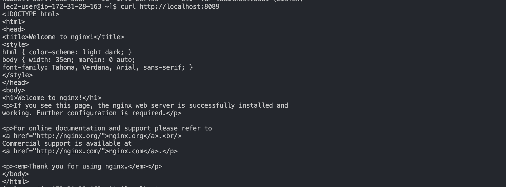
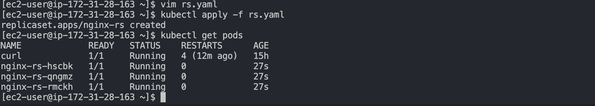
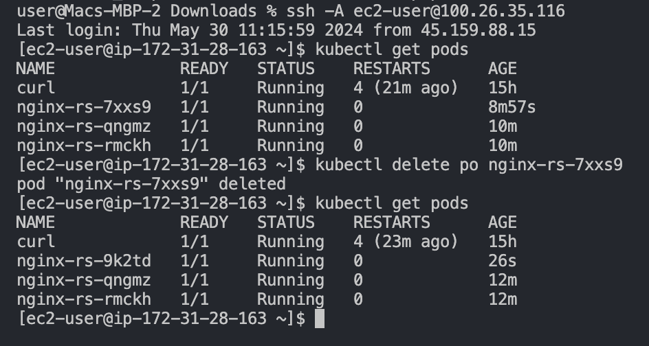
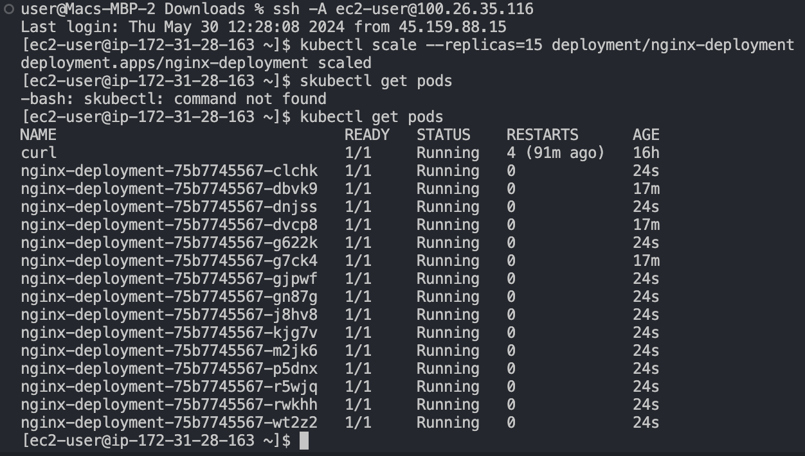
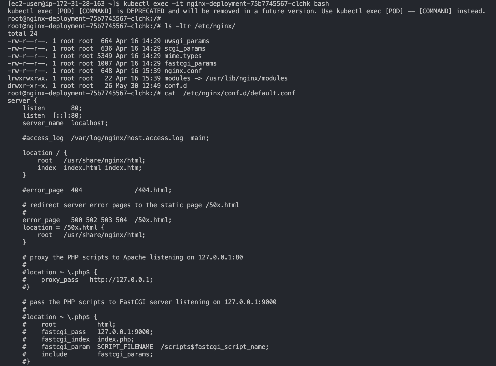
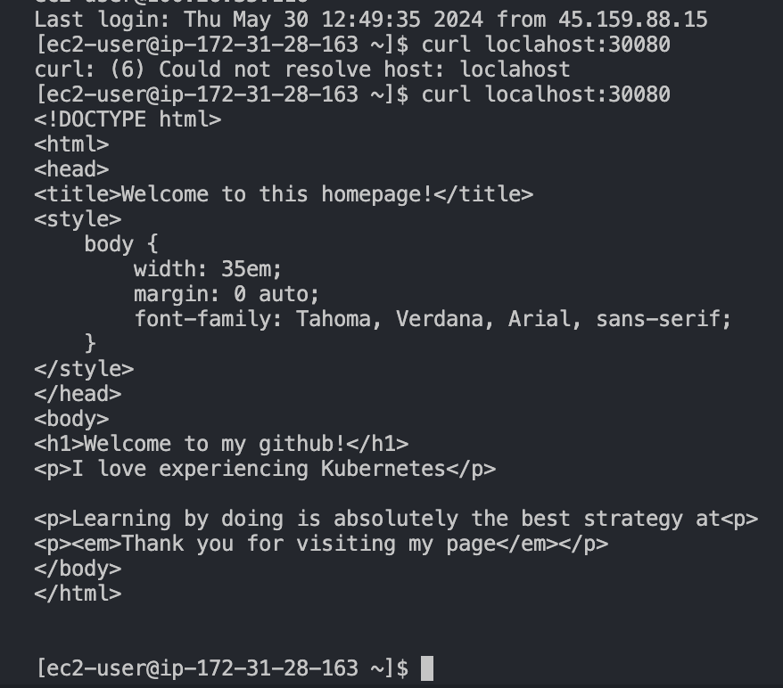

### Deploying Applications into Kubernetes Cluster
In this project, we will explore deploying applications on a Kubernetes (K8s) cluster. Kubernetes, with its many components, provides several layers of abstraction between your application and the host machines where it runs.

### Choosing the Right Kubernetes Cluster Setup
When selecting a Kubernetes cluster setup, the choice largely depends on the intended use. For development or learning purposes, lightweight tools like Minikube or k3s are ideal. These tools can run on a workstation without significant system requirements. While they have limitations in terms of workload capacity, they function just like any other Kubernetes cluster.

For more robust needs, suitable for production workloads with advanced features such as horizontal scaling of worker nodes, building your own Kubernetes cluster from scratch is an option. This approach was covered in the previous project, Kubernetes From the Ground Up.

Alternatively, managed Kubernetes services from public cloud providers like AWS EKS, Microsoft AKS, or Google Cloud Platform GKE are available. These services offer numerous advantages, including:

- Less administrative overhead
- Reduced cost of ownership
- Improved security
- Seamless support
- Periodic updates to stable, well-tested versions
- Faster cluster spin-up

However, some organizations with strict compliance and security requirements prefer to build their own Kubernetes clusters, often using on-premises data centers. This approach ensures data is stored privately and securely, avoiding the uncertainties of public cloud data center locations. Banks and government agencies are typical examples of entities that might choose this route.

Hybrid Cloud Setups
Some setups combine both public and private clouds. For instance, master nodes, etcd clusters, and worker nodes running stateful applications can be configured in private data centers, while worker nodes requiring heavy computation and stateless applications can run in public clouds. This hybrid architecture balances compliance requirements with the advantages of public cloud capabilities.

${{insert pictuere}}

### Deploying Applications Using Kubernetes Objects
In this section, we will write configuration files for Kubernetes objects, commonly referred to as `manifests`, using `yaml`syntax and deploy them using the `kubectl` console. First, let's understand what a Kubernetes object is.

#### Understanding Kubernetes Objects
Kubernetes objects are persistent entities within the Kubernetes system, representing the state of your cluster. They can describe:

Which containerized applications are running (and on which nodes)
The resources available to those applications
The policies governing application behavior, such as restart policies, upgrades, and fault tolerance
These objects serve as a **"record of intent."** Once an object is created, Kubernetes continuously works to ensure its existence, maintaining the cluster's desired state as specified by the object.

To manage Kubernetes objects—whether to create, modify, or delete them—you use the Kubernetes API. The `kubectl` command-line interface interacts with the API on your behalf. Alternatively, you can use `curl` to directly interact with the API or develop programs using client libraries for various programming languages, which requires advanced knowledge.

**Common Kubernetes Objects**
- **Pod**
- **Namespace**
- **ReplicaSet** (Manages Pods)
- **DeploymentController** (Manages Pods)
- **StatefulSet**
- **DaemonSet**
- **Service**
- **ConfigMap**
- **Volume**
- **Job/CronJob**

#### Docker vs. Kubernetes
It's important to understand the difference between how Docker and Kubernetes run containers. With Docker, each `docker run` command runs an image (representing an application) as a container, which is Docker's smallest deployable entity. Kubernetes, however, uses Pods as its smallest deployable object. A Pod can encapsulate one or more containers, allowing them to run together.

In Docker or Docker Compose, you deploy separate containers for an application and its database. In Kubernetes, you can run both the application and database containers within the same Pod, enabling direct communication as if they were on the same localhost. However, running both in the same Pod is generally not recommended.

A Pod with one container is called a single-container Pod, the most common Kubernetes use case. A Pod with multiple related containers is called a multi-container Pod. One common pattern for multi-container Pods is the sidecar container pattern, where an auxiliary container enhances the functionality of the main container without modifying it.

#### Common YAML Fields for Kubernetes Objects
Every Kubernetes object includes specific fields that govern its configuration:

- **kind**: The type of Kubernetes object being created (e.g., Pod, DaemonSet, Deployment, Service).
- **apiVersion**: The Kubernetes API version used to create the resource (e.g., v1, v1beta, v2). Some features are released under beta versions.
- **metadata**: Information about the resource, such as the name of the Pod, the namespace under which it will run, labels, and annotations.
spec: Core information about the Pod, including container image, number of replicas, environment variables, and volumes. This specifies the desired state of the resource.
- **status**: Information about the running object and the status of each container. This field is updated by Kubernetes after creation and is not included in the YAML manifest.

#### Deploying a Basic Pod
To illustrate how these fields work, let's deploy a basic Nginx container inside a Pod. Before proceeding, ensure you have Kubernetes installed and configured, such as Minikube, kubectl, Docker, and AWS CLI.

Let's proceed
1. Create a pod `yaml` mainfest 
```bash
sudo cat <<EOF | sudo tee ./nginx-pod.yaml
apiVersion: v1
kind: Pod
metadata:
  name: nginx-pod
spec:
  containers:
  - image: nginx:latest
    name: nginx-pod
    ports:
    - containerPort: 80
      protocol: TCP
EOF
```
2. Apply the manifest with the help of `kubectl`
```bash
kubectl apply -f nginx-pod.yaml
```
**Output**:
```bash
NAME        READY   STATUS    RESTARTS   AGE
nginx-pod   1/1     Running   0          19m
```
4. if the Pods were not ready for any reason, for example if there are no worker nodes, you will see something like the below output.
```bash
NAME        READY   STATUS    RESTARTS   AGE
nginx-pod   0/1     Pending   0          111s
```
5. To see other fields introduced by kubernetes after you have deployed the resource, simply run below command, and examine the output. You will see other fields that kubernetes updates from time to time to represent the state of the resource within the cluster. `-o` simply means the **output** format.
```bash
kubectl get pod nginx-pod -o yaml 
```
or 
```bash
kubectl get pod nginx-pod -o yaml 
```
### Accessing the app from the browser
Now that you have a running pod. What's next?

The ultimate goal of any solution is to access it either through a web portal or an application (e.g., mobile app). When we have a Pod with an Nginx container, accessing it from the browser directly isn't possible because the Pod has its own IP address that can't be accessed externally. To enable access, we use another Kubernetes object called a [Service](https://kubernetes.io/docs/concepts/services-networking/service/).

A Service in Kubernetes acts as a bridge, accepting requests on behalf of Pods and forwarding them to the Pod's IP address. Running the command below will reveal the Pod's IP address, but without a Service, direct external access isn't feasible.
```bash
kubectl get pod nginx-pod  -o wide 
```


Let us try to access the Pod through its IP address from within the K8s cluster. To do this,

1. We need an image that already has curl software installed. You can check this out here
```bash
dareyregistry/curl
```
2. Run kubectl to connect inside the container
```bash
kubectl run curl --image=dareyregistry/curl -i --tty
```
3. Run curl and point to the IP address of the Nginx Pod (Use the IP address of your own Pod)
```bash
curl -v <<pod_ip_address>>:80
```

If your solution is intended solely for internal use without requiring access from the public internet, this might be sufficient. However, in most cases, this approach is not reliable.

Assuming you need to access the Nginx Pod internally, relying on its IP address directly is problematic because Pods in Kubernetes are ephemeral. They are designed to be transient, and when a Pod restarts, its IP address changes. This can break applications that depend on the previous IP address.

To address this issue, Kubernetes introduces **Service**—a crucial abstraction layer that manages Pod IP addresses. A Service acts as a load balancer and reverse proxy, accepting requests using a human-readable DNS name. It dynamically resolves this name to the IP address of an active Pod and forwards the request accordingly. This eliminates the need to directly reference Pod IPs and instead allows you to use the service name.

Now, let's proceed to create a Service to facilitate access to the **Nginx Pod**.
1. Create a service `yaml` manifest file:
```bash
sudo cat <<EOF | sudo tee ./nginx-service.yaml
apiVersion: v1
kind: Service
metadata:
  name: nginx-service
spec:
  selector:
    app: nginx-pod 
  ports:
    - protocol: TCP
      port: 80
      targetPort: 80
EOF
```
2. Create a `nginx-service` resource by applying your manifest
```bash
kubectl apply -f nginx-sesrvice.yaml
```
**Output**:
```bash
service/nginx-service created
```
3. Check the created service
```bash
NAME            TYPE        CLUSTER-IP      EXTERNAL-IP   PORT(S)   AGE
kubernetes      ClusterIP   10.100.0.1      <none>        443/TCP   59m
nginx-service   ClusterIP   10.100.60.217   <none>        80/TCP    12m
```
**Observation**:
The TYPE column in the output shows that there are [different service types](https://kubernetes.io/docs/concepts/services-networking/service/#publishing-services-service-types).

- ClusterIP
- NodePort
- LoadBalancer &
- Headless Service

Since we did not specify any type, it is obvious that the default type is **ClusterIP**

Now that we have a service created, how can we access the app? Since there is no public IP address, we can leverage `kubectl` **port-forward** functionality.
```bash
kubectl port-forward svc/nginx-service 8089:80
```
Port **8089** on your laptop or client PC is an arbitrary port number through which we aim to tunnel traffic to port **80** of the nginx-service.

However, currently, this setup won't function as intended. The Service needs to know which specific Pod to route traffic to. If there are numerous Pods running, it's essential to ensure that the Service directs requests only to the intended Pod.

To achieve this, you must update the Pod manifest and introduce **labels**. These labels will match the selectors defined in the Service manifest's field section.
1. Update the Pod manifest with the below and apply the manifest:
```bash
apiVersion: v1
kind: Pod
metadata:
  name: nginx-pod
  labels:
    app: nginx-pod  
spec:
  containers:
  - image: nginx:latest
    name: nginx-pod
    ports:
    - containerPort: 80
      protocol: TCP
```
Notice that under the metadata section, we have now introduced labels with a key field called `app` and its value `nginx-pod`. This matches exactly the `selector` key in the `service` manifest.

The key/value pairs can be anything you specify. These are not Kubernetes specific keywords. As long as it matches the selector, the service object will be able to route traffic to the Pod.

Apply the manifest with:
```bash
kubectl apply -f nginx-pod.yaml
```
2. Run kubectl port-forward command again
```bash
kubectl  port-forward svc/nginx-service 8089:80
```
output:
```bash
kubectl  port-forward svc/nginx-service 8089:80
Forwarding from 127.0.0.1:8089 -> 80
Forwarding from [::1]:8089 -> 80
```
Curl localhost:8089- you should now be able to see the nginx page through localhost.


#### Expose a Service on a server's public IP address & static port 
Sometimes, it may be needed to directly access the application using the public IP of the server (when we speak of a K8s cluster we can replace 'server' with 'node') the Pod is running on. This is when the [NodePort](https://kubernetes.io/docs/concepts/services-networking/service/#nodeport) service type comes in handy.

A **Node port** service type exposes the service on a static port on the node's IP address. NodePorts are in the 30000-32767 range by default, which means a NodePort is unlikely to match a service’s intended port (for example, 80 may be exposed as 30080).

Update the nginx-service yaml to use a NodePort Service.
```bash
apiVersion: v1
kind: Service
metadata:
  name: nginx-service
spec:
  type: NodePort
  selector:
    app: nginx-pod
  ports:
    - protocol: TCP
      port: 80
      nodePort: 30080
``` 
What has changed is:

Specified the type of service (Nodeport)
1. Specified the NodePort number to use.
2. Allow the inbound traffic in your EC2's Security Group to the NodePort range `30000-32767`
3. Get the public IP address of the node the Pod is running on, append the nodeport and access the app through the browser.

You must understand that the port number `30080` is a port on the node in which the Pod is scheduled to run. If the Pod ever gets rescheduled elsewhere, then the same port number will be used on the new node it is running on. So, if you have multiple Pods running on several nodes at the same time - they all will be exposed on respective nodes' IP addresses with a static port number.

Read some more information regarding Services in Kubernetes in [this article](https://medium.com/avmconsulting-blog/service-types-in-kubernetes-24a1587677d6).

#### How Kubernetes ensures desired number of Pods is always running?
When we define a Pod manifest and appy it - we create a Pod that is running until it's terminated for some reason (e.g., error, Node reboot or some other reason), but what if we want to declare that we always need at least 3 replicas of the same Pod running at all times? Then we must use an **[**ResplicaSet (RS)**](https://kubernetes.io/docs/concepts/workloads/controllers/replicaset/) object - it's purpose is to maintain a stable set of Pod replicas running at any given time. As such, it is often used to guarantee the availability of a specified number of identical Pods.

Let us delete our nginx-pod Pod:
```bash
kubectl delete -f nginx-pod.yaml
```
**Create a ReplicaSet**
Let us create a `rs.yaml` manifest for a ReplicaSet object:
```bash
apiVersion: apps/v1
kind: ReplicaSet
metadata:
  name: nginx-rs
spec:
  replicas: 3
  selector:
    matchLabels:
      app: nginx-pod
  template:
    metadata:
      name: nginx-pod
      labels:
         app: nginx-pod
    spec:
      containers:
      - image: nginx:latest
        name: nginx-pod
        ports:
        - containerPort: 80
          protocol: TCP
```
```bash
kubectl apply -f rs.yaml
```
The manifest file of ReplicaSet consist of the following fields:

- apiVersion: This field specifies the version of kubernetes Api to which the object belongs. ReplicaSet belongs to **apps/v1** apiVersion.
- kind: This field specify the type of object for which the manifest belongs to. Here, it is ReplicaSet.
- metadata: This field includes the metadata for the object. It mainly includes two fields: name and labels of the **ReplicaSet**.
- spec: This field specifies the **label selector** to be used to select the Pods, number of replicas of the Pod to be run and the container or list of containers which the Pod will run. In the above example, we are running 3 replicas of nginx container.
Let us check what Pods have been created:

```bash
kubectl get pods
```

Here we see three nginx-pods with some random suffixes (e.g., -rmckh) - it means, that these Pods were created and named automatically by some other object (higher level of abstraction) such as ReplicaSet.

Try to delete one of the Pods:
```bash
kubectl delete po nginx-rs-7xxs9
```


You can see, that we still have all 3 Pods, but one has been recreated (can you differentiate the new one?)

Explore the ReplicaSet created:
```bash
kubectl get rs -o wide
```
**Output**:
```bash
NAME        DESIRED   CURRENT   READY   AGE   CONTAINERS   IMAGES         SELECTOR
nginx-rs   3         3         3       34m   nginx-pod    nginx:latest   app=nginx-pod
```
Notice, that ReplicaSet understands which Pods to create by using **SELECTOR** key-value pair.

**Get detailed information of a ReplicaSet**
To display detailed information about any Kubernetes object, you can use 2 different commands:

- kubectl describe %object_type% %object_name% (e.g. kubectl describe rs nginx-rs)
- kubectl get %object_type% %object_name% -o yaml (e.g. kubectl describe rs nginx-rs -o yaml)
Try both commands in action and see the difference. Also try get with `-o json` instead of `-o yaml` and decide for yourself which output option is more readable for you.

**Scale ReplicaSet up and down**
In general, there are 2 approaches of [Kubernetes Object Management](https://kubernetes.io/docs/concepts/overview/working-with-objects/object-management/): imperative and declarative.

Let us see how we can use both to scale our Replicaset up and down:

**Imperative**:

We can easily scale our ReplicaSet up by specifying the desired number of replicas in an imperative command, like this:
```bash
kubectl scale rs nginx-rs --replicas=5

replicaset.apps/nginx-rs scaled
```
Scaling down will work the same way.

**Declarative**:

Declarative way would be to open our rs.yaml manifest, change desired number of replicas in respective section
```
spec:

replicas: 3
```
and applying the updated manifest:

```bash
kubectl apply -f rs.yaml
```
There is another method - `'ad-hoc'`, it is definitely not the best practice and we do not recommend using it, but you can edit an existing ReplicaSet with following command:

```bash
kubectl edit -f rs.yaml
```
**Advanced label matching**

As Kubernetes mature as a technology, so does its features and improvements to k8s objects. `ReplicationControllers` do not meet certain complex business requirements when it comes to using `selectors`. Imagine if you need to select Pods with multiple lables that represents things like:

- **Application** tier: such as Frontend, or Backend
- **Environment**: such as Dev, SIT, QA, Preprod, or Prod
So far, we used a simple selector that just matches a key-value pair and check only `'equality'`:
```bash
  selector:
    app: nginx-pod
```
But in some cases, we want ReplicaSet to manage our existing containers that match certain criteria, we can use the same simple label matching or we can use some more complex conditions, such as:
```bash
 - in
 - not in
 - not equal
 - etc...
 ```
Let us look at the following manifest file:
```bash
apiVersion: apps/v1
kind: ReplicaSet
metadata: 
  name: nginx-rsV2
spec:
  replicas: 3
  selector:
    matchLabels:
      env: prod
    matchExpressions:
    - { key: tier, operator: In, values: [frontend] }
  template:
    metadata:
      name: nginx
      labels: 
        env: prod
        tier: frontend
    spec:
      containers:
      - name: nginx-container
        image: nginx:latest
        ports:
        - containerPort: 80
          protocol: TCP
```
In the above spec file, under the selector, `matchLabels` and `matchExpression` are used to specify the key-value pair. The `matchLabel` works exactly the same way as the equality-based selector, and the matchExpression is used to specify the set based selectors. This feature is the main differentiator between `ReplicaSet` and previously mentioned obsolete `ReplicationController`.

Get the replication set:
```bash
kubectl get rs nginx-rs -o wide

NAME       DESIRED   CURRENT   READY   AGE     CONTAINERS        IMAGES         SELECTOR
nginx-rs   3         3         3       5m34s   nginx-container   nginx:latest   env=prod,tier in (frontend)
```
### Using AWS Load Balancer to access your service in Kubernetes
Previously accessed the Nginx service through **ClusterIP**, and **NodeIP**, but there is another service type - [Loadbalancer](https://kubernetes.io/docs/concepts/services-networking/service/#loadbalancer). This type of service not only creates a Service object in Kubernetes but also provisions a real external Load Balancer. For instance, in AWS, this could be  [Elastic Load Balancer(ELB)]((https://aws.amazon.com/elasticloadbalancing/)) in AWS

The LoadBalancer service type is especially useful when you need to expose your service to the internet or other external networks. It abstracts the complexities of managing external load balancers and integrates seamlessly with cloud provider infrastructure.

For more details, you can refer to the [Kubernetes documentation on LoadBalancer services](https://kubernetes.io/docs/concepts/services-networking/service/#loadbalancer).

### Transitioning to Deployment Controllers
**Do Not Use Replication Controllers - Use Deployment Controllers Instead**
Kubernetes is packed with numerous features that are continually evolving thanks to its vibrant open-source community.

Previously, you may have encountered improvements from **ReplicationControllers (RC)** to **ReplicaSets (RS)**. In this section, we will explore another highly recommended Kubernetes object that surpasses both RC and RS: the Deployment.

A [Deployment](https://kubernetes.io/docs/concepts/workloads/controllers/deployment/) is a more advanced and robust abstraction layer above ReplicaSets and Pods. It simplifies the management of ReplicaSets, allowing for easy updates and rollbacks to previous deployment versions. Deployments are declarative and support rolling updates of micro-services, ensuring zero downtime.

It is officially recommended to use **Deployments** to manage ReplicaSets rather than using ReplicaSets directly.

Let's see a Deployment in action.
1. Delete the ReplicaSet
```bash
kubectl delete rs nginx-rs
```
2. Create the nginx-deployment.yaml file
```bash
# Section 1 - This is the part that defines the deployment
apiVersion: apps/v1 
kind: Deployment
metadata:
  name: nginx-deployment
  labels:
    tier: frontend
# Section 2 - This is the Replica set layer controlled by the deployment
spec:
  replicas: 3
  selector:
    matchLabels:
      tier: frontend
  template:
    metadata:
      labels:
        tier: frontend
# Section 3 - This is the Pod section controlled by the deployment and selected by the replica set in section 2.
  template:
    metadata:
      labels:
        tier: frontend
    spec:
      containers:
      - name: nginx
        image: nginx:latest
        ports:
        - containerPort: 80

    spec:
      containers:
      - name: nginx
        image: nginx:latest
        ports:
        - containerPort: 80
```
``` kubectl apply -f nginx-deployment.yaml
```
Run commands to get the following
1. Get the Deployment

```bash
kubectl get deployment
```
```bash
NAME               READY   UP-TO-DATE   AVAILABLE   AGE
nginx-deployment   3/3     3            3           39s
```
```bash
kubectl get rs
```
```bash
NAME                          DESIRED   CURRENT   READY   AGE
nginx-deployment-7d476d754d   3         3         3       96s
```
```bash
kubectl get pods
```
2. Scale the replicas in the Deployment to 15 Pods


3. Exec into one of the Pod's container to run Linux commands
```bash
kubectl exec -it nginx-deployment-75b7745567-clchk -- bash
```
4. List the files and folders in the nginx directory 

Install vim so that you can edit the file
```bash
apt-get update
apt-get install vim
```
5. Update the content of the file and curl localhost
