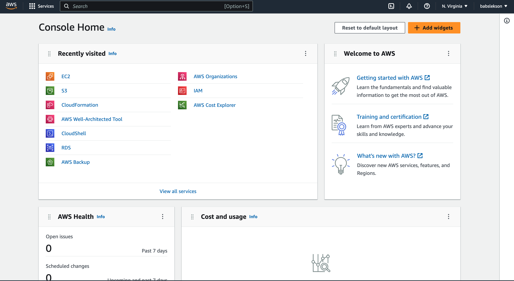
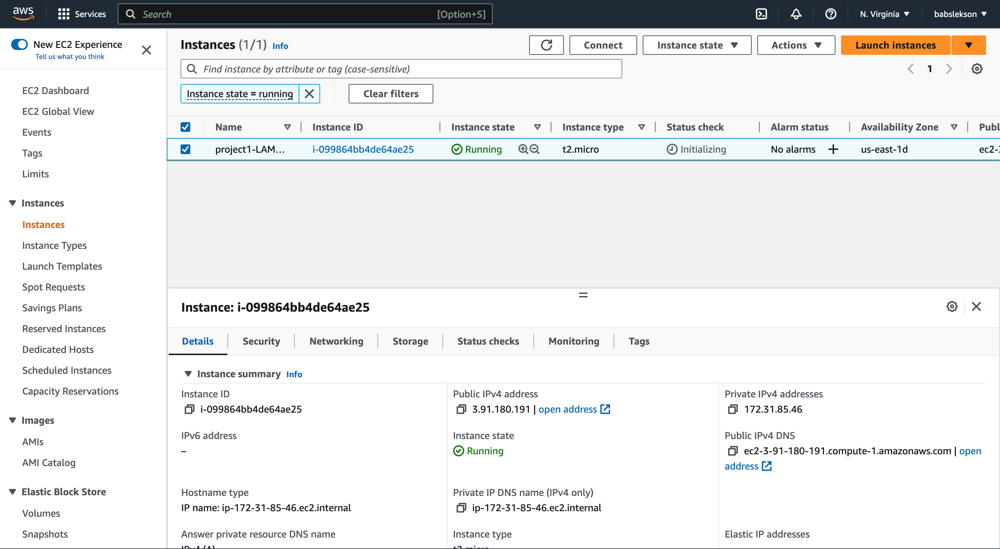
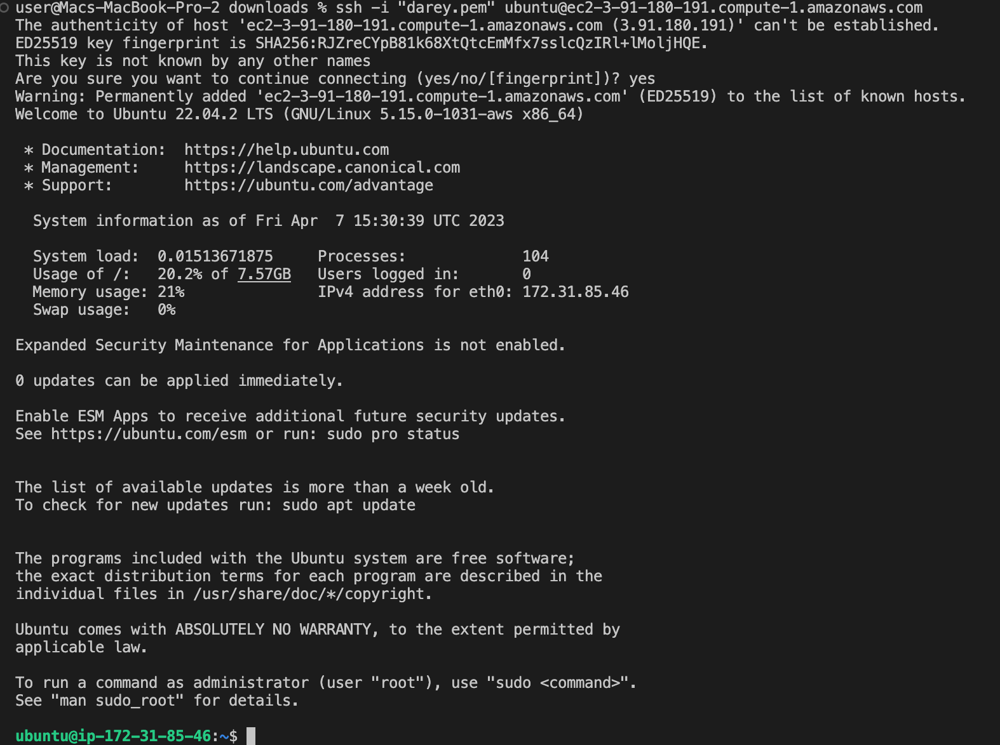
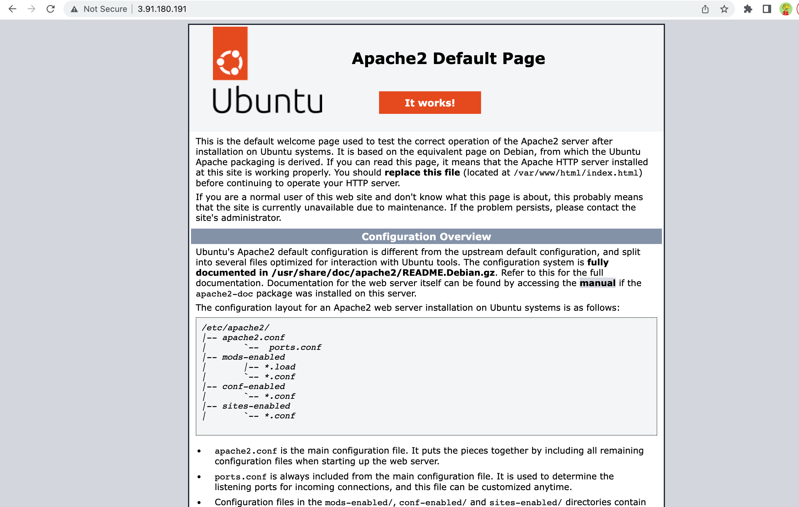
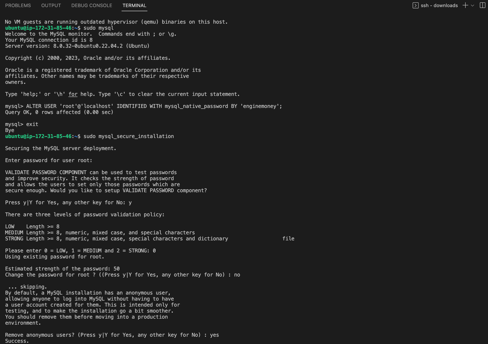

# LAMP STACK IMPLEMENTATION
---
## STEP 0
---
### Create an AWS account


### Create and launch an EC2 instance



### Connect to instance



## STEP 1 
---
### Installing Apache
```bash
sudo apt update 
sudo apt install apache2

# Verifying that apache is installed
sudo systemctl status apache2
```

### Apache on instance URL
>http://\<Public-IP-Address\>:80



## STEP 2
---
### Installing Mysql
```bash
sudo apt install mysql-server
sudo mysql
#remove insure defsult settings
ALTER USER 'root'@'localhost' IDENTIFIED WITH mysql_native_password BY '<PassWord.1>';

#setup user
sudo mysql_secure_installation
```


