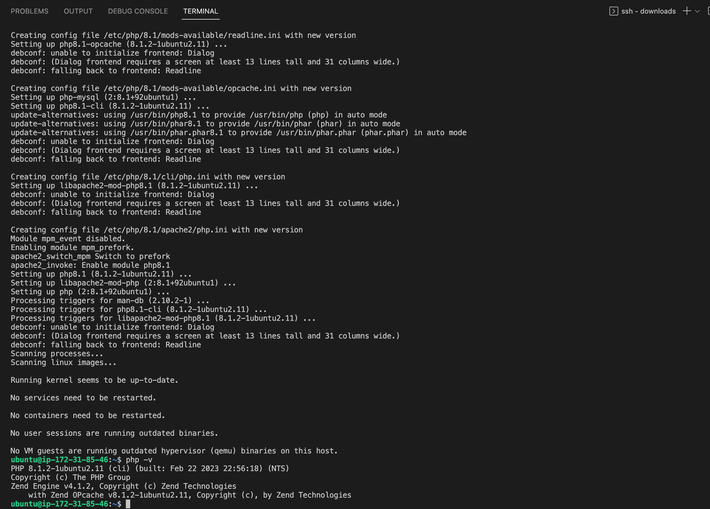
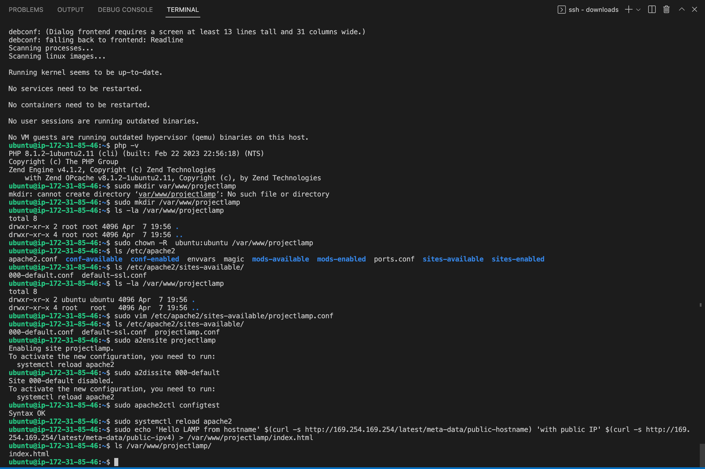
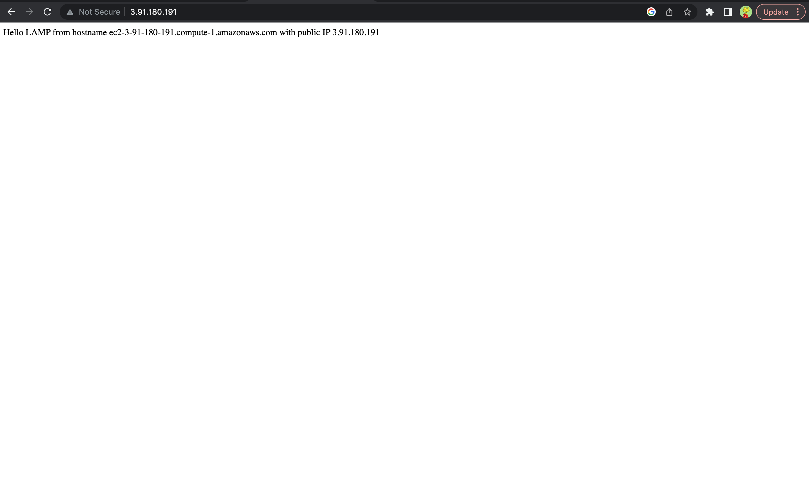
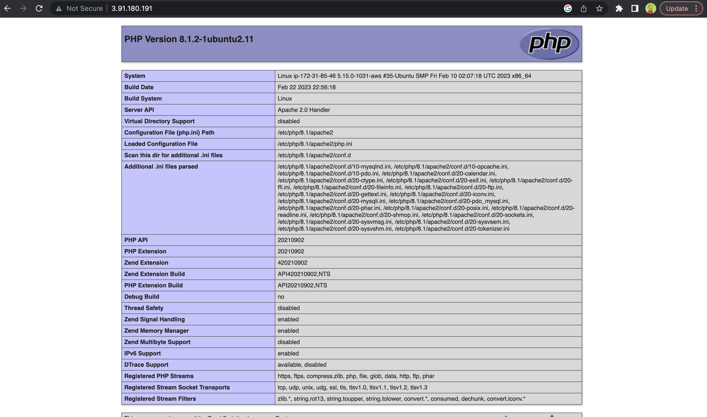

# LAMP STACK IMPLEMENTATION
---
## STEP 0
---
### Create an AWS account


### Create and launch an EC2 instance


### Connect to instance


## STEP 1 
---
### Installing Apache
```bash
sudo apt update 
sudo apt install apache2

# Verifying that apache is installed
sudo systemctl status apache2
```

### Apache on instance URL
>http://\<Public-IP-Address\>:80


## STEP 2
---
### Installing Mysql
```bash
sudo apt install mysql-server
sudo mysql
#remove insure defsult settings
ALTER USER 'root'@'localhost' IDENTIFIED WITH mysql_native_password BY '<PassWord.1>';

#setup user
sudo mysql_secure_installation
```


## STEP 3
---
### Installing PHP
```bash
sudo apt install php libapache2-mod-php php-mysql

#verify that php is installed
php -v
```



## STEP 4
---
CREATING A VIRTUAL HOST FOR THE WEBSITE USING APACHE

```bash
sudo mkdir /var/www/projectlamp

#change ownership
sudo chown -R ubuntu:ubuntu /var/www/projectlamp
# write into config file
sudo vim /etc/apache2/sites-available/projectlamp
```
>content of projectlamp.conf
```bash
<VirtualHost *:80>
    ServerName projectlamp
    ServerAlias www.projectlamp 
    ServerAdmin webmaster@localhost
    DocumentRoot /var/www/projectlamp
    ErrorLog ${APACHE_LOG_DIR}/error.log
    CustomLog ${APACHE_LOG_DIR}/access.log combined
</VirtualHost>
```
```bash
# enable virtual host 
sudo a2ensite projectlamp

#disable default website
sudo a2dissite 000-default

#check for configuration error
sudo apache2ctl configtest

# Create index.html file in the /var/www/projectlamp directory
sudo echo 'Hello LAMP from hostname' $(curl -s http://169.254.169.254/latest/meta-data/public-hostname) 'with public IP' $(curl -s http://169.254.169.254/latest/meta-data/public-ipv4) > /var/www/projectlamp/index.html
```


### Open website using ip address
>http://\<Public-Ip-Address>:80



## STEP 5
### Enable PHP on the website
```bash
# Changing the files' order of precedence
sudo vim /etc/apache2/mods-enabled/dir.conf
```
```bash
<IfModule mod_dir.c>
#Change this:
#DirectoryIndex index.html index.cgi index.pl index.php index.xhtml index.htm
#To this:
DirectoryIndex index.php index.html index.cgi index.pl index.xhtml index.htm
</IfModule>
```
```bash
# Restart Apache
sudo systemctl reload apache2

# Create index.php file
vim /var/www/projectlamp/index.php
```
```bash
<?php
phpinfo();
```


### DONE!!