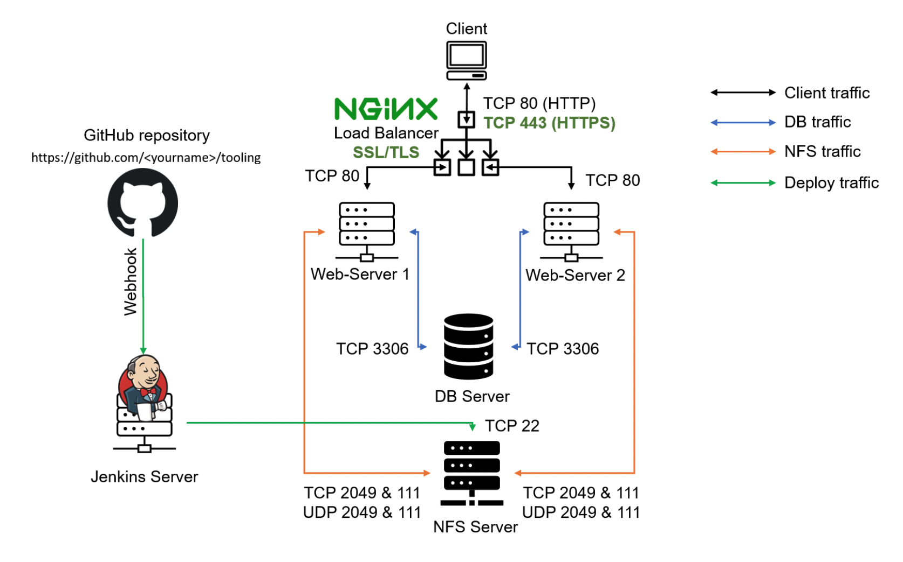
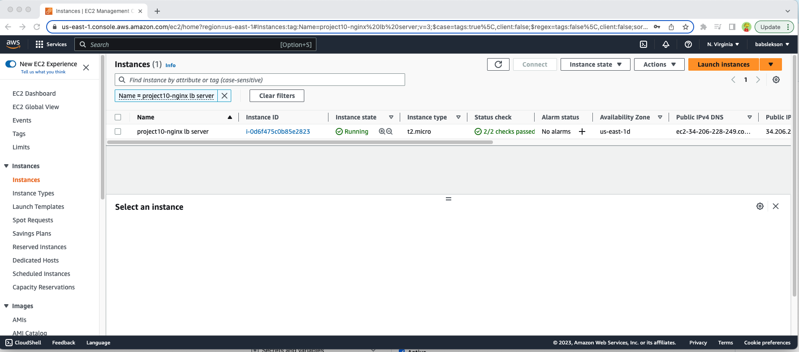
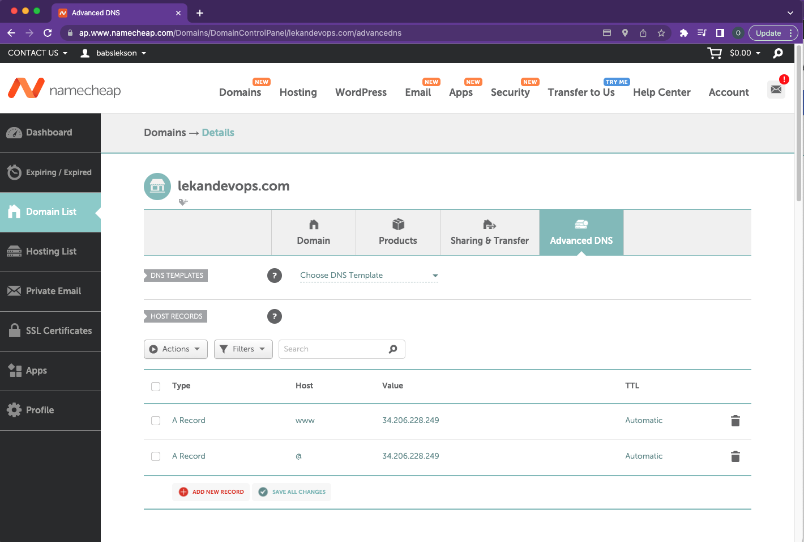
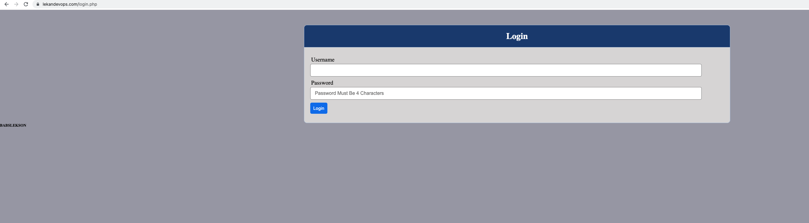

# LOAD BALANCER SOLUTION WITH NGINX AND SSL/TLS

## CONFIGURE NGINX AS A LOAD BALANCER
```bash
sudo apt update 
sudo apt install nginx
```
### Configure Nginx LB using Web Servers’ names
```bash
sudo vim /etc/hosts

#add the following 
<webserver-ip-addresss> Web1
<webserver-ip-address> Web2

esq + wq
```
#### Open default nginx configuration file
```bash
sudo vim /etc/nginx/nginx.conf
#insert following configuration into http section

 upstream myproject {
    server Web1 weight=5;
    server Web2 weight=5;
  }

server {
    listen 80;
    server_name www.domain.com;
    location / {
      proxy_pass http://myproject;
    }
  }

#comment out this line
#       include /etc/nginx/sites-enabled/*;
```
#### Restart nginx server 
```bash
sudo systemctl restart nginx
sudo systemctl status nginx
```
## REGISTER A NEW DOMAIN NAME AND CONFIGURE SECURED CONNECTION USING SSL/TLS CERTIFICATES
---
#### Assign elastic ip address to the nginx server 

#### Associate Domain name 


#### Configure Nginx to recognize the domain name
```bash
sudo vim /etc/nginx/nginx.conf

#Update your nginx.conf with server_name www.<your-domain-name.com> instead of server_name www.domain.com
```
### Install certbot and request for an SSL/TLS certificate
```bash
#verify snap is active 
sudo systemctl status snapd

# install certbot
sudo snap install --classic certbot

# Request certificate
sudo ln -s /snap/bin/certbot /usr/bin/certbot
sudo certbot --nginx
```
#### Set up periodical renewal of your SSL/TLS certificate
```bash
# Test renewal command
sudo certbot renew --dry-run

#configure a cronjob to run the command twice a day
crontab -e

#Add following line:

* */12 * * *   root /usr/bin/certbot renew > /dev/null 2>&1
```




