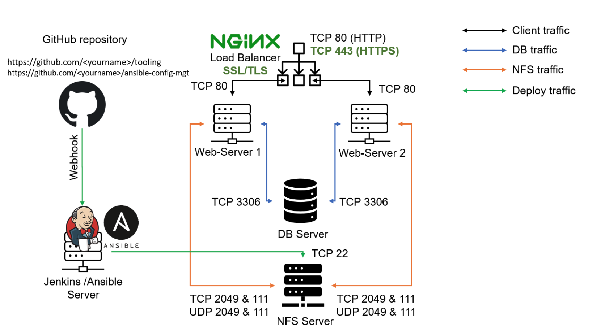
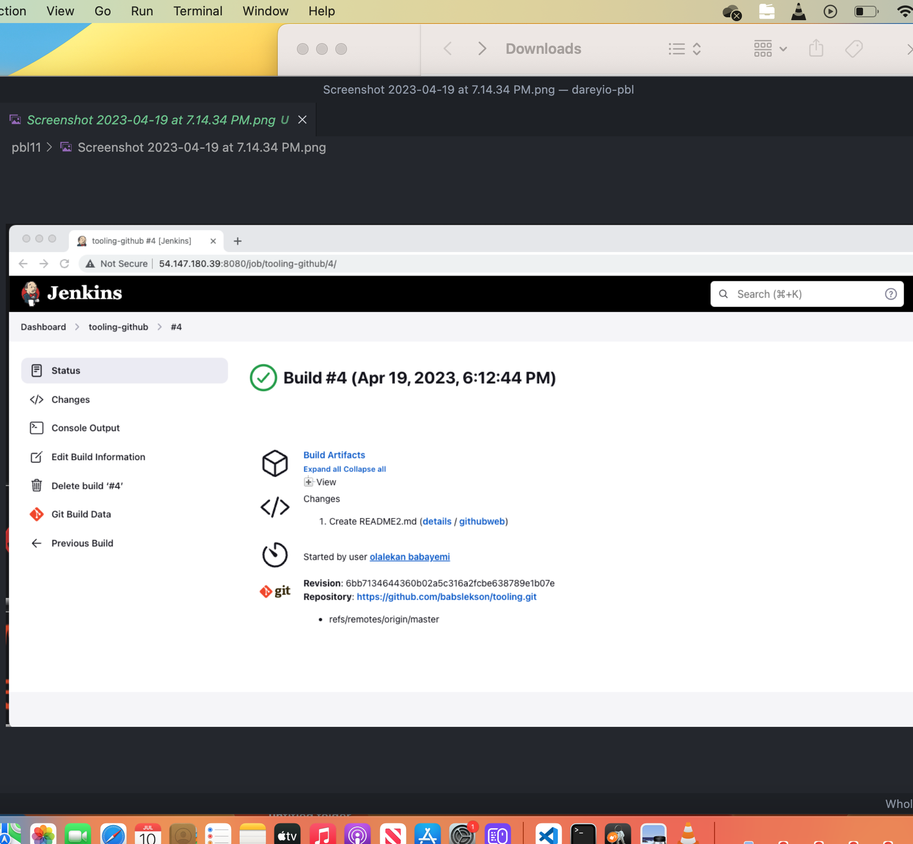
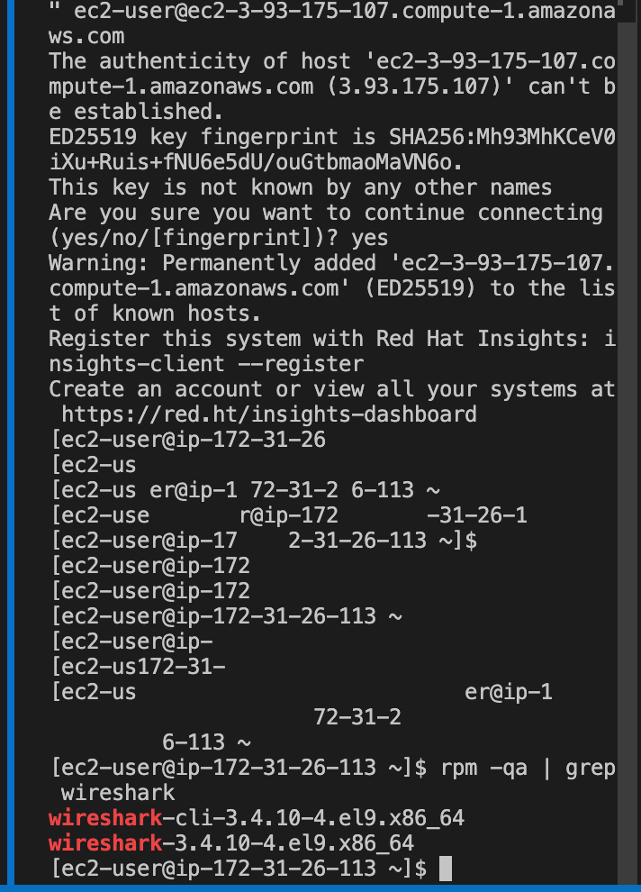
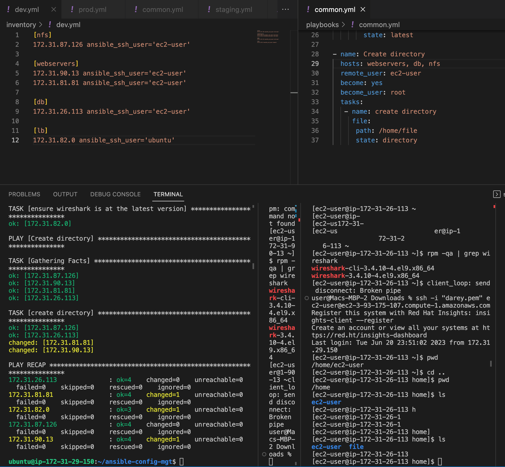
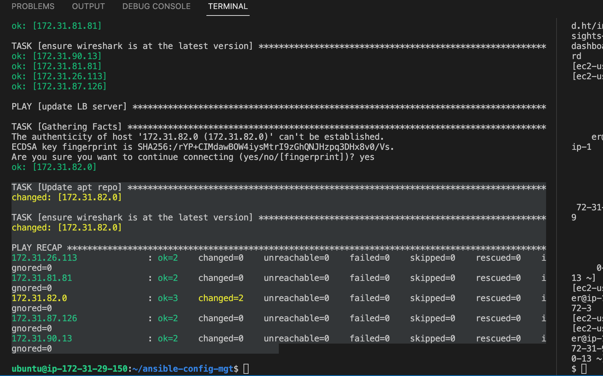
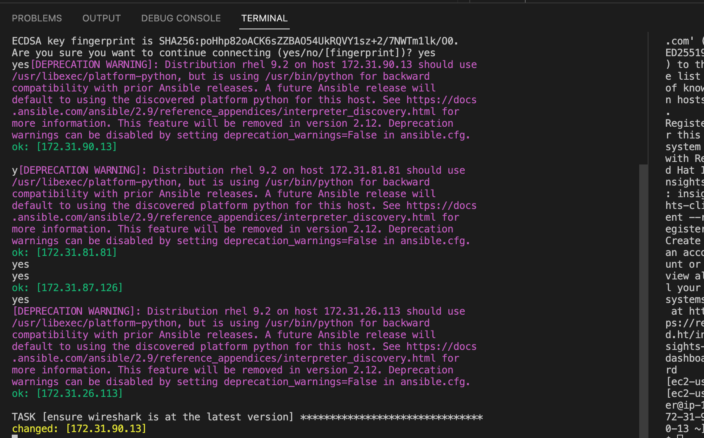
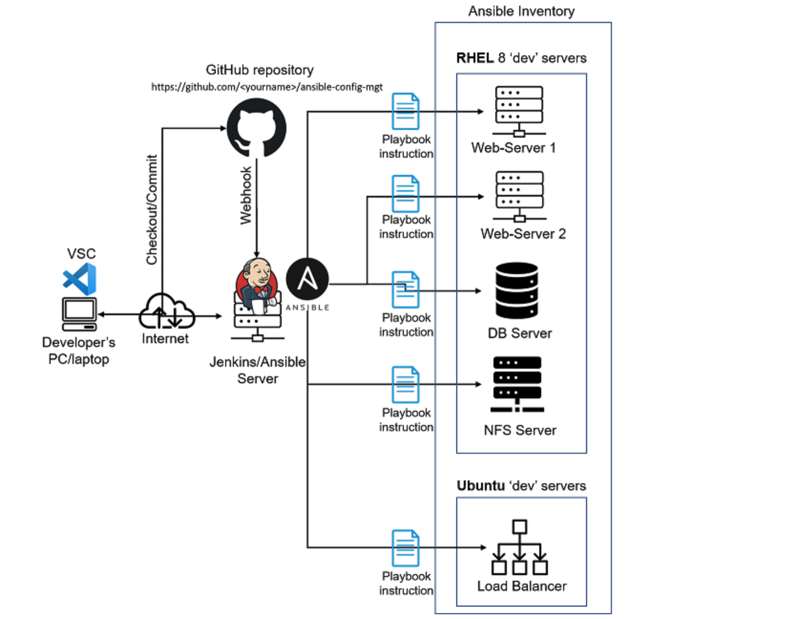

# ANSIBLE CONFIGURATION MANAGEMENT – AUTOMATE PROJECT 7 TO 10

---
###STEP 0
---
###Create a new repository on github named ansible config-mgt
---
##STEP 1
###install ansible
```bash
sudo apt install ansible 
```
###STEP 2
##Create a freestyle project 'ansible' in jenkins and point it to 'ansible-config-mgt'

---
###setup ssh key agent to enable ansible to ssh into the instances
```bash
eval `ssh-agent -s`
ssh-add <path-to-private-key>

# Confirm the key has been added
ssh-add -l

# ssh into your Jenkins-Ansible server 
ssh -A ubuntu@public-ip
```
## STEP 3
---
>Created a directory named playbooks – it will be used to store all playbook files.
Created a directory named inventory – it will be used to keep hosts organised.
Within the playbooks folder, first playbook was created named common.yml
Within the inventory folder, inventory file was created  (.yml) for each environment (Development, Staging Testing and Production) dev, staging, uat, and prod respectively.

## STEP 4
---
### Update inventory/dev.yml file 
```bash
<NFS-Server-Private-IP-Address> ansible_ssh_user='ec2-user'

[webservers]
<Web-Server1-Private-IP-Address> ansible_ssh_user='ec2-user'
<Web-Server2-Private-IP-Address> ansible_ssh_user='ec2-user'

[db]
<Database-Private-IP-Address> ansible_ssh_user='ec2-user' 

[lb]
<Load-Balancer-Private-IP-Address> ansible_ssh_user='ubuntu'
```
### Update playbooks/common.yml
```bash
---
- name: update web, nfs and db servers
  hosts: webservers, nfs, db
  remote_user: ec2-user
  become: yes
  become_user: root
  tasks:
    - name: ensure wireshark is at the latest version
      yum:
        name: wireshark
        state: latest

- name: update LB server
  hosts: lb
  remote_user: ubuntu
  become: yes
  become_user: root
  tasks:
    - name: Update apt repo
      apt: 
        update_cache: yes

    - name: ensure wireshark is at the latest version
      apt:
        name: wireshark
        state: latest

- name: Create directory
  hosts: webservers, db, nfs
  remote_user: ec2-user
  become_user: root
  tasks:
   - name: create directory
     file:
      path: /home/file
      state: directory

```

##STEP 5
---
### Run ansible test
```bash
cd ansible-config-mgt
ansible-playbook -i inventory/dev.yml playbooks/common.yml
```




### Updated architecture



