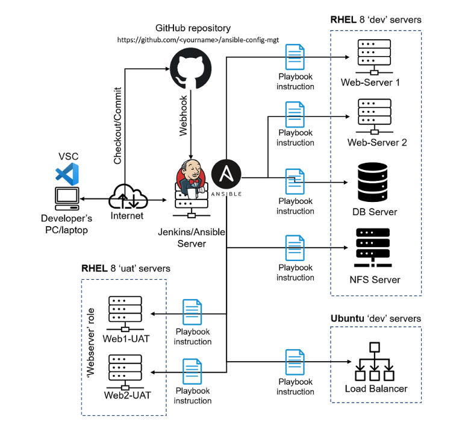
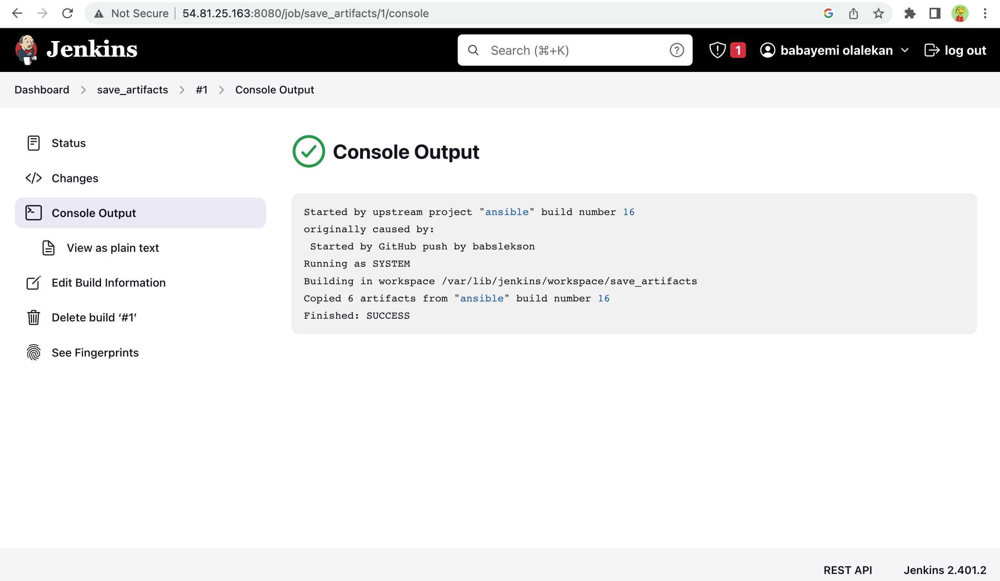
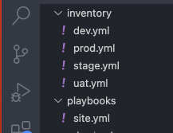
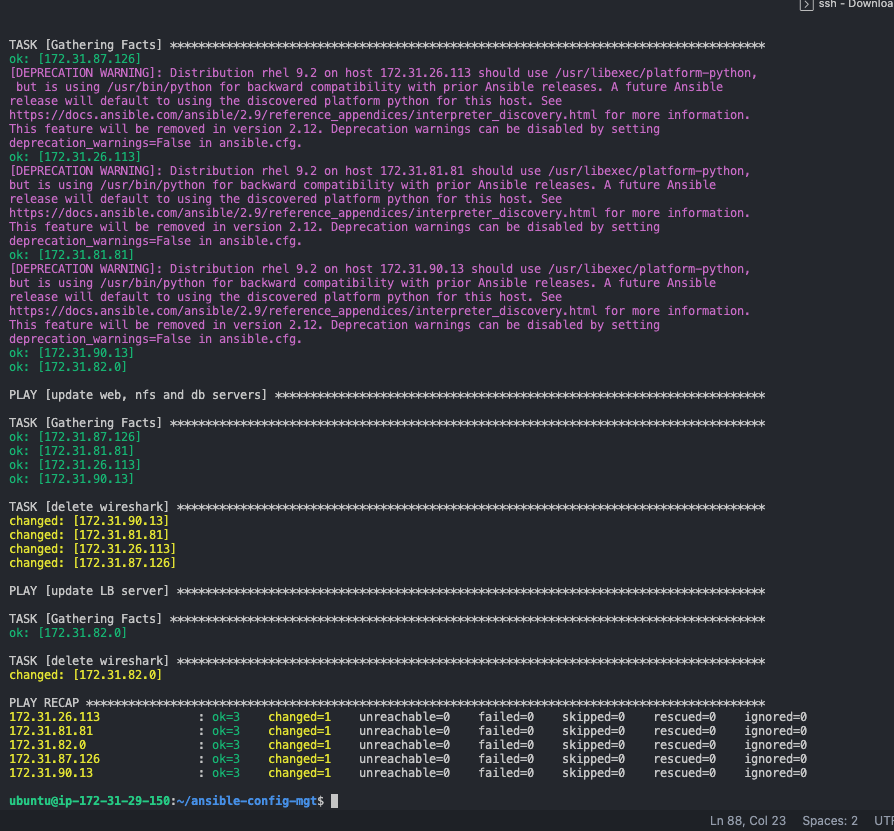
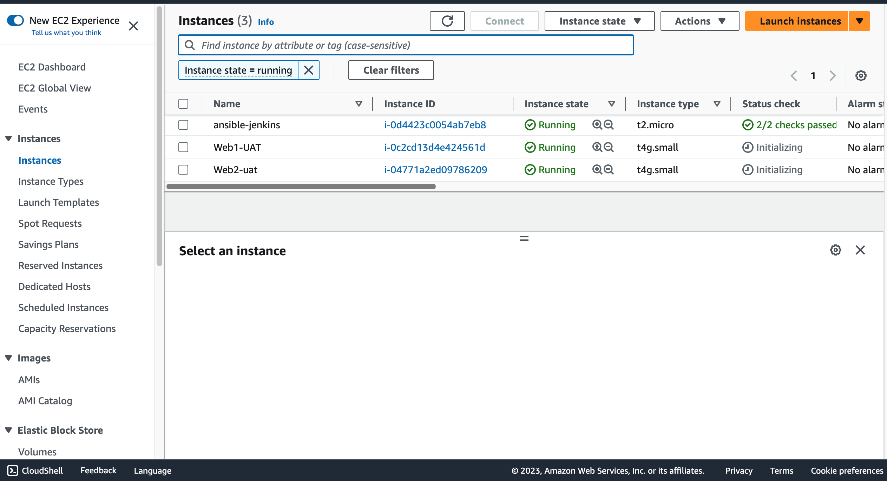
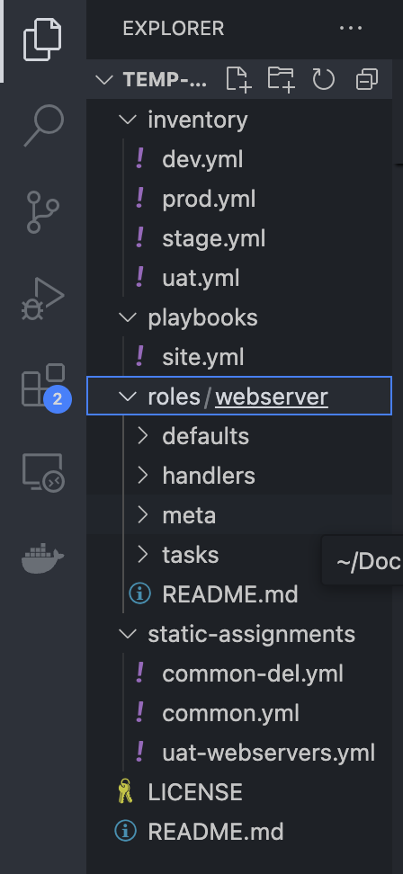
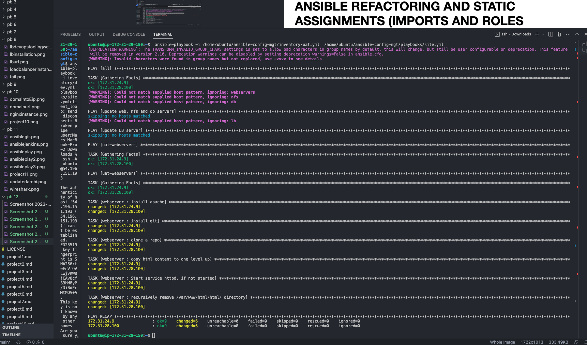
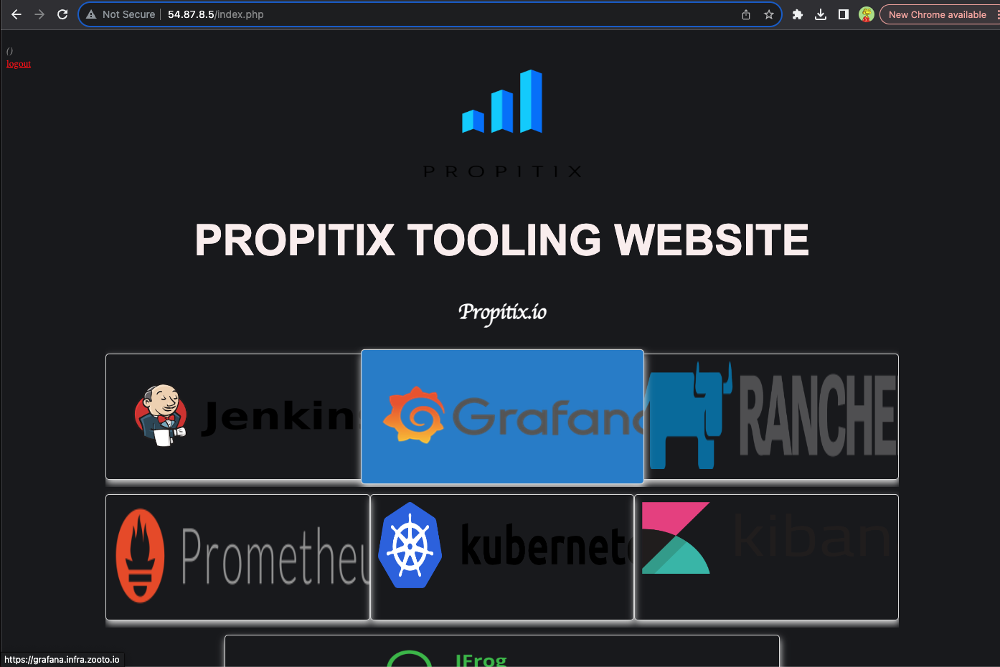

# ANSIBLE REFACTORING AND STATIC ASSIGNMENTS (IMPORTS AND ROLES
---
 ## Ansible Refactoring And Static Assignments
 
 ### Step 1 - Jenkins job enhancement 
 #### Create a new directory to store artifacts in Jenkins-Ansible instance
 ```bash
 sudo mkdir /home/ubuntu/ansible-config-artifact
 sudo chmod -R 777 /home/ubuntu/ansible-config-artifact
 ```
 #### Create a new job in ansible to copy artifacts to the directory created
 - Install 'copy artifacts` plugin
 - Create a new job `save_artifacts`
 - Add a build step
    - choose `Copy artifacts from other project`
    - select ansible as source project
    - set /home/ubuntu/ansible-config-artifact as target directory
 - Test the setup

 
 Check directory permissions if AccessDenied Error is encountered

 ## Refactor Ansible
 ---
 - Change the directory structure to match below 
 
 
 
 - in the site.yml file import common.yml
 ```bash
 ---
 - hosts: all
 -import_playbool: ../static-assigments/common.yml
 ```
 - Create another playbook in the static-assignment directory named common-del.yml to unisntall Wireshark
 ```bash
 ---
- name: update web, nfs and db servers
  hosts: webservers, nfs, db
  remote_user: ec2-user
  become: yes
  become_user: root
  tasks:
  - name: delete wireshark
    yum:
      name: wireshark
      state: removed

- name: update LB server
  hosts: lb
  remote_user: ubuntu
  become: yes
  become_user: root
  tasks:
  - name: delete wireshark
    apt:
      name: wireshark-qt
      state: absent
      autoremove: yes
      purge: yes
      autoclean: yes
```
- Update site.yml to import common-del.yml instead of common.yml
- Commit to github and run the playbook against dev servers


### Configure UAT Webservers
- Launch 2 new EC2 instances using RHEL8 image
- Name them Web1-UAT and Web2-UAT


- Create a a roles directory in the ansible repository
```bash
mkdir roles

cd roles

ansible-galaxy init webserver
```
- Refactor the roles directory to match the structure below


- Update the inventory/uat.yml with the private IP addresses of the 2 UAT web servers
```bash
[uat-webservers]
<Web1-UAT-Server-Private-IP-Address> ansible_ssh_user='ec2-user' 
<Web2-UAT-Server-Private-IP-Address> ansible_ssh_user='ec2-user'
```
- Configure the webserver role
```bash
---
# tasks file for webserver
- name: Install Apache
  become: true
  yum: 
    name: httpd
    state: present
  
- name: Install git
  become: true
  yum:
    name: git
    state: present

- name: Clone a Repo
  become: true
  git:
    repo: https://github.com/Horleryheancarh/tooling.git
    dest: /var/www/html
    force: true

- name: Copy html content one level up
  become: true
  command: cp -r /var/www/html/html /var/www/

- name: Start httpd if not started
  become: true
  service: 
    name: httpd
    state: started

- name: Recursively remove /var/www/html/html directory
  become: true
  file: 
    path: /var/www/html/html
    state: absent
```
### Reference webserver Role
---
- Create a new file static-assignment/uat-websrvers.yml to reference the role
```bash
---
- hosts: uat-webservers
  roles:
     - webserver
```
- Refer the role in site.yml

```bash
---
- hosts: all
- import_playbook: ../static-assignments/common.yml

- hosts: uat-webservers
- import_playbook: ../static-assignments/uat-webservers.yml
```
## Commit and Test
---
### Commit the changes and them into the main branch
```bash
cd ansible-config-artifact

ansible-playbook -i inventory/uat.yml playbooks/site.yml
```


