# AWS Cloud Solution For 2 Company Websites Using A Reverse Proxy Technology
---
## Set Up Architecture
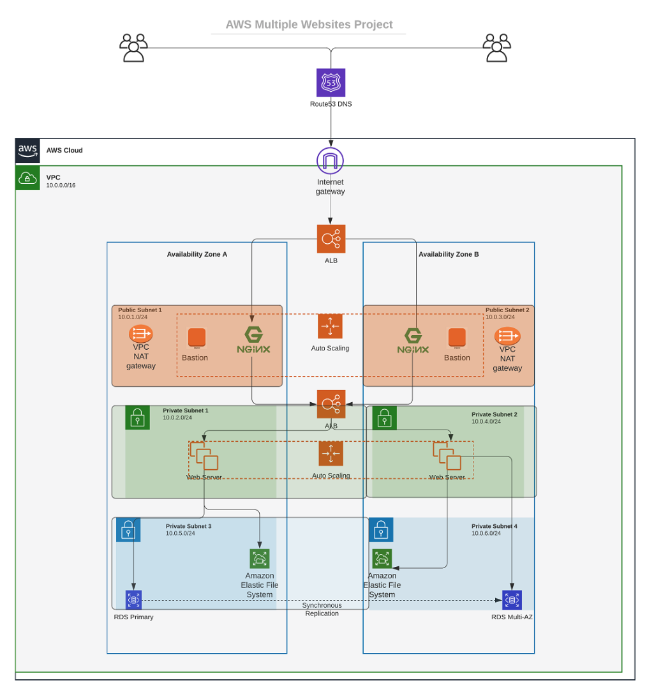
---
### Create VPC 
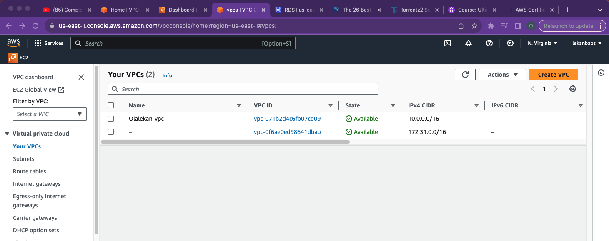
---
### Create public and private subnet
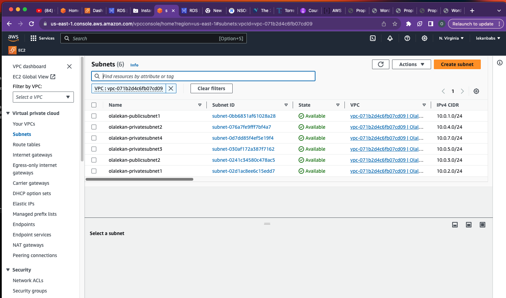
---
### Create routing table for public and private subnets 
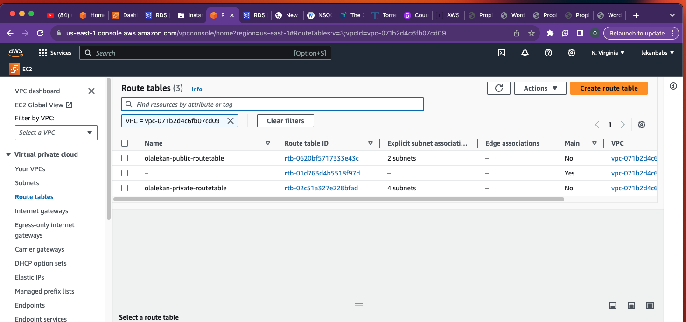
---
### Create internet gateway and associate it with the public subnet
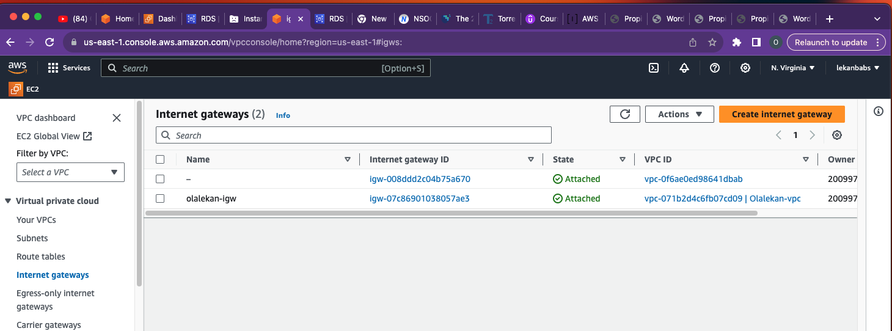
----
### Create a NAT gateway
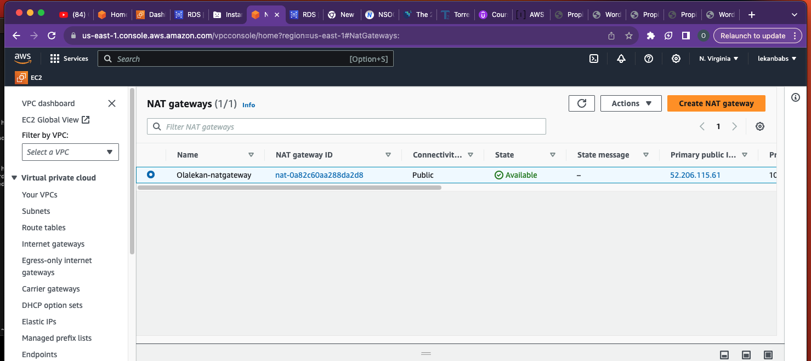
---
### create security group for the nginx server, bastion server, webservers, application load balancers and data layer
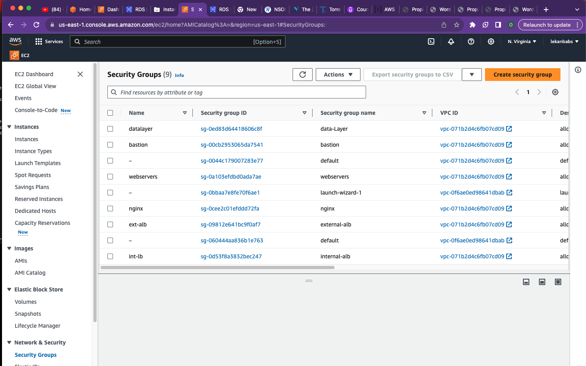
---
### create EC2 instances for nginx, bastion and webservers
Configure the instances
```bash
# For bastion
sudo yum install -y https://dl.fedoraproject.org/pub/epel/epel-release-latest-8.noarch.rpm
sudo yum install -y dnf-utils http://rpms.remirepo.net/enterprise/remi-release-8.rpm
sudo yum install wget vim python3 telnet htop git mysql net-tools chrony -y
sudo systemctl start chrony
sudo systemctl enable chrony
```
```bash
# For Nginx and webserver
sudo yum install -y https://dl.fedoraproject.org/pub/epel/epel-release-latest-8.noarch.rpm
sudo yum install -y dnf-utils http://rpms.remirepo.net/enterprise/remi-release-8.rpm
sudo yum install wget vim python3 telnet htop git mysql net-tools chrony -y
sudo systemctl start chronyd
sudo systemctl enable chronyd

# Configure selinux policies
sudo setsebool -P httpd_can_network_connect=1
sudo setsebool -P httpd_can_network_connect_db=1
sudo setsebool -P httpd_execmem=1
sudo setsebool -P httpd_use_nfs=1

# Install Amazon EFS utils for mounting EFS
git clone https://github.com/aws/efs-utils
cd efs-utils
sudo yum install -y make rpm-build
make rpm
sudo yum install -y  ./build/amazon-efs-utils*rpm

# Self-signed Certificate for Nginx
sudo mkdir /etc/ssl/private
sudo chmod 700 /etc/ssl/private
openssl req -x509 -nodes -days 365 -newkey rsa:2048 -keyout /etc/ssl/private/olalekan.key -out /etc/ssl/certs/olalekan.crt
sudo openssl dhparam -out /etc/ssl/certs/dhparam.pem 2048

# Self-signed Certificate for Apache
sudo yum install -y mod_ssl
openssl req -newkey rsa:2048 -nodes -keyout /etc/pki/tls/private/olalekan.key -x509 -days 365 -out /etc/pki/tls/certs/olalekan.crt
vim /etc/httpd/conf.d/ssl.conf
```
---
### Create AMIs from the instances
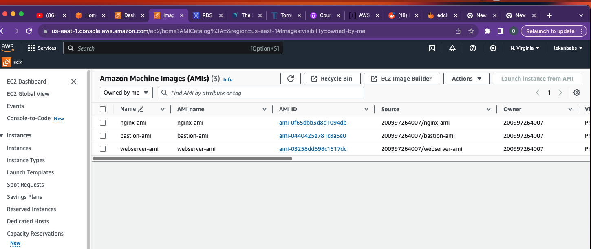
---
### Create target groups
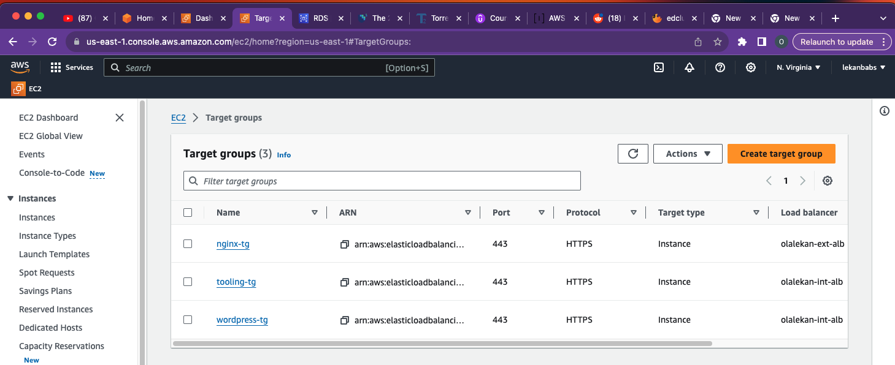
---
### Create KMS key
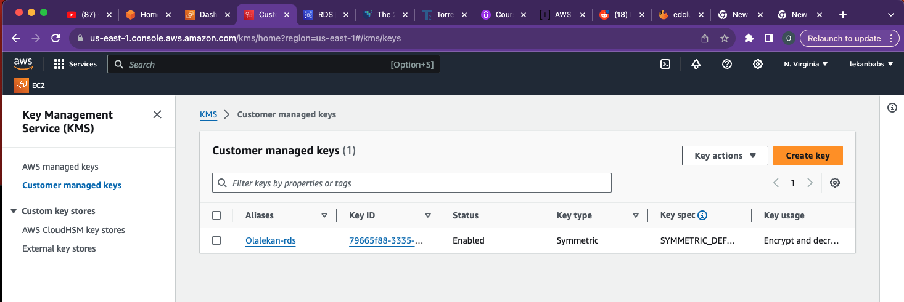
---
### Create RDS instance using the KMS key
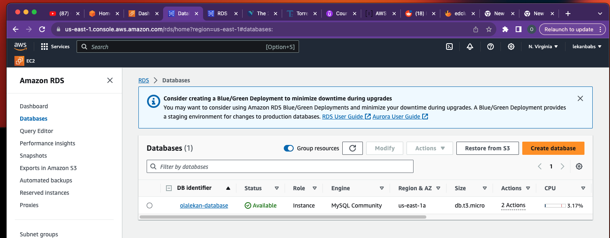
---
### Create certificate using the Amazon Certificate Manager
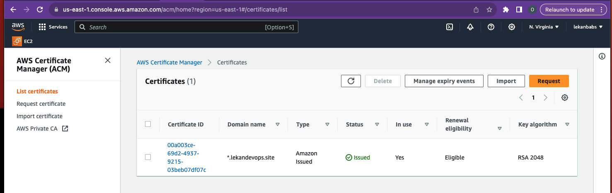

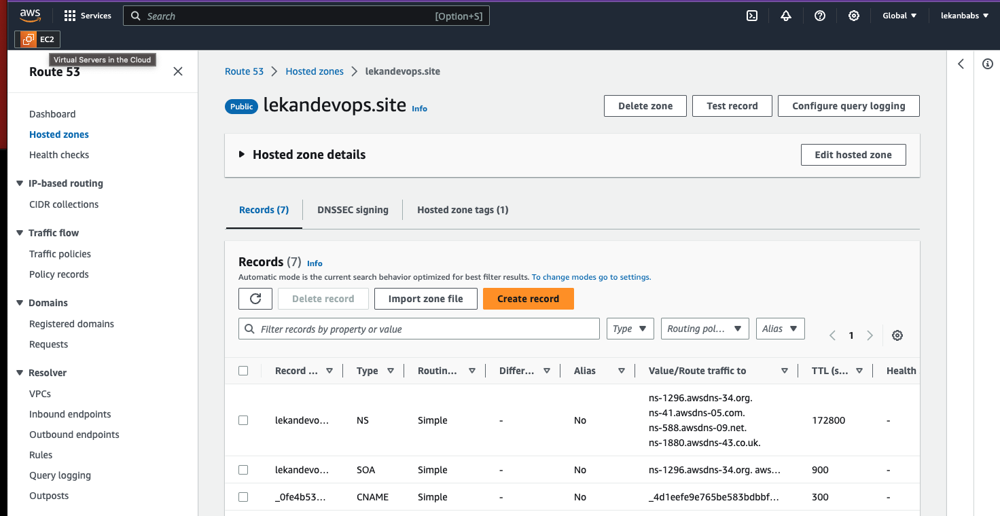
---
### Create Application load balancer (one internal and external)
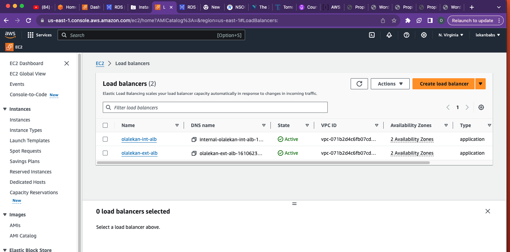
---
### Create EFS and access points for the company websites
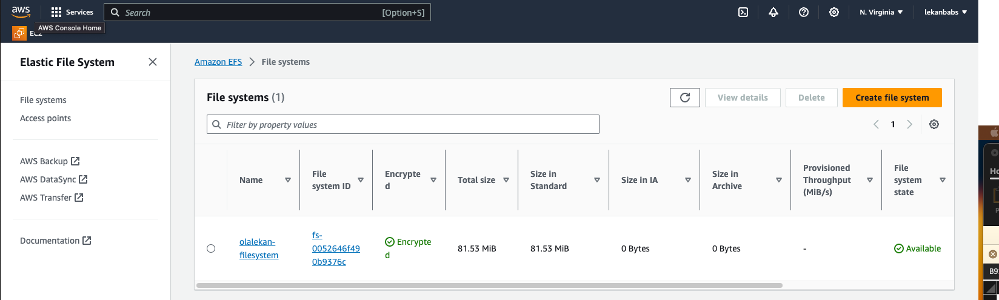
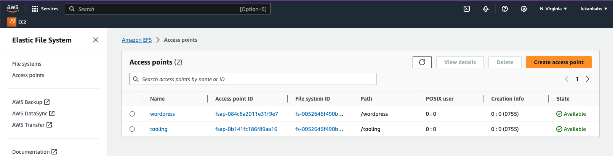
---
### Create launch templates from the AMIs
ADD USER DATA to the configuration to setup the templates
```bash

##### bastion userdata
#!/bin/bash
yum install -y mysql
yum install -y git tmux
yum install -y ansible

##### nginx userdata 
#!/bin/bash
yum install -y nginx
systemctl start nginx
systemctl enable nginx
git clone https://github.com/babslekson/ACS-project-config.git
mv /ACS-project-config/reverse.conf /etc/nginx/
mv /etc/nginx/nginx.conf /etc/nginx/nginx.conf-distro
cd /etc/nginx/
touch nginx.conf
sed -n 'w nginx.conf' reverse.conf
systemctl restart nginx
rm -rf reverse.conf
rm -rf /ACS-project-config

##### tooling userdata
#!/bin/bash
mkdir /var/www/
sudo mount -t efs -o tls,accesspoint=fsap-0b141fc186f89aa16 fs-0052646f490b9376c:/ /var/www/
yum install -y httpd 
systemctl start httpd
systemctl enable httpd
yum module reset php -y
yum module enable php:remi-7.4 -y
yum install -y php php-common php-mbstring php-opcache php-intl php-xml php-gd php-curl php-mysqlnd php-fpm php-json
systemctl start php-fpm
systemctl enable php-fpm
git clone https://github.com/babslekson/tooling.git
mkdir /var/www/html
cp -R /tooling-1/html/*  /var/www/html/
cd /tooling-1
mysql -h olalekan-database.cixtanntjbvk.us-east-1.rds.amazonaws.com-u olalekanadmin -p toolingdb < tooling-db.sql
cd /var/www/html/
touch healthstatus
sed -i "s/$db = mysqli_connect('mysql.tooling.svc.cluster.local', 'admin', 'admin', 'tooling');/$db = mysqli_connect('olalekan-database.cixtanntjbvk.us-east-1.rds.amazonaws.com', 'olalekanadmin', '12345678', 'toolingdb');/g" functions.php
chcon -t httpd_sys_rw_content_t /var/www/html/ -R
systemctl restart httpd

##### wordpress userdata
#!/bin/bash
mkdir /var/www/
sudo mount -t efs -o tls,accesspoint=fsap-084c8a2011e31f9e7 fs-0052646f490b9376c:/ /var/www/
yum install -y httpd 
systemctl start httpd
systemctl enable httpd
yum module reset php -y
yum module enable php:remi-7.4 -y
yum install -y php php-common php-mbstring php-opcache php-intl php-xml php-gd php-curl php-mysqlnd php-fpm php-json
systemctl start php-fpm
systemctl enable php-fpm
wget http://wordpress.org/latest.tar.gz
tar xzvf latest.tar.gz
rm -rf latest.tar.gz
cp wordpress/wp-config-sample.php wordpress/wp-config.php
mkdir /var/www/html/
cp -R /wordpress/* /var/www/html/
cd /var/www/html/
touch healthstatus
sed -i "s/localhost/olalekan-database.cixtanntjbvk.us-east-1.rds.amazonaws.com/g" wp-config.php 
sed -i "s/username_here/olalekanadmin/g" wp-config.php 
sed -i "s/password_here/12345678/g" wp-config.php 
sed -i "s/database_name_here/wordpressdb/g" wp-config.php 
chcon -t httpd_sys_rw_content_t /var/www/html/ -R
systemctl restart httpd
```
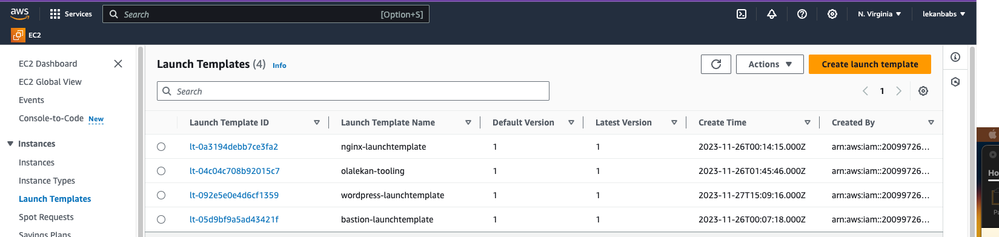
---
### create Database in RDS instance
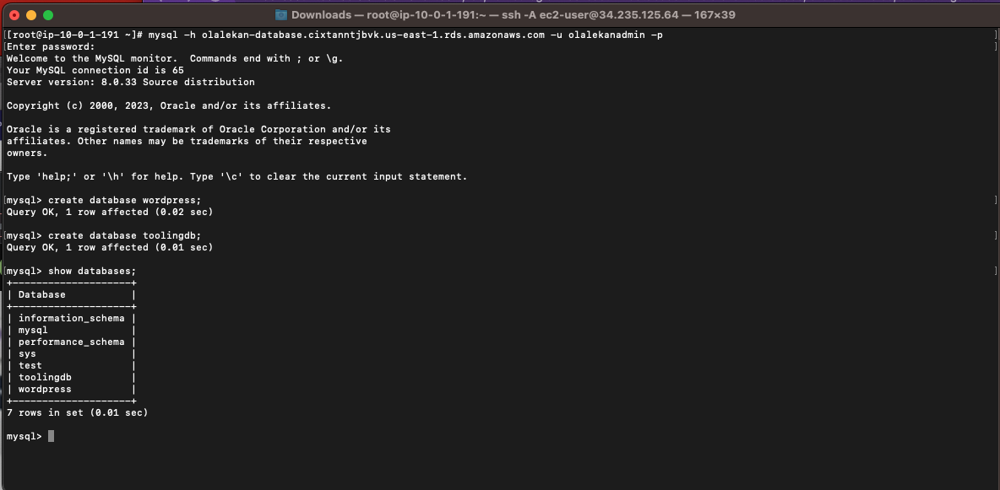
---
### Create AutoScaling group for Bastion, Nginx, Tooling and Wordpress
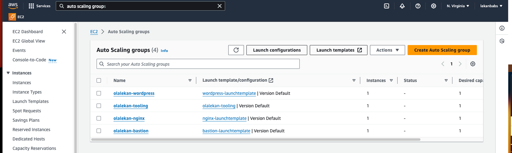

### Create new records on Route53 pointing to the external ALB
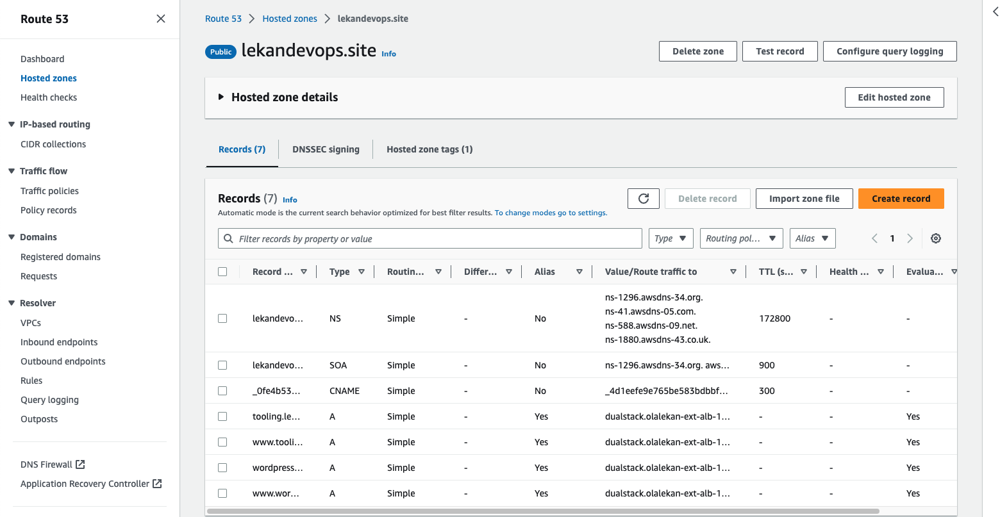 

### Check status of target group 
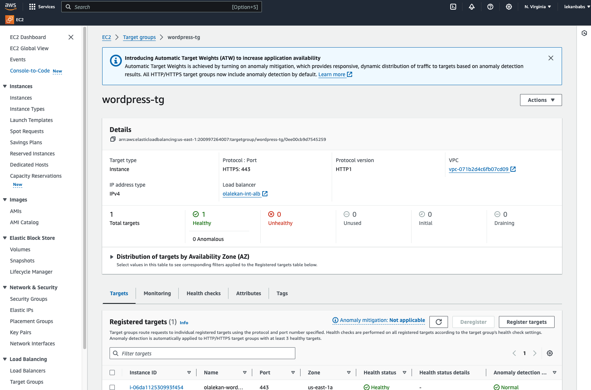
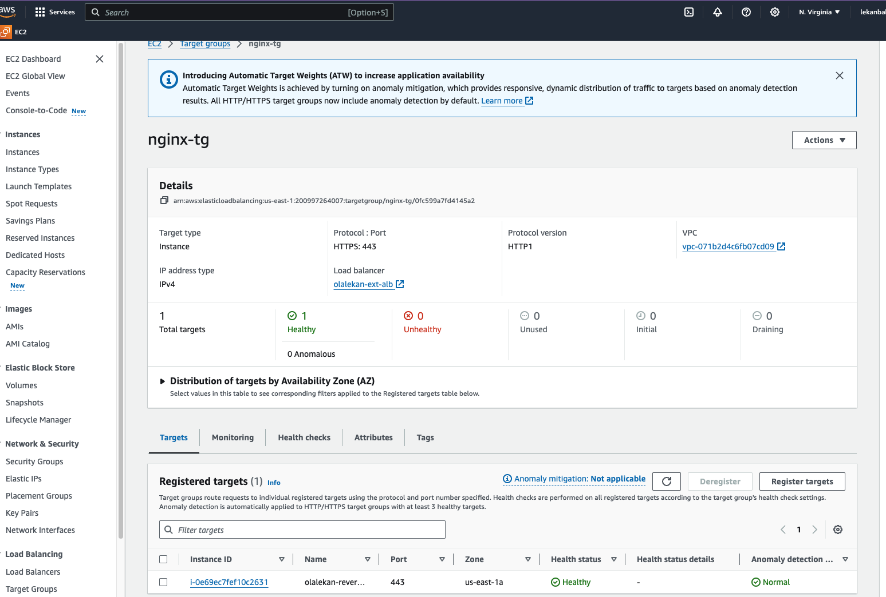
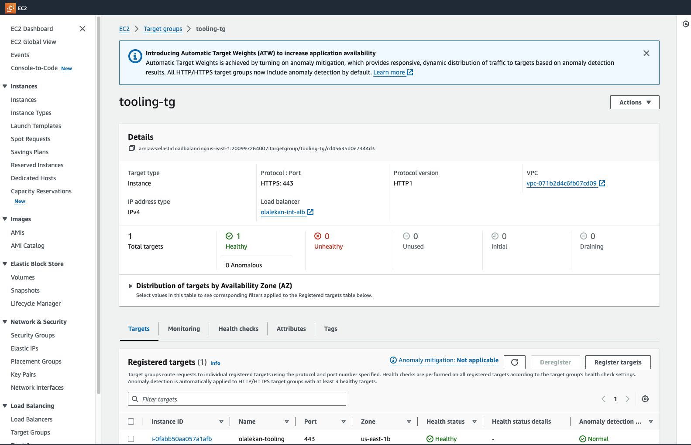

### Check ec2 instances
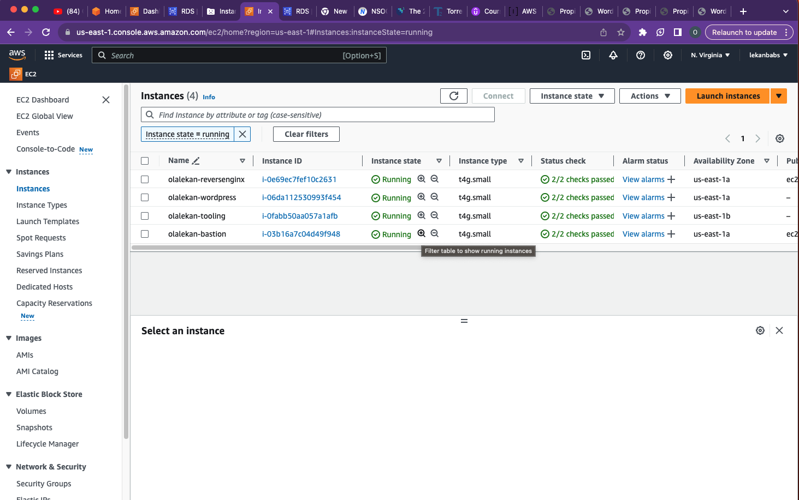
---
#### The webpages are up and running
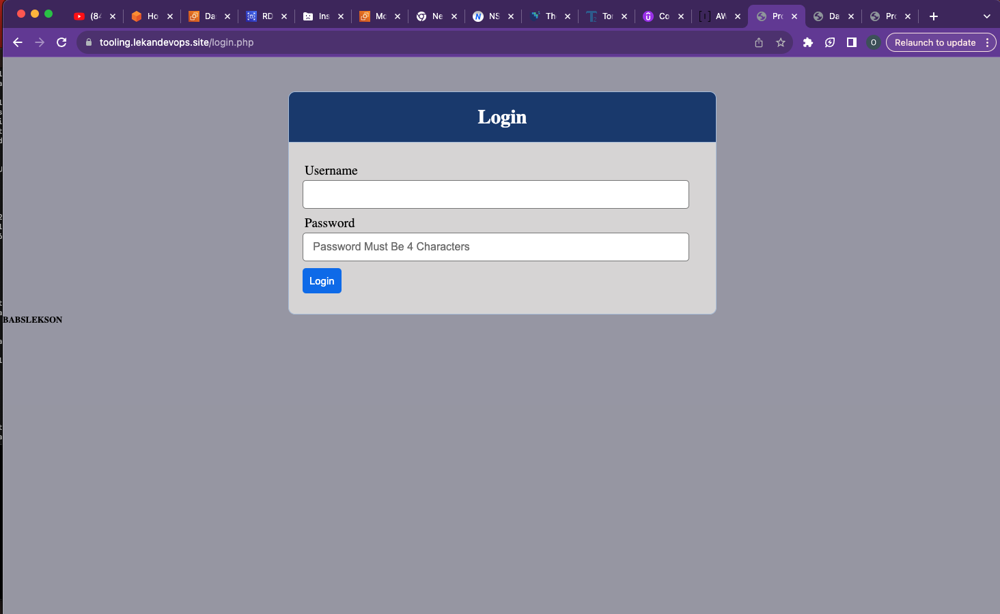
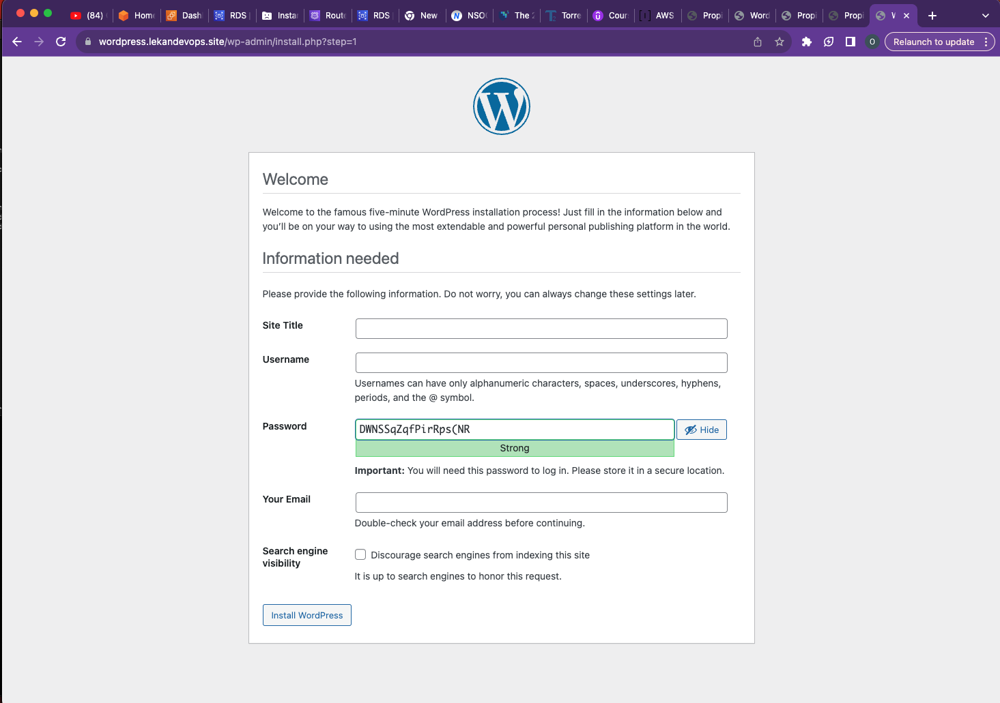
