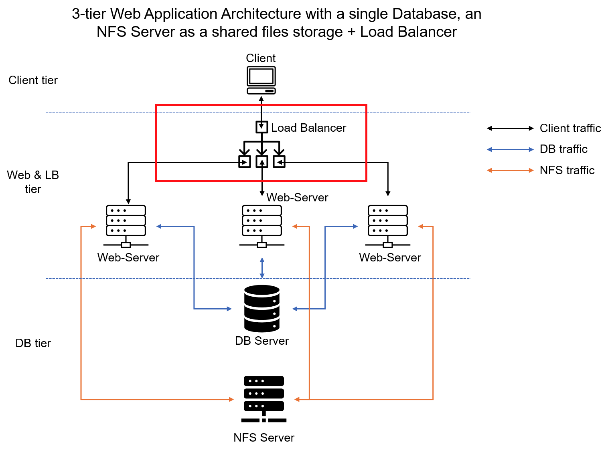
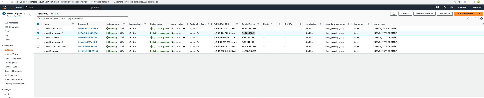
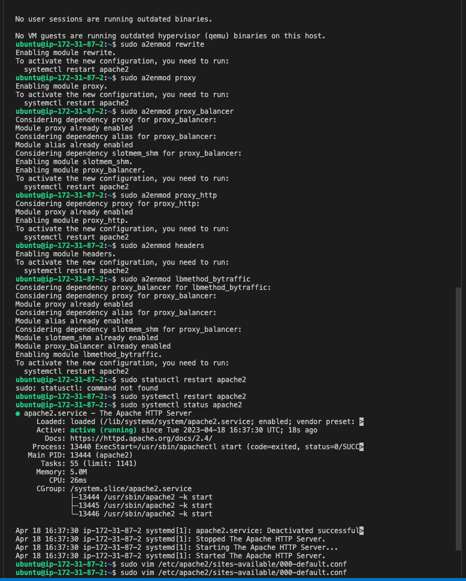
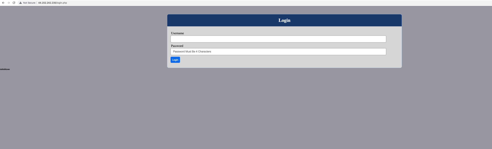
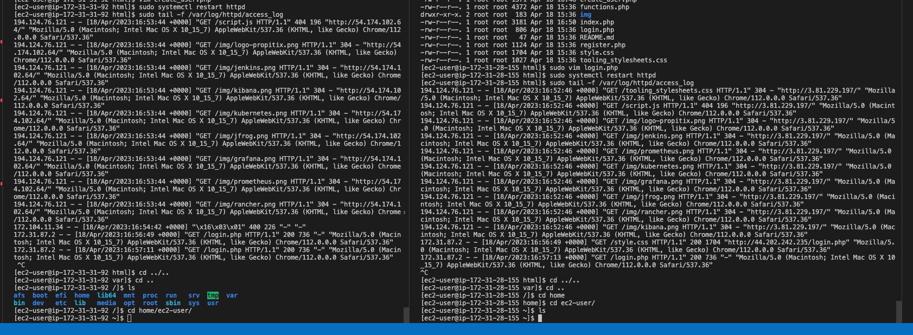

# CONFIGURE LOAD BALANCER FOR DEVOPS TOOLING WEBSITE


### CREATE LOAD BALANCER SERVER

### Install Apache Load Balancer on apache-lb server and configure to point traffic coming to LB to the Web Servers

```bash
#Install apache2
sudo apt update
sudo apt install apache2 -y
sudo apt-get install libxml2-dev

#Enable following modules:
sudo a2enmod rewrite
sudo a2enmod proxy
sudo a2enmod proxy_balancer
sudo a2enmod proxy_http
sudo a2enmod headers
sudo a2enmod lbmethod_bytraffic

#Restart apache2 service
sudo systemctl restart apache2
```
### Configure load balancing
```bash
sudo vim /etc/apache2/sites-available/000-default.conf
#Add this configuration into this section <VirtualHost *:80>  </VirtualHost>

<Proxy "balancer://mycluster">
               BalancerMember http://<WebServer1-Private-IP-Address>:80 loadfactor=5 timeout=1
               BalancerMember http://<WebServer2-Private-IP-Address>:80 loadfactor=5 timeout=1
               BalancerMember http://<WebServer2-Private-IP-Address>:80 loadfactor=5 timeout=1
               ProxySet lbmethod=bytraffic
               # ProxySet lbmethod=byrequests
        </Proxy>

        ProxyPreserveHost On
        ProxyPass / balancer://mycluster/
        ProxyPassReverse / balancer://mycluster/

#Restart apache server
sudo systemctl restart apache2
```

> Access load balancer public ip


#### check the servers if they receive HTTP GET requests from your LB 
```bash
sudo tail -f /var/log/httpd/access_log
```

