# TOOLING WEBSITE DEPLOYMENT AUTOMATION WITH CONTINUOUS INTEGRATION.
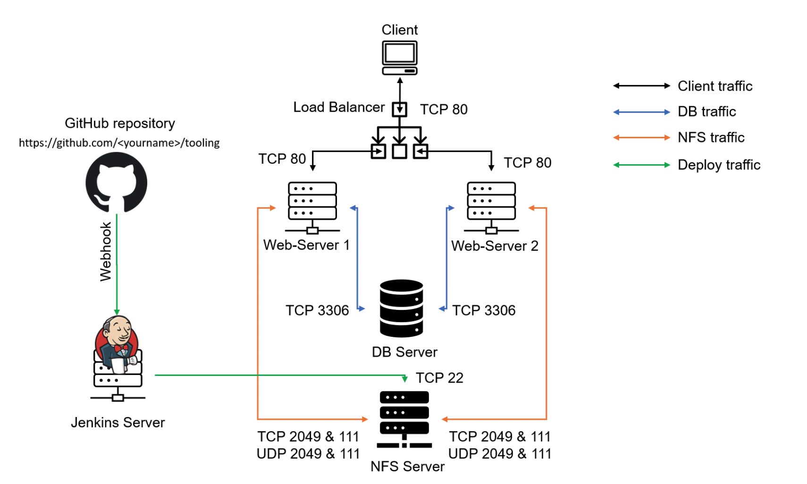
## INSTALL AND CONFIGURE JENKINS SERVER
### Install Jenkins server
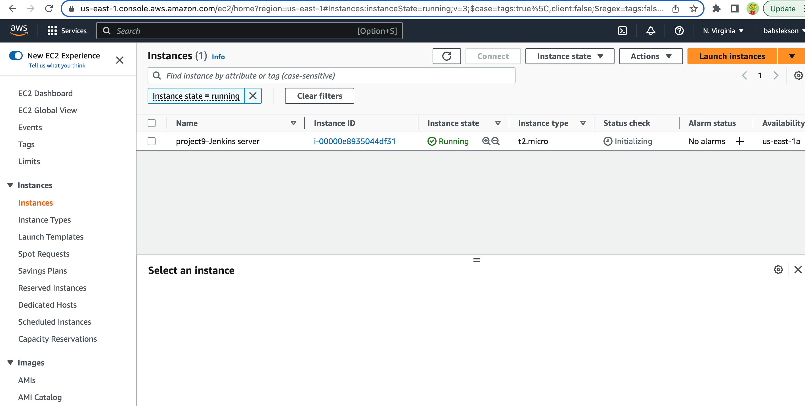
### Install JDK
```bash
sudo apt update
sudo apt install default-jdk-headless
```
### Install Jenkins

```bash
wget -q -O - https://pkg.jenkins.io/debian-stable/jenkins.io.key | sudo apt-key add -

sudo sh -c 'echo deb https://pkg.jenkins.io/debian-stable binary/ > \
    /etc/apt/sources.list.d/jenkins.list'

curl -fsSL https://pkg.jenkins.io/debian-stable/jenkins.io-2023.key | sudo tee \
  /usr/share/keyrings/jenkins-keyring.asc > /dev/null

echo deb [signed-by=/usr/share/keyrings/jenkins-keyring.asc] \
  https://pkg.jenkins.io/debian-stable binary/ | sudo tee \
  /etc/apt/sources.list.d/jenkins.list > /dev/null
sudo apt update 
sudo apt install jenkins

#verify Jenkins is up and running
sudo systemctl status jenkins
```
Open TCP port 8080 to access jenkins server
> Access Jenkins server http://\<Jenkins-Server-Public-IP-Address>:8080

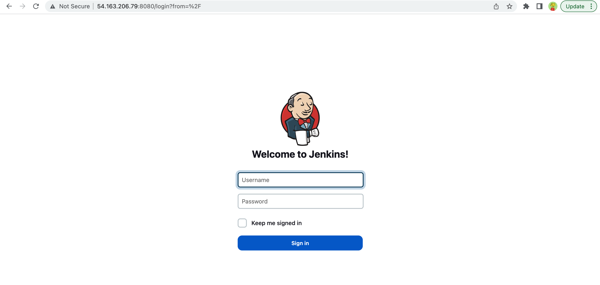


Retrieve password from jenkins server
```bash
sudo cat /var/lib/jenkins/secrets/initialAdminPassword
```
## CONFIGURE JENKINS TO RETRIEVE SOURCE CODES FROM GITHUB USING WEBHOOKS
---
### Enable webhook on Github
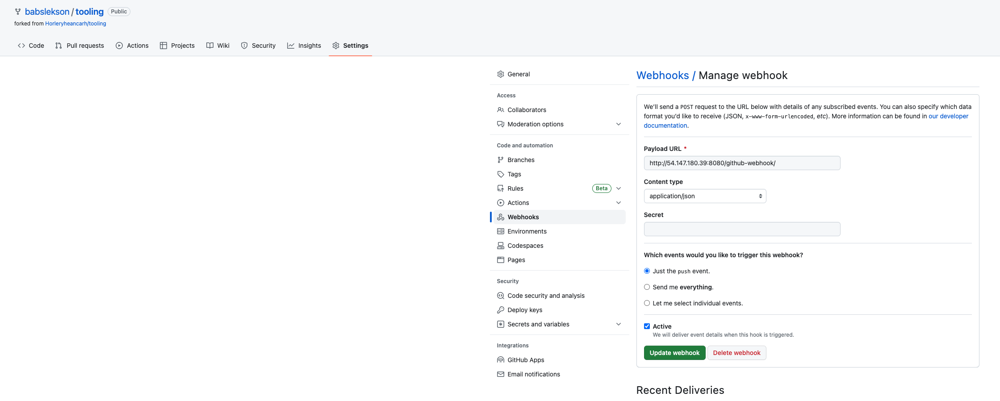
### Create a freestyle project on jenkins and allow access to tooling github repository
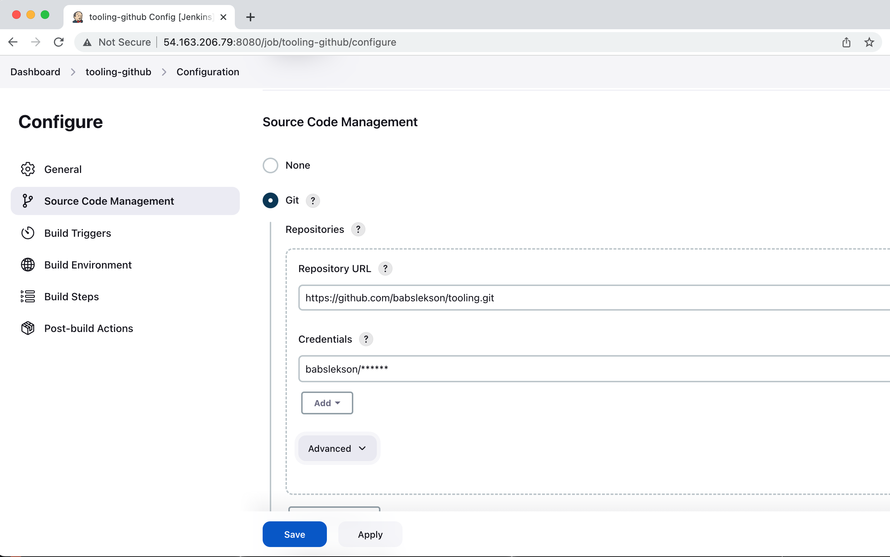
### Configure triggering the job from GitHub webhook
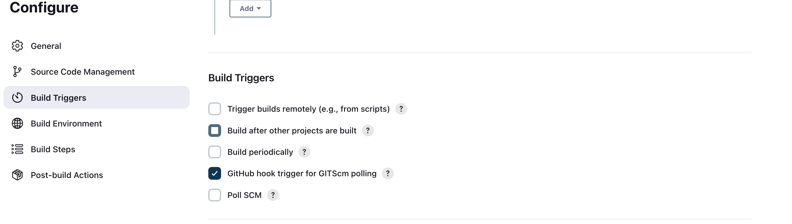
### Configure Post-build Actions to archive all the files
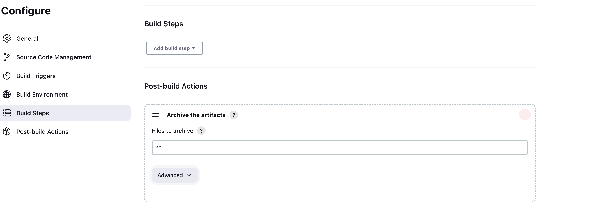
```bash
#check artifact on jenkins server
 ls /var/lib/jenkins/jobs/tooling_github/builds/<build_number>/archive/
 ```
 ## CONFIGURE JENKINS TO COPY FILES TO NFS SERVER VIA SSH
 ### Install publish over ssh plugin 
 ---
 
 #### Configure the freestyle project to copy artifacts over to NFS server
 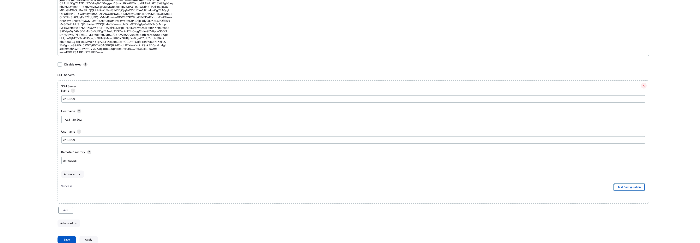

#### Open project configuration page and add another Post-build Action
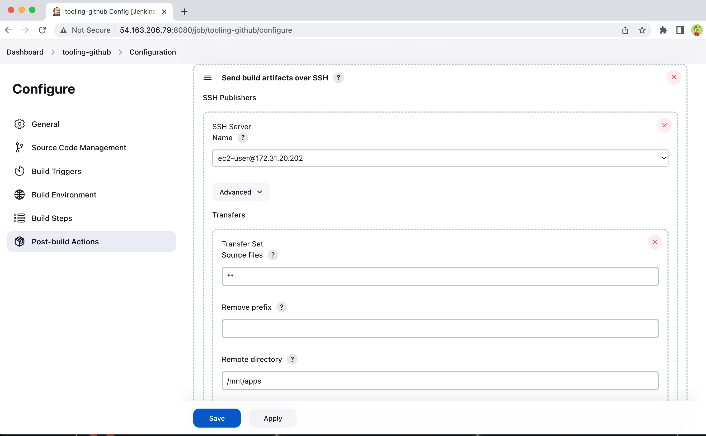

#### Test configuration by changing the readme on Github
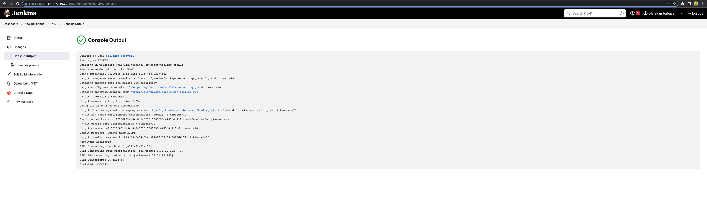

#### Verify changes in NFS server
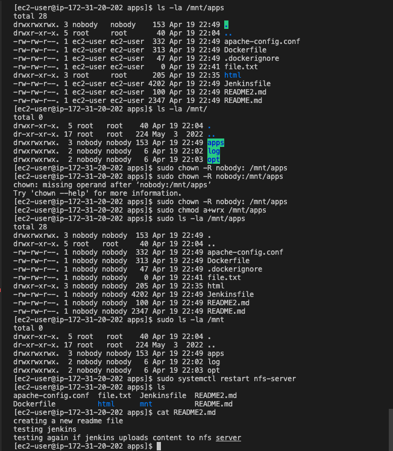 
